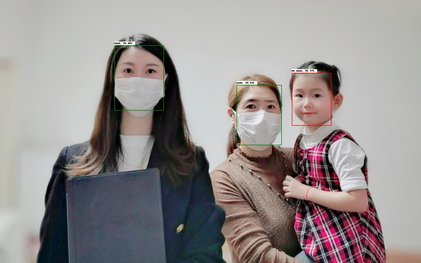
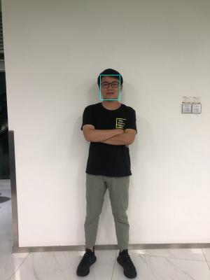
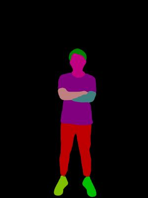
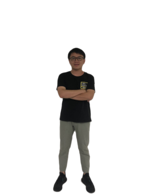

<p align="center">
 

[](https://travis-ci.org/PaddlePaddle/PaddleHub)
[](LICENSE)
[](https://github.com/PaddlePaddle/PaddleHub/releases)


PaddleHub是飞桨生态的预训练模型应用工具，开发者可以便捷地使用高质量的预训练模型结合Fine-tune API快速完成模型迁移到部署的全流程工作。PaddleHub提供的预训练模型涵盖了图像分类、目标检测、词法分析、语义模型、情感分析、视频分类、图像生成、图像分割、文本审核、关键点检测等主流模型。更多详情可查看官网：https://www.paddlepaddle.org.cn/hub


PaddleHub以预训练模型应用为核心具备以下特点：  

* **[模型即软件](#模型即软件)**，通过Python API或命令行实现模型调用，可快速体验或集成飞桨特色预训练模型。

* **[易用的迁移学习](#易用的迁移学习)**，通过Fine-tune API，内置多种优化策略，只需少量代码即可完成预训练模型的Fine-tuning。

* **[一键模型转服务](#一键模型转服务)**，简单一行命令即可搭建属于自己的深度学习模型API服务完成部署。

* **[自动超参优化](#自动超参优化)**，内置AutoDL Finetuner能力，一键启动自动化超参搜索。


<p align="center">
 

<p align='center'>
 十行代码完成ERNIE工业级文本分类
</p>


## 目录

* [安装](#%E5%AE%89%E8%A3%85)
* [特性](#特性)
* [FAQ](#faq)
* [用户交流群](#%E7%94%A8%E6%88%B7%E4%BA%A4%E6%B5%81%E7%BE%A4)
* [更新历史](#%E6%9B%B4%E6%96%B0%E5%8E%86%E5%8F%B2)


## 安装

### 环境依赖

* Python >= 3.6
* PaddlePaddle >= 1.7.0
* 操作系统: Windows/Mac/Linux

### 安装命令

PaddlePaddle框架的安装请查阅[飞桨快速安装](https://www.paddlepaddle.org.cn/install/quick)

```shell
pip install paddlehub
```

除上述依赖外，预训练模型和数据集的下载需要网络连接，请确保机器可以**正常访问网络**。若本地已存在相关预训练模型目录，则可以离线使用PaddleHub。

## 特性

### 模型即软件

PaddleHub采用模型即软件的设计理念，所有的预训练模型与Python软件包类似，具备版本的概念，通过`hub install/uninstall` 可以便捷完成模型的升级和卸载。还可以通过Python的API或命令行实现快速预测的软件集成，更方便地应用和集成深度学习模型。

安装PaddleHub后，执行命令[hub run](./docs/tutorial/cmdintro.md)，即可快速体验无需代码、一键预测的功能：

* 使用[目标检测](https://www.paddlepaddle.org.cn/hublist?filter=en_category&value=ObjectDetection)模型pyramidbox_lite_mobile_mask对图片进行口罩检测
```shell
$ wget https://paddlehub.bj.bcebos.com/resources/test_mask_detection.jpg
$ hub run pyramidbox_lite_mobile_mask --input_path test_mask_detection.jpg
```
<p align="center">
 

* 使用[词法分析](https://www.paddlepaddle.org.cn/hublist?filter=en_category&value=LexicalAnalysis)模型LAC进行分词
```shell
$ hub run lac --input_text "现在，慕尼黑再保险公司不仅是此类行动的倡议者，更是将其大量气候数据整合进保险产品中，并与公众共享大量天气信息，参与到新能源领域的保障中。"
[{
    'word': ['现在', '，', '慕尼黑再保险公司', '不仅', '是', '此类', '行动', '的', '倡议者', '，', '更是', '将', '其', '大量', '气候', '数据', '整合', '进', '保险', '产品', '中', '，', '并', '与', '公众', '共享', '大量', '天气', '信息', '，', '参与', '到', '新能源', '领域', '的', '保障', '中', '。'],
    'tag':  ['TIME', 'w', 'ORG', 'c', 'v', 'r', 'n', 'u', 'n', 'w', 'd', 'p', 'r', 'a', 'n', 'n', 'v', 'v', 'n', 'n', 'f', 'w', 'c', 'p', 'n', 'v', 'a', 'n', 'n', 'w', 'v', 'v', 'n', 'n', 'u', 'vn', 'f', 'w']
}]
```

* 使用[情感分析](https://www.paddlepaddle.org.cn/hublist?filter=en_category&value=SentimentAnalysis)模型Senta对句子进行情感预测
```shell
$ hub run senta_bilstm --input_text "今天天气真好"
{'text': '今天天气真好', 'sentiment_label': 1, 'sentiment_key': 'positive', 'positive_probs': 0.9798, 'negative_probs': 0.0202}]
```

* 使用[目标检测](https://www.paddlepaddle.org.cn/hublist?filter=en_category&value=ObjectDetection)模型Ultra-Light-Fast-Generic-Face-Detector-1MB对图片进行人脸识别
```shell
$ wget https://paddlehub.bj.bcebos.com/resources/test_image.jpg
$ hub run ultra_light_fast_generic_face_detector_1mb_640 --input_path test_image.jpg
```
<p align="center">
 

* 使用[图像分割](https://www.paddlepaddle.org.cn/hublist?filter=en_category&value=ImageSegmentation)模型进行人像扣图和人体部件识别

```shell
$ wget https://paddlehub.bj.bcebos.com/resources/test_image.jpg
$ hub run ace2p --input_path test_image.jpg
$ hub run deeplabv3p_xception65_humanseg --input_path test_image.jpg
```

<p align="center">  
  
  
</p>  

<p align='center'>
 &#8194;&#8194;&#8194&#8194;&#8194;&#8194;&#8194;&#8194;&#8194;ACE2P人体部件分割&#8194;&#8194;&#8194;&#8194;&#8194;&#8194;&#8194;&#8194;&#8194;&#8194;&#8194;&#8194;&#8194;&#8194;&#8194;&#8194;
 HumanSeg人像分割&#8194;&#8194;&#8194;
</p>

PaddleHub还提供图像分类、语义模型、视频分类、图像生成、图像分割、文本审核、关键点检测等主流模型，更多模型介绍，请前往[预训练模型介绍](./docs/pretrained_models.md)或者PaddleHub官网[https://www.paddlepaddle.org.cn/hub](https://www.paddlepaddle.org.cn/hub) 查看

### 易用的迁移学习

通过Fine-tune API，只需要少量代码即可完成深度学习模型在自然语言处理和计算机视觉场景下的迁移学习。

* [Demo示例](./demo)提供丰富的Fine-tune API的使用代码，包括[文本分类](./demo/text_classification)、[序列标注](./demo/sequence_labeling)、[多标签分类](./demo/multi_label_classification)、[图像分类](./demo/image_classification)、[检索式问答任务](./demo/qa_classification)、[回归任务](./demo/regression)、[句子语义相似度计算](./demo/sentence_similarity)、[阅读理解任务](./demo/reading_comprehension)等场景的模型迁移示例。

* 如需在线快速体验，请点击[PaddleHub教程合集](https://aistudio.baidu.com/aistudio/projectdetail/231146)，可使用AI Studio平台提供的GPU算力进行快速尝试。

更多Fine-tune API的使用教程可参考：

* [Fine-tune API](./docs/reference)

* [如何对自定义数据集进行Fine-tuning](./docs/tutorial/how_to_load_data.md)

* [如何自定义迁移任务](./docs/tutorial/how_to_define_task.md)

* [ULMFiT优化策略](./docs/tutorial/strategy_exp.md)

### 一键模型转服务

PaddleHub提供便捷的模型转服务的能力，只需简单一行命令即可完成模型的HTTP服务部署。通过以下命令即可快速启动LAC词法分析服务：

```shell
$ hub serving start --modules lac
```

更多关于模型服务化使用说明参见[PaddleHub模型一键能服务化部署](./docs/tutorial/serving.md)。

**PaddleHub 1.5.0版本增加文本Embedding服务[Bert Service](./docs/tutorial/bert_service.md), 高性能地获取文本Embedding**

### 自动超参优化

PaddleHub内置AutoDL Finetuner能力，提供多种优化策略策略实现自动化超参搜索，使得模型在验证集上得到更好的结果，用户只需要一行命令`hub autofinetune`即可启动。更多详细使用说明请参见[PaddleHub超参优化](./docs/tutorial/autofinetune.md)。

## FAQ

**Q:** 利用PaddleHub Fine-tune如何适配自定义数据集？

**A:** 参考[PaddleHub适配自定义数据集完成Fine-tune](https://github.com/PaddlePaddle/PaddleHub/wiki/PaddleHub%E9%80%82%E9%85%8D%E8%87%AA%E5%AE%9A%E4%B9%89%E6%95%B0%E6%8D%AE%E5%AE%8C%E6%88%90FineTune)。


**Q:** 使用PaddleHub时，无法下载预置数据集、Module的等现象。

**A:** 下载数据集、module等，PaddleHub要求机器可以访问外网。可以使用server_check()可以检查本地与远端PaddleHub-Server的连接状态，使用方法如下：

```python
import paddlehub
paddlehub.server_check()
# 如果可以连接远端PaddleHub-Server，则显示Request Hub-Server successfully。
# 如果无法连接远端PaddleHub-Server，则显示Request Hub-Server unsuccessfully。
```

**Q:** 利用PaddleHub ERNIE/BERT进行Fine-tune时，运行出错并提示`paddle.fluid.core_avx.EnforceNotMet: Input ShapeTensor cannot be found in Op reshape2`等信息。

**A:** 预训练模型版本与PaddlePaddle版本不匹配。可尝试将PaddlePaddle和PaddleHub升级至最新版本，并将原ERNIE模型卸载。
```shell
$ pip install --upgrade paddlehub
$ hub uninstall ernie
```

**FAQ**

当安装或者使用遇到问题时，可以通过[FAQ](https://github.com/PaddlePaddle/PaddleHub/wiki/PaddleHub-FAQ)查找解决方案。
如果在FAQ中没有找到解决方案，欢迎您将问题以[Github Issues](https://github.com/PaddlePaddle/PaddleHub/issues)的形式提交给我们，我们会第一时间进行跟进。

## 用户交流群

* 飞桨PaddlePaddle 交流群：796771754（QQ群）
* 飞桨ERNIE交流群：760439550（QQ群）


## 更新历史

PaddleHub v1.6 已发布！
更多升级详情参考[更新历史](./RELEASE.md)
