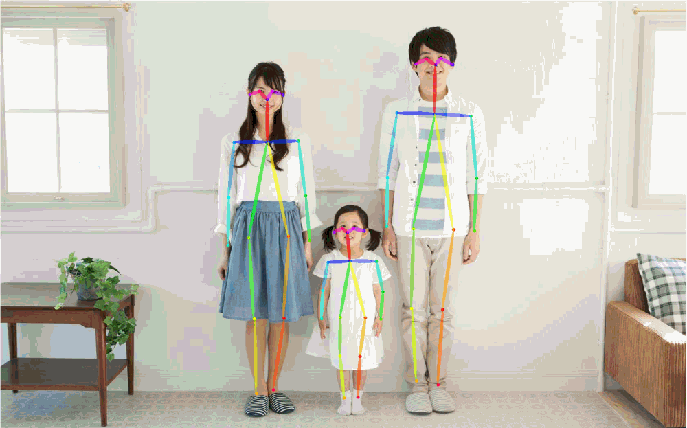
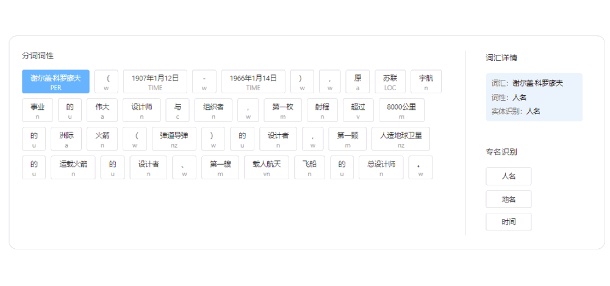

English | [简体中文](README_ch.md)

<p align="center">
 
<p align="center">
<div align="center">  
  <h3> <a href=#QuickStart> QuickStart </a> | <a href="https://paddlehub.readthedocs.io/en/release-v2.1"> Tutorial </a> | <a href="./modules"> Models List </a> | <a href="https://www.paddlepaddle.org.cn/hub"> Demos </a> </h3>
</div>

------------------------------------------------------------------------------------------

<p align="center">
    <a href="./LICENSE"></a>
    <a href="https://github.com/PaddlePaddle/PaddleHub/releases"></a>
    <a href=""></a>
    <a href=""></a>
    <a href=""></a>
</p>
<p align="center">
    <a href="https://github.com/PaddlePaddle/PaddleHub/graphs/contributors"></a>
    <a href="https://github.com/PaddlePaddle/PaddleHub/commits"></a>
    <a href="https://pypi.org/project/paddlehub/"></a>
    <a href="https://github.com/PaddlePaddle/PaddleHub/issues"></a>
    <a href="https://github.com/PaddlePaddle/PaddleHub/stargazers"></a>
    <a href="https://huggingface.co/PaddlePaddle"></a>
</p>


## Introduction and Features
- **PaddleHub** aims to provide developers with rich, high-quality, and directly usable pre-trained models.
- **Abundant Pre-trained Models**: 360+ pre-trained models cover the 6 major categories, including Wenxin large models, Image, Text, Audio, Video, and Industrial application. All of them are free for download and offline usage.
- **No Need for Deep Learning Background**: you can use AI models quickly and enjoy the dividends of the artificial intelligence era.
- **Quick Model Prediction**: model prediction can be realized through a few lines of scripts to quickly experience the model effect.
- **Model As Service**: one-line command to build deep learning model API service deployment capabilities.
- **Easy-to-use Transfer Learning**: few lines of codes to complete the transfer-learning task such as image classification and text classification based on high quality pre-trained models.
- **Cross-platform**: support Linux, Windows, MacOS and other operating systems.

### Recent updates
- **🔥2022.08.19:** The v2.3.0 version is released, supports Wenxin large models and five text-to-image models based on disco diffusion(dd).
  - Support [Wenxin large models API](https://wenxin.baidu.com/moduleApi) for Baidu ERNIE large-scale pre-trained model, including [**ERNIE-ViLG** model](https://aistudio.baidu.com/aistudio/projectdetail/4445016), which supports text-to-image task, and [**ERNIE 3.0 Zeus**](https://aistudio.baidu.com/aistudio/projectdetail/4445054) model, which supports applications such as writing essays, summarization, couplets, question answering, writing novels and completing text.
  - Add five text-to-image domain models based on disco diffusion(dd), three for [English](https://aistudio.baidu.com/aistudio/projectdetail/4444984) and two for Chinese. Welcome to enjoy our **ERNIE-ViL**-based Chinese text-to-image module [disco_diffusion_ernievil_base](https://aistudio.baidu.com/aistudio/projectdetail/4444998) in aistudio.
- **2022.02.18:** Added Huggingface Org, add spaces and models to the org: [PaddlePaddle Huggingface](https://huggingface.co/PaddlePaddle)
- **🔥2021.12.22**，The v2.2.0 version is released. [1]More than 100 new models released，including dialog, speech, segmentation, OCR, text processing, GANs, and many other categories. The total number of pre-trained models reaches [**【360】**](https://www.paddlepaddle.org.cn/hublist). [2]Add an [indexed file](./modules/README.md) including useful information of pretrained models supported by PaddleHub. [3]Refactor README of pretrained models.

- [【more】](./docs/docs_en/release.md)


## Visualization Demo [[More]](./docs/docs_en/visualization.md) [[ModelList]](./modules)


### **[Wenxin large models](https://www.paddlepaddle.org.cn/hubdetail?name=ernie_vilg&en_category=TextToImage)**
- Include ERNIE-ViL、ERNIE 3.0 Zeus, supports applications such as text-to-image, writing essays, summarization, couplets, question answering, writing novels and completing text.
<div align="center">

</div>

### **[Computer Vision (212 models)](./modules#Image)**
<div align="center">

</div>


- Many thanks to CopyRight@[PaddleOCR](https://github.com/PaddlePaddle/PaddleOCR)、[PaddleDetection](https://github.com/PaddlePaddle/PaddleDetection)、[PaddleGAN](https://github.com/PaddlePaddle/PaddleGAN)、[AnimeGAN](https://github.com/TachibanaYoshino/AnimeGANv2)、[openpose](https://github.com/CMU-Perceptual-Computing-Lab/openpose)、[PaddleSeg](https://github.com/PaddlePaddle/PaddleSeg)、[Zhengxia Zou](https://github.com/jiupinjia/SkyAR)、[PaddleClas](https://github.com/PaddlePaddle/PaddleClas) for the pre-trained models, you can try to train your models with them.


### **[Natural Language Processing (130 models)](./modules#Text)**
<div align="center">

</div>

- Many thanks to CopyRight@[ERNIE](https://github.com/PaddlePaddle/ERNIE)、[LAC](https://github.com/baidu/LAC)、[DDParser](https://github.com/baidu/DDParser)for the pre-trained models, you can try to train your models with them.


### [Speech (15 models)](./modules#Audio)
- ASR speech recognition algorithm, multiple algorithms are available.
- The speech recognition effect is as follows:
<div align="center">
<table>
    <thead>
        <tr>
            <th width=250> Input Audio  </th>
            <th width=550> Recognition Result  </th>
        </tr>
    </thead>
    <tbody>
        <tr>
            <td align = "center">
            <a href="https://paddlespeech.bj.bcebos.com/PaddleAudio/en.wav" rel="nofollow">
                    </a><br>
            </td>
            <td >I knocked at the door on the ancient side of the building.</td>
            </tr>
            <tr>
            <td align = "center">
            <a href="https://paddlespeech.bj.bcebos.com/PaddleAudio/zh.wav" rel="nofollow">
                    </a><br>
            </td>
            <td>我认为跑步最重要的就是给我带来了身体健康。</td>
        </tr>
    </tbody>
</table>
</div>

- TTS speech synthesis algorithm, multiple algorithms are available.
- Input: `Life was like a box of chocolates, you never know what you're gonna get.`
- The synthesis effect is as follows:
<div align="center">
<table>
    <thead>
    </thead>
    <tbody>
        <tr>
            <th>deepvoice3 </th>
            <th>fastspeech </th>
            <th>transformer</th>
        </tr>
        <tr>
            <th>
            <a href="https://paddlehub.bj.bcebos.com/resources/deepvoice3_ljspeech-0.wav">
            </a><br>
            </th>
            <th>
            <a href="https://paddlehub.bj.bcebos.com/resources/fastspeech_ljspeech-0.wav">
            </a><br>
            </th>
            <th>
            <a href="https://paddlehub.bj.bcebos.com/resources/transformer_tts_ljspeech-0.wav">
            </a><br>
            </th>
        </tr>
    </tbody>
</table>
</div>

- Many thanks to CopyRight@[PaddleSpeech](https://github.com/PaddlePaddle/PaddleSpeech) for the pre-trained models, you can try to train your models with PaddleSpeech.

### [Video (8 models)](./modules#Video)
- Short video classification trained via large-scale video datasets, supports 3000+ tag types prediction for short Form Videos.
- Many thanks to CopyRight@[PaddleVideo](https://github.com/PaddlePaddle/PaddleVideo) for the pre-trained model, you can try to train your models with PaddleVideo.
- `Example: Input a short video of swimming, the algorithm can output the result of "swimming"`
<div align="center">

</div>

## ===**Key Points**===
- All the above pre-trained models are all open source and free, and the number of models is continuously updated. Welcome **⭐Star⭐** to pay attention.
<div align="center">
<a href="https://github.com/PaddlePaddle/PaddleHub/stargazers">
    </a>  
</div>

<a name="Welcome_joinus"></a>

## Welcome to join PaddleHub technical group

If you have any questions during the use of the model, you can join the official WeChat group to get more efficient questions and answers, and fully communicate with developers from all walks of life. We look forward to your joining.
<div align="center">

</div>  
please add WeChat above and send "Hub" to the robot, the robot will invite you to join the group automatically.

<a name="QuickStart"></a>
## QuickStart

### The installation of required components.
```python
# install paddlepaddle with gpu
# !pip install --upgrade paddlepaddle-gpu

# or install paddlepaddle with cpu
!pip install --upgrade paddlepaddle

# install paddlehub
!pip install --upgrade paddlehub
```

### The simplest cases of Chinese word segmentation.

```python
import paddlehub as hub

lac = hub.Module(name="lac")
test_text = ["今天是个好天气。"]

results = lac.cut(text=test_text, use_gpu=False, batch_size=1, return_tag=True)
print(results)
#{'word': ['今天', '是', '个', '好天气', '。'], 'tag': ['TIME', 'v', 'q', 'n', 'w']}
```
### The simplest command of deploying lac service.
</div>

```python
!hub serving start -m lac
```

More model description, please refer [Models List](https://www.paddlepaddle.org.cn/hublist)

More API for transfer learning, please refer [Tutorial](https://paddlehub.readthedocs.io/en/release-v2.1/transfer_learning_index.html)

<a name="License"></a>
## License
The release of this project is certified by the <a href="./LICENSE">Apache 2.0 license</a>.

<a name="Contribution"></a>
## Contribution

<p align="center">
    <a href="https://github.com/nepeplwu"></a>
    <a href="https://github.com/Steffy-zxf"></a>
    <a href="https://github.com/ZeyuChen"></a>
    <a href="https://github.com/ShenYuhan"></a>
    <a href="https://github.com/kinghuin"></a>
    <a href="https://github.com/grasswolfs"></a>
    <a href="https://github.com/haoyuying"></a>
    <a href="https://github.com/sjtubinlong"></a>
    <a href="https://github.com/KPatr1ck"></a>
    <a href="https://github.com/jm12138"></a>
    <a href="https://github.com/DesmonDay"></a>
    <a href="https://github.com/chunzhang-hub"></a>
    <a href="https://github.com/rainyfly"></a>
    <a href="https://github.com/adaxiadaxi"></a>
    <a href="https://github.com/linjieccc"></a>
    <a href="https://github.com/linshuliang"></a>
    <a href="https://github.com/eepgxxy"></a>
    <a href="https://github.com/paopjian"></a>
    <a href="https://github.com/zbp-xxxp"></a>
    <a href="https://github.com/houj04"></a>
    <a href="https://github.com/Wgm-Inspur"></a>
    <a href="https://github.com/AK391"></a>
    <a href="https://github.com/apps/dependabot"></a>
    <a href="https://github.com/dxxxp"></a>
    <a href="https://github.com/jianganbai"></a>
    <a href="https://github.com/1084667371"></a>
    <a href="https://github.com/Channingss"></a>
    <a href="https://github.com/Austendeng"></a>
    <a href="https://github.com/BurrowsWang"></a>
    <a href="https://github.com/cqvu"></a>
    <a href="https://github.com/DeepGeGe"></a>
    <a href="https://github.com/Haijunlv"></a>
    <a href="https://github.com/holyseven"></a>
    <a href="https://github.com/MRXLT"></a>
    <a href="https://github.com/cclauss"></a>
    <a href="https://github.com/hu-qi"></a>
    <a href="https://github.com/itegel"></a>
    <a href="https://github.com/jayhenry"></a>
    <a href="https://github.com/hlmu"></a>
    <a href="https://github.com/shinichiye"></a>
    <a href="https://github.com/will-jl944"></a>
    <a href="https://github.com/yma-admin"></a>
    <a href="https://github.com/zl1271"></a>
    <a href="https://github.com/brooklet"></a>
    <a href="https://github.com/wj-Mcat"></a>
</p>

We welcome you to contribute code to PaddleHub, and thank you for your feedback.

* Many thanks to [肖培楷](https://github.com/jm12138), Contributed to street scene cartoonization, portrait cartoonization, gesture key point recognition, sky replacement, depth estimation, portrait segmentation and other modules
* Many thanks to [Austendeng](https://github.com/Austendeng) for fixing the SequenceLabelReader
* Many thanks to [cclauss](https://github.com/cclauss) optimizing travis-ci check
* Many thanks to [奇想天外](http://www.cheerthink.com/)，Contributed a demo of mask detection
* Many thanks to [mhlwsk](https://github.com/mhlwsk)，Contributed the repair sequence annotation prediction demo
* Many thanks to [zbp-xxxp](https://github.com/zbp-xxxp)，Contributed modules for viewing pictures and writing poems
* Many thanks to [zbp-xxxp](https://github.com/zbp-xxxp) and [七年期限](https://github.com/1084667371),Jointly contributed to the Mid-Autumn Festival Special Edition Module
* Many thanks to [livingbody](https://github.com/livingbody)，Contributed models for style transfer based on PaddleHub's capabilities and Mid-Autumn Festival WeChat Mini Program
* Many thanks to [BurrowsWang](https://github.com/BurrowsWang) for fixing Markdown table display problem
* Many thanks to [huqi](https://github.com/hu-qi) for fixing readme typo
* Many thanks to [parano](https://github.com/parano) [cqvu](https://github.com/cqvu) [deehrlic](https://github.com/deehrlic) for contributing this feature in PaddleHub
* Many thanks to [paopjian](https://github.com/paopjian) for correcting the wrong website address [#1424](https://github.com/PaddlePaddle/PaddleHub/issues/1424)
* Many thanks to [Wgm-Inspur](https://github.com/Wgm-Inspur) for correcting the demo errors in readme, and updating the RNN illustration in the text classification and sequence labeling demo
* Many thanks to [zl1271](https://github.com/zl1271) for fixing serving docs typo
* Many thanks to [AK391](https://github.com/AK391) for adding the webdemo of UGATIT and deoldify models in Hugging Face spaces
* Many thanks to [itegel](https://github.com/itegel) for fixing quick start docs typo
* Many thanks to [AK391](https://github.com/AK391) for adding the webdemo of Photo2Cartoon model in Hugging Face spaces
