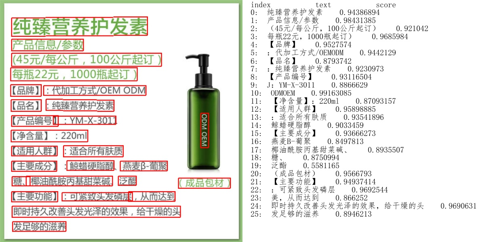
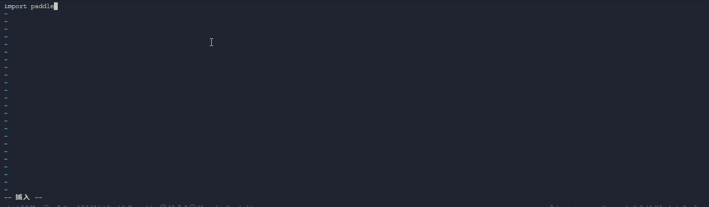

<p align="center">
 

[](https://travis-ci.org/PaddlePaddle/PaddleHub)
[](LICENSE)
[](https://github.com/PaddlePaddle/PaddleHub/releases)


## 简介
PaddleHub是飞桨生态的预训练模型应用工具，开发者可以便捷地使用高质量的预训练模型结合Fine-tune API快速完成模型迁移到部署的全流程工作。PaddleHub提供的预训练模型涵盖了图像分类、目标检测、词法分析、语义模型、情感分析、视频分类、图像生成、图像分割、文本审核、关键点检测等主流模型。更多详情可查看官网：https://www.paddlepaddle.org.cn/hub

## 特性
- **模型即软件**：通过Python API或命令行实现模型调用，可快速体验或集成飞桨特色预训练模型。[-> 效果展示](#模型即软件)
- **易用的迁移学习**：通过Fine-tune API，只需少量代码即可完成预训练模型的Fine-tuning。[-> 效果展示](#易用的迁移学习)
- **一键模型转服务**：简单一行命令即可搭建属于自己的深度学习模型API服务完成部署。[-> 效果展示](#一键模型转服务)


## 文档教程 [[readthedocs]](https://paddlehub.readthedocs.io/zh_CN/develop/index.html)

- [概述](./docs/overview.md)
- [PIP安装](./docs/installation.md)
- [快速体验](./docs/quickstart.md)
- [丰富的预训练模型](./docs/pretrained_models.md)
    - [飞桨优势特色模型](./docs/pretrained_models.md)
    - [计算机视觉](./docs/pretrained_models.md)
      - [图像分类](./docs/pretrained_models.md)
      - [目标检测](./docs/pretrained_models.md)
      - [图像分割](./docs/pretrained_models.md)
      - [关键点检测](./docs/pretrained_models.md)
      - [图像生成](./docs/pretrained_models.md)
    - [自然语言处理](./docs/pretrained_models.md)
      - [中文词法分析与词向量](./docs/pretrained_models.md)
      - [情感分析](./docs/pretrained_models.md)
      - [文本相似度计算](./docs/pretrained_models.md)
      - [文本生成](./docs/pretrained_models.md)
      - [语义表示](./docs/pretrained_models.md)
    - [视频](./docs/pretrained_models.md)
- 使用教程
    - [命令行工具](./docs/tutorial/cmdintro.md)
    - [自定义数据](./docs/tutorial/how_to_load_data.md)
    - [服务化部署](./docs/tutorial/serving.md)
- 进阶指南
    - [文本Embedding服务](./docs/tutorial/bert_service.md)
    - [语义相似度计算](./docs/tutorial/sentence_sim.md)
- API
    - [hub.datasets](./docs/reference/datasets.md)
    - [hub.finetune](./docs/reference/finetune.md)
    - [hub.Module](./docs/reference/module.md)
    - [hub.vision.transforms](./docs/reference/vision.md)
- [FAQ](./docs/faq.md)  
- 社区交流
    - [加入技术交流群](#欢迎加入PaddleHub技术交流群)
    - [贡献预训练模型](./docs/contribution/contri_pretrained_model.md)
    - [贡献代码](./docs/contribution/contri_pr.md)
- [更新历史](./docs/release.md)
- [许可证书](#许可证书)
- [致谢](#致谢)

## 效果展示

<a name="模型即软件"></a>
### 1、模型即软件

PaddleHub采用模型即软件的设计理念，所有的预训练模型与Python软件包类似，具备版本的概念，通过`hub install/uninstall` 可以便捷完成模型的升级和卸载。还可以通过Python的API或命令行实现快速预测的软件集成，更方便地应用和集成深度学习模型。

安装PaddleHub后，执行命令[hub run](./docs/tutorial/cmdintro.md)，即可快速体验无需代码、一键预测的功能：

* 使用[文字识别](https://www.paddlepaddle.org.cn/hublist?filter=en_category&value=TextRecognition)轻量级中文OCR模型chinese_ocr_db_crnn_mobile即可一键快速识别图片中的文字。
```shell
$ wget https://paddlehub.bj.bcebos.com/model/image/ocr/test_ocr.jpg
$ hub run chinese_ocr_db_crnn_mobile --input_path test_ocr.jpg --visualization=True
```

预测结果图片保存在当前运行路径下ocr_result文件夹中，如下图所示。

<p align="center">
 

* 使用[目标检测](https://www.paddlepaddle.org.cn/hublist?filter=en_category&value=ObjectDetection)模型pyramidbox_lite_mobile_mask对图片进行口罩检测
```shell
$ wget https://paddlehub.bj.bcebos.com/resources/test_mask_detection.jpg
$ hub run pyramidbox_lite_mobile_mask --input_path test_mask_detection.jpg
```
<p align="center">
 

* 使用[词法分析](https://www.paddlepaddle.org.cn/hublist?filter=en_category&value=LexicalAnalysis)模型LAC进行分词
```shell
$ hub run lac --input_text "现在，慕尼黑再保险公司不仅是此类行动的倡议者，更是将其大量气候数据整合进保险产品中，并与公众共享大量天气信息，参与到新能源领域的保障中。"
[{
    'word': ['现在', '，', '慕尼黑再保险公司', '不仅', '是', '此类', '行动', '的', '倡议者', '，', '更是', '将', '其', '大量', '气候', '数据', '整合', '进', '保险', '产品', '中', '，', '并', '与', '公众', '共享', '大量', '天气', '信息', '，', '参与', '到', '新能源', '领域', '的', '保障', '中', '。'],
    'tag':  ['TIME', 'w', 'ORG', 'c', 'v', 'r', 'n', 'u', 'n', 'w', 'd', 'p', 'r', 'a', 'n', 'n', 'v', 'v', 'n', 'n', 'f', 'w', 'c', 'p', 'n', 'v', 'a', 'n', 'n', 'w', 'v', 'v', 'n', 'n', 'u', 'vn', 'f', 'w']
}]
```

PaddleHub还提供图像分类、语义模型、视频分类、图像生成、图像分割、文本审核、关键点检测等主流模型，更多模型介绍，请前往[预训练模型介绍](./docs/pretrained_models.md)或者PaddleHub官网[https://www.paddlepaddle.org.cn/hub](https://www.paddlepaddle.org.cn/hub) 查看

<a name="易用的迁移学习"></a>

### 2、易用的迁移学习

通过Fine-tune API，只需要少量代码即可完成深度学习模型在计算机视觉场景下的迁移学习。

* [Demo示例](./demo)提供丰富的Fine-tune API的使用代码，包括[图像分类](./demo/image_classification)、[图像着色](./demo/colorization)、[风格迁移](./demo/style_transfer)、等场景的模型迁移示例。

<p align="center">
 

<p align='center'>
 十行代码完成ERNIE工业级文本分类
</p>

* 如需在线快速体验，请点击[PaddleHub教程合集](https://aistudio.baidu.com/aistudio/projectdetail/231146)，可使用AI Studio平台提供的GPU算力进行快速尝试。

<a name="一键模型转服务"></a>
### 3、一键模型转服务

PaddleHub提供便捷的模型转服务的能力，只需简单一行命令即可完成模型的HTTP服务部署。通过以下命令即可快速启动LAC词法分析服务：

```shell
$ hub serving start --modules lac
```

更多关于模型服务化使用说明参见[PaddleHub模型一键服务化部署](./docs/tutorial/serving.md)。

## FAQ

**Q:** 利用PaddleHub Fine-tune如何适配自定义数据集？

**A:** 参考[PaddleHub使用自定义数据集完成Fine-tune](./docs/tutorial/how_to_load_data.md)


**Q:** 使用PaddleHub时，无法下载预置数据集、Module的等现象。

**A:** 下载数据集、module等，PaddleHub要求机器可以访问外网。可以使用server_check()可以检查本地与远端PaddleHub-Server的连接状态，使用方法如下：

```python
import paddlehub
paddlehub.server_check()
# 如果可以连接远端PaddleHub-Server，则显示Request Hub-Server successfully。
# 如果无法连接远端PaddleHub-Server，则显示Request Hub-Server unsuccessfully。
```

**[More](./docs/faq.md)**

当您安装或者使用遇到问题时，如果在FAQ中没有找到解决方案，欢迎您将问题以[Github Issues](https://github.com/PaddlePaddle/PaddleHub/issues)的形式提交给我们，我们会第一时间进行跟进。

<a name="欢迎加入PaddleHub技术交流群"></a>
## 微信扫描二维码，欢迎加入PaddleHub技术交流群

<div align="center">

</div>  
如扫码失败，请添加微信15711058002，并备注“Hub”，运营同学会邀请您入群。  

<a name="许可证书"></a>
## 许可证书
本项目的发布受<a href="https://github.com/PaddlePaddle/PaddleOCR/blob/master/LICENSE">Apache 2.0 license</a>许可认证。

<a name="致谢"></a>
## 致谢
我们非常欢迎您为PaddleHub贡献代码，也十分感谢您的反馈。

* 非常感谢[Austendeng](https://github.com/Austendeng)贡献了修复SequenceLabelReader的pr
* 非常感谢[cclauss](https://github.com/cclauss)贡献了优化travis-ci检查的pr
* 非常感谢[奇想天外](http://www.cheerthink.com/)贡献了口罩检测的demo
* 非常感谢[mhlwsk](https://github.com/mhlwsk)贡献了修复序列标注预测demo的pr
* 非常感谢[zbp-xxxp](https://github.com/zbp-xxxp)贡献了看图作诗的module
* 非常感谢[zbp-xxxp](https://github.com/zbp-xxxp)和[七年期限](https://github.com/1084667371)联合贡献了看图写诗中秋特别版module
* 非常感谢[livingbody](https://github.com/livingbody)贡献了基于PaddleHub能力的风格迁移和中秋看图写诗微信小程序
