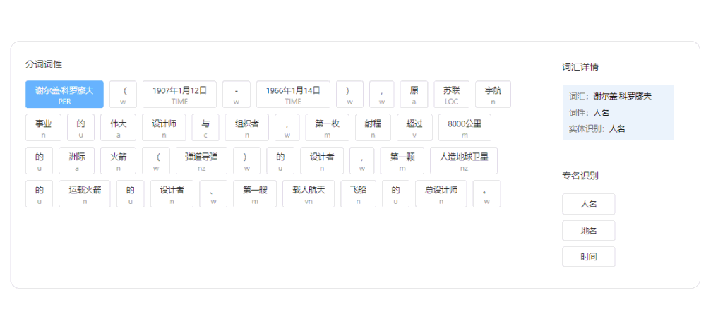

简体中文 | [English](README.md)

<p align="center">
 
<p align="center">
<div align="center">  
  <h3> <a href=#QuickStart> 快速开始 </a> | <a href="https://paddlehub.readthedocs.io/zh_CN/release-v2.1//"> 教程文档 </a> | <a href="https://www.paddlepaddle.org.cn/hublist"> 模型搜索 </a> | <a href="https://www.paddlepaddle.org.cn/hub"> 演示Demo </a>
  </h3>
</div>

------------------------------------------------------------------------------------------

<p align="center">
    <a href="./LICENSE"></a>
    <a href="https://github.com/PaddlePaddle/PaddleHub/releases"></a>
    <a href=""></a>
    <a href=""></a>
    <a href=""></a>
</p>
<p align="center">
    <a href="https://github.com/PaddlePaddle/PaddleHub/graphs/contributors"></a>
    <a href="https://github.com/PaddlePaddle/PaddleHub/commits"></a>
    <a href="https://pypi.org/project/paddlehub/"></a>
    <a href="https://github.com/PaddlePaddle/PaddleHub/issues"></a>
    <a href="https://github.com/PaddlePaddle/PaddleHub/stargazers"></a>
</p>


## 简介与特性
- PaddleHub旨在为开发者提供丰富的、高质量的、直接可用的预训练模型
- **【模型种类丰富】**: 涵盖CV、NLP、Audio、Video、工业应用主流五大品类的 350+ 预训练模型，全部开源下载，离线可运行
- **【超低使用门槛】**：无需深度学习背景、无需数据与训练过程，可快速使用AI模型
- **【一键模型快速预测】**：通过一行命令行或者极简的Python API实现模型调用，可快速体验模型效果
- **【一键模型转服务化】**：一行命令，搭建深度学习模型API服务化部署能力
- **【十行代码迁移学习】**：十行代码完成图片分类、文本分类的迁移学习任务
- **【跨平台兼容性】**：可运行于Linux、Windows、MacOS等多种操作系统

## 近期更新
- **2021.05.12**，新增轻量级中文对话模型[plato-mini](https://www.paddlepaddle.org.cn/hubdetail?name=plato-mini&en_category=TextGeneration)，可以配合使用wechaty实现微信闲聊机器人，[参考demo](https://github.com/KPatr1ck/paddlehub-wechaty-demo)
- **2021.04.27**，发布v2.1.0版本。【1】新增基于VOC数据集的高精度语义分割模型2个，语音分类模型3个。【2】新增图像语义分割、文本语义匹配、语音分类等相关任务的Fine-Tune能力以及相关任务数据集;完善部署能力：【3】新增ONNX和PaddleInference等模型格式的导出功能。【4】新增[BentoML](https://github.com/bentoml/BentoML) 云原生服务化部署能力，可以支持统一的多框架模型管理和模型部署的工作流，[详细教程](https://github.com/PaddlePaddle/PaddleHub/blob/release/v2.1/demo/serving/bentoml/cloud-native-model-serving-with-bentoml.ipynb). 更多内容可以参考BentoML 最新 v0.12.1 [Releasenote](https://github.com/bentoml/BentoML/releases/tag/v0.12.1).（感谢@[parano](https://github.com/parano) @[cqvu](https://github.com/cqvu) @[deehrlic](https://github.com/deehrlic)）的贡献与支持。【5】预训练模型总量达到[**【300】**](https://www.paddlepaddle.org.cn/hublist)个。
- **2021.02.18**，发布v2.0.0版本，【1】模型开发调试更简单，finetune接口更加灵活易用。视觉类任务迁移学习能力全面升级，支持[图像分类](./demo/image_classification/README.md)、[图像着色](./demo/colorization/README.md)、[风格迁移](./demo/style_transfer/README.md)等多种任务；BERT、ERNIE、RoBERTa等Transformer类模型升级至动态图，支持[文本分类](./demo/text_classification/README.md)、[序列标注](./demo/sequence_labeling/README.md)的Fine-Tune能力；【2】优化服务化部署Serving能力，支持多卡预测、自动负载均衡，性能大幅度提升；【3】新增自动数据增强能力[Auto Augment](./demo/autoaug/README.md)，能高效地搜索适合数据集的数据增强策略组合。【4】新增[词向量模型](./modules/text/embedding)61个，其中包含中文模型51个，英文模型10个；新增[图像分割](./modules/thirdparty/image/semantic_segmentation)模型4个、[深度模型](./modules/thirdparty/image/depth_estimation)2个、[图像生成](./modules/thirdparty/image/Image_gan/style_transfer)模型7个、[文本生成](./modules/thirdparty/text/text_generation)模型3个。【5】预训练模型总量达到[**【274】**](https://www.paddlepaddle.org.cn/hublist) 个。
- [More](./docs/docs_ch/release.md)


## **精品模型效果展示[【更多】](./docs/docs_ch/visualization.md)**

### **图像类（161个）**
- 包括图像分类、人脸检测、口罩检测、车辆检测、人脸/人体/手部关键点检测、人像分割、80+语言文本识别、图像超分/上色/动漫化等
<div align="center">

</div>

- 感谢CopyRight@[PaddleOCR](https://github.com/PaddlePaddle/PaddleOCR)、[PaddleDetection](https://github.com/PaddlePaddle/PaddleDetection)、[PaddleGAN](https://github.com/PaddlePaddle/PaddleGAN)、[AnimeGAN](https://github.com/TachibanaYoshino/AnimeGANv2)、[openpose](https://github.com/CMU-Perceptual-Computing-Lab/openpose)、[PaddleSeg](https://github.com/PaddlePaddle/PaddleSeg)、[Zhengxia Zou](https://github.com/jiupinjia/SkyAR)、[PaddleClas](https://github.com/PaddlePaddle/PaddleClas) 提供相关预训练模型，训练能力开放，欢迎体验。


### **文本类（129个）**
- 包括中文分词、词性标注与命名实体识别、句法分析、AI写诗/对联/情话/藏头诗、中文的评论情感分析、中文色情文本审核等
<div align="center">

</div>

- 感谢CopyRight@[ERNIE](https://github.com/PaddlePaddle/ERNIE)、[LAC](https://github.com/baidu/LAC)、[DDParser](https://github.com/baidu/DDParser)提供相关预训练模型，训练能力开放，欢迎体验。


### **语音类（3个）**
- TTS语音合成算法，多种算法可选
- 感谢CopyRight@[Parakeet](https://github.com/PaddlePaddle/Parakeet)提供预训练模型，训练能力开放，欢迎体验。
- 输入：`Life was like a box of chocolates, you never know what you're gonna get.`
- 合成效果如下:
<div align="center">
<table>
    <thead>
    </thead>
    <tbody>
        <tr>
            <th>deepvoice3 </th>
            <th>fastspeech </th>
            <th>transformer</th>
        </tr>
        <tr>
            <th>
            <a href="https://paddlehub.bj.bcebos.com/resources/deepvoice3_ljspeech-0.wav">
            </a><br>
            </th>
            <th>
            <a href="https://paddlehub.bj.bcebos.com/resources/fastspeech_ljspeech-0.wav">
            </a><br>
            </th>
            <th>
            <a href="https://paddlehub.bj.bcebos.com/resources/transformer_tts_ljspeech-0.wav">
            </a><br>
            </th>
        </tr>
    </tbody>
</table>
</div>

### **视频类（8个）**
- 包含短视频分类，支持3000+标签种类，可输出TOP-K标签，多种算法可选。
- 感谢CopyRight@[PaddleVideo](https://github.com/PaddlePaddle/PaddleVideo)提供预训练模型，训练能力开放，欢迎体验。
- `举例：输入一段游泳的短视频，算法可以输出"游泳"结果`
<div align="center">

</div>


##  ===划重点===
- 以上所有预训练模型全部开源，模型数量持续更新，欢迎**⭐Star⭐**关注。
<div align="center">
<a href="https://github.com/PaddlePaddle/PaddleHub/stargazers">
            </a>  
</div>

<a name="欢迎加入PaddleHub技术交流群"></a>
## 欢迎加入PaddleHub技术交流群
- 在使用模型过程中有任何问题，可以加入官方微信群，获得更高效的问题答疑，与各行各业开发者充分交流，期待您的加入。
<div align="center">

</div>  
扫码备注"Hub"加好友之后，再发送“Hub”，会自动邀请您入群。  

<div id="QuickStart">


## 快速开始

[【零基础windows安装并实现图像风格迁移】](./docs/docs_ch/get_start/windows_quickstart.md)

[【零基础mac安装并实现图像风格迁移】](./docs/docs_ch/get_start/mac_quickstart.md)

[【零基础linux安装并实现图像风格迁移】](./docs/docs_ch/get_start/linux_quickstart.md)

### 快速安装相关组件
</div>

```python
!pip install --upgrade paddlepaddle -i https://mirror.baidu.com/pypi/simple
!pip install --upgrade paddlehub -i https://mirror.baidu.com/pypi/simple
```

### 极简中文分词案例  
</div>

```python
import paddlehub as hub

lac = hub.Module(name="lac")
test_text = ["今天是个好天气。"]

results = lac.cut(text=test_text, use_gpu=False, batch_size=1, return_tag=True)
print(results)
#{'word': ['今天', '是', '个', '好天气', '。'], 'tag': ['TIME', 'v', 'q', 'n', 'w']}
```

### 一行代码部署lac（词法分析）模型
</div>

```python
!hub serving start -m lac
```

 欢迎用户通过[模型搜索](https://www.paddlepaddle.org.cn/hublist)发现更多实用的预训练模型！

 更多迁移学习能力可以参考[教程文档](https://paddlehub.readthedocs.io/zh_CN/release-v2.1/transfer_learning_index.html)


<a name="许可证书"></a>
## 许可证书
本项目的发布受<a href="./LICENSE">Apache 2.0 license</a>许可认证。

<a name="致谢"></a>
## 致谢开发者

<p align="center">
    <a href="https://github.com/nepeplwu"></a>
    <a href="https://github.com/Steffy-zxf"></a>
    <a href="https://github.com/ZeyuChen"></a>
    <a href="https://github.com/ShenYuhan"></a>
    <a href="https://github.com/kinghuin"></a>
    <a href="https://github.com/grasswolfs"></a>
    <a href="https://github.com/haoyuying"></a>
    <a href="https://github.com/sjtubinlong"></a>
    <a href="https://github.com/KPatr1ck"></a>
    <a href="https://github.com/jm12138"></a>
    <a href="https://github.com/DesmonDay"></a>
    <a href="https://github.com/chunzhang-hub"></a>
    <a href="https://github.com/rainyfly"></a>
    <a href="https://github.com/adaxiadaxi"></a>
    <a href="https://github.com/linjieccc"></a>
    <a href="https://github.com/linshuliang"></a>
    <a href="https://github.com/eepgxxy"></a>
    <a href="https://github.com/paopjian"></a>
    <a href="https://github.com/zbp-xxxp"></a>
    <a href="https://github.com/houj04"></a>
    <a href="https://github.com/Wgm-Inspur"></a>
    <a href="https://github.com/AK391"></a>
    <a href="https://github.com/apps/dependabot"></a>
    <a href="https://github.com/dxxxp"></a>
    <a href="https://github.com/jianganbai"></a>
    <a href="https://github.com/1084667371"></a>
    <a href="https://github.com/Channingss"></a>
    <a href="https://github.com/Austendeng"></a>
    <a href="https://github.com/BurrowsWang"></a>
    <a href="https://github.com/cqvu"></a>
    <a href="https://github.com/DeepGeGe"></a>
    <a href="https://github.com/Haijunlv"></a>
    <a href="https://github.com/holyseven"></a>
    <a href="https://github.com/MRXLT"></a>
    <a href="https://github.com/cclauss"></a>
    <a href="https://github.com/hu-qi"></a>
    <a href="https://github.com/itegel"></a>
    <a href="https://github.com/jayhenry"></a>
    <a href="https://github.com/hlmu"></a>
    <a href="https://github.com/shinichiye"></a>
    <a href="https://github.com/will-jl944"></a>
    <a href="https://github.com/yma-admin"></a>
    <a href="https://github.com/zl1271"></a>
    <a href="https://github.com/brooklet"></a>
    <a href="https://github.com/wj-Mcat"></a>
</p>

我们非常欢迎您为PaddleHub贡献代码，也十分感谢您的反馈。

* 非常感谢[肖培楷](https://github.com/jm12138)贡献了街景动漫化，人像动漫化、手势关键点识别、天空置换、深度估计、人像分割等module
* 非常感谢[Austendeng](https://github.com/Austendeng)贡献了修复SequenceLabelReader的pr
* 非常感谢[cclauss](https://github.com/cclauss)贡献了优化travis-ci检查的pr
* 非常感谢[奇想天外](http://www.cheerthink.com/)贡献了口罩检测的demo
* 非常感谢[mhlwsk](https://github.com/mhlwsk)贡献了修复序列标注预测demo的pr
* 非常感谢[zbp-xxxp](https://github.com/zbp-xxxp)和[七年期限](https://github.com/1084667371)联合贡献了看图写诗中秋特别版module、谣言预测、请假条生成等module
* 非常感谢[livingbody](https://github.com/livingbody)贡献了基于PaddleHub能力的风格迁移和中秋看图写诗微信小程序
* 非常感谢[BurrowsWang](https://github.com/BurrowsWang)修复Markdown表格显示问题
* 非常感谢[huqi](https://github.com/hu-qi)修复了readme中的错别字
* 非常感谢[parano](https://github.com/parano)、[cqvu](https://github.com/cqvu)、[deehrlic](https://github.com/deehrlic)三位的贡献与支持
* 非常感谢[paopjian](https://github.com/paopjian)修改了中文readme模型搜索指向的的网站地址错误[#1424](https://github.com/PaddlePaddle/PaddleHub/issues/1424)
* 非常感谢[Wgm-Inspur](https://github.com/Wgm-Inspur)修复了readme中的代码示例问题，并优化了文本分类、序列标注demo中的RNN示例图
* 非常感谢[zl1271](https://github.com/zl1271)修复了serving文档中的错别字
* 非常感谢[AK391](https://github.com/AK391)在Hugging Face spaces中添加了UGATIT和deoldify模型的web demo
* 非常感谢[itegel](https://github.com/itegel)修复了快速开始文档中的错别字
* 非常感谢[AK391](https://github.com/AK391)在Hugging Face spaces中添加了Photo2Cartoon模型的web demo
