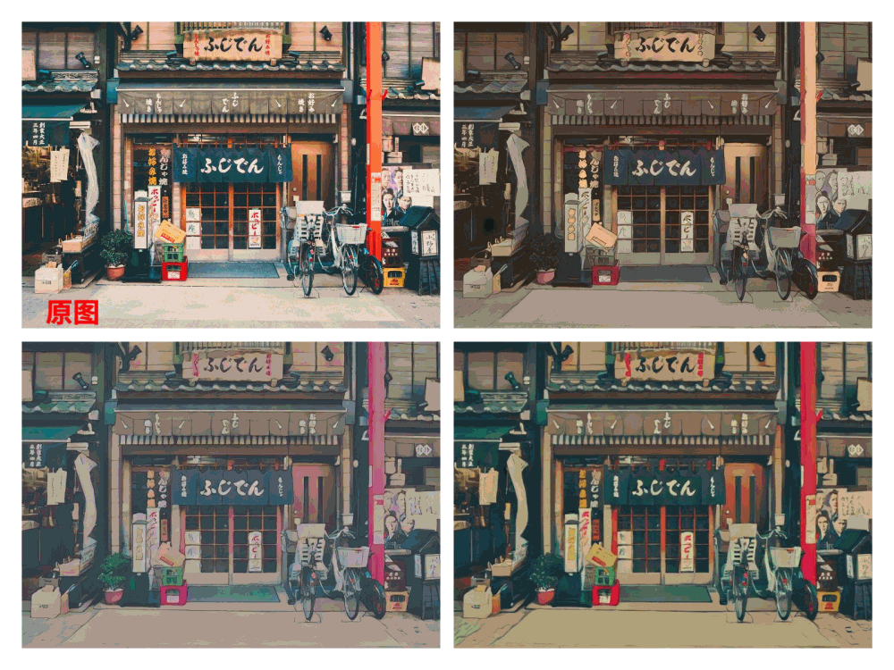

 

------------------------------------------------------------------------------------------

## Introduction
- PaddleHub aims to provide developers with rich, high-quality, and directly usable pre-trained models.
- **【No need for deep learning background, no data and training process】**，you can use AI models quickly and enjoy the dividends of the artificial intelligence era.
- Covers the four major categories of CV, NLP, Audio, and Video, and supports **one-click prediction**, **one-click service deployment** and **migration learning**
- All models are open source download, **offline can run**.

**Recent updates**
- 2020.11.20: Release 2.0-beta version, fully migrate the dynamic graph programming mode, and upgrade the service deployment Serving capability; add 1 hand key detection model, 12 image animation models, 3 image editing models, 3 speech synthesis models, syntax Analyzing one, the total number of pre-trained models reaches **【182】**.
- 2020.10.09: Added 4 new OCR multi-language series models, 4 image editing models, and the total number of pre-trained models reached **【162】**.
- 2020.09.27: 6 new text generation models and 1 image segmentation model were added, and the total number of pre-trained models reached **【154】**.
- 2020.08.13: Released v1.8.1, added a segmentation model, and supports EMNLP2019-Sentence-BERT as a text matching task network. The total number of pre-training models reaches **【147】**.
- 2020.07.29: Release v1.8.0, new AI couplets and AI writing poems, jieba word cutting, text data LDA, semantic similarity calculation, new target detection, short video classification model, ultra-lightweight Chinese and English OCR, new pedestrian detection, vehicle Industrial-grade models such as detection and animal recognition support VisualDL visualization training, and the total number of pre-training models reaches **【135】**.

## Features
- **【Abundant pre-trained models】**: 180+ pre-trained models covering the four major categories of CV, NLP, Audio, and Video, all open source downloads, and can be run offline.
- **【Quick model prediction】**: Model calls can be realized through a one-line command line or a minimalist Python API to quickly experience the model effect.
- **【Model to Servicing】**: A one-line command to build deep learning model API service deployment capabilities.
- **【Ten lines of code for transfer-learning】**: Ten lines of code complete the transfer-learning task of image classification and text classification
- **【PIP installation is convenient】**: Support PIP quick installation and use
- **【Cross-platform compatibility】**: Can run on Linux, Windows, MacOS and other operating systems

## Show results
### Text recognition
- Contains ultra-lightweight Chinese and English OCR models, high-precision Chinese and English, multilingual German, French, Japanese, Korean OCR recognition.

### Face Detection
- Including face detection, mask face detection, multiple algorithms are optional.

### Image editing
- 4 times the super-score effect, multiple super-score algorithms are optional.
- Coloring black and white pictures can be used to repair old photos.

<table>
    <thead>
    </thead>
    <tbody>
        <tr>
            <th>SuperResolution </th>
            <th>Restoration </th>
        </tr>
        <tr>
            <th>
             
            </th>
            <th>
             
            </th>
        </tr>
    </tbody>
</table>

### Object Detection
- Including pedestrian detection, vehicle detection, and more industrial-grade ultra-large-scale pre-training models are optional.

### Key point detection
- Including single person, multi-person body key point detection, face key point detection, hand key point detection.

### Image segmentation
- Contains excellent portrait cutout model, ACE2P human body analysis world champion model

### Image animation
- Many cartoonists including Hayao Miyazaki and Makoto Shinkai are migrating their styles, and a variety of algorithms are available

### Image Classification
- Including animal classification, dish classification, wild animal product classification, multiple algorithms are available

### lexical analysis
- Including AI poem writing, AI couplets, AI love words, AI hidden poems, multiple algorithms are available.

### Syntax analysis
- Leading Chinese syntactic analysis model.

### Sementic analysis
- Support Chinese comment sentiment analysis

### Text review
- Contains the review of Chinese pornographic text, and multiple algorithms are available.

### Speech synthesis
- TTS speech synthesis algorithm, multiple algorithms are available
- Input: `Life was like a box of chocolates, you never know what you're gonna get.`
- The synthesis effect is as follows:

<table>
    <thead>
    </thead>
    <tbody>
        <tr>
            <th>deepvoice3 </th>
            <th>fastspeech </th>
            <th>transformer</th>
        </tr>
        <tr>
            <th>
             
            </th>
            <th>
             
            </th>
            <th>
             
            </th>
        </tr>
    </tbody>
</table>

### Video classification
- Contains short video classification, supports 3000+ tag types, can output TOP-K tags, and multiple algorithms are optional.
- `Example: Input a short video of swimming, the algorithm can output the result of "swimming"`

## ===Key Points===
-All the above pre-trained models are all open source, and the number of models is continuously updated. Welcome Star to pay attention.

  

## Welcome to join PaddleHub technical group
- If you have any questions during the use of the model, you can join the official WeChat group to get more efficient questions and answers, and fully communicate with developers from all walks of life. We look forward to your joining.

  
If you fail to scan the code, please add WeChat 15711058002 and note "Hub", the operating class will invite you to join the group.

## Documentation Tutorial
- [PIP Installation](./docs/docs_en/installation_en.md)
- Quick Start
    - [Command Line](./docs/docs_en/quick_experience/cmd_quick_run_en.md)
    - [Python API](./docs/docs_en/quick_experience/python_use_hub_en.md)
    - [More_demos](./docs/docs_en/quick_experience/more_demos_en.md)
- Rich pre-trained models 182
    - [Boutique Featured Models](./docs/docs_en/figures_en.md)
    - Computer vision 126
      - [Image classification 64 ](./modules/image/classification/README_en.md)
      - [Object Detection 13 ](./modules/image/object_detection/README_en.md)
      - [Face Detection 7 ](./modules/image/face_detection/README_en.md)  
      - [Key point detection 3 ](./modules/image/keypoint_detection/README_en.md)
      - [Image segmentation 7 ](./modules/image/semantic_segmentation/README_en.md)
      - [Text recognition 8 ](./modules/image/text_recognition/README_en.md)
      - [Image generation 17 ](./modules/image/Image_gan/README_en.md)
      - [Image editing 7 ](./modules/image/Image_editing/README_en.md)
    - Natural language processing 48
      - [lexical analysis 2 ](./modules/text/lexical_analysis/README_en.md)
      - [Syntax analysis 1 ](./modules/text/syntactic_analysis/README_en.md)
      - [emotion analysis 7 ](./modules/text/sentiment_analysis/README_en.md)
      - [Text review 3 ](./modules/text/text_review/README_en.md)
      - [Text generation 9 ](./modules/text/text_generation/README_en.md)
      - [Semantic models 26 ](./modules/text/language_model/README_en.md)
    - Audio 3
      - [Speech synthesis 3 ](./modules/audio/README_en.md)
    - Video 5
      - [Video classification 5 ](./modules/video/README_en.md)
- Deploy
    - [Local Inference deployment](./docs/docs_en/quick_experience/python_use_hub_en.md)
    - [One line of code service deployment](./docs/docs_en/tutorial/serving_en.md)
    - [Mobile Lite deployment (Jump Lite tutorial)](https://paddle-lite.readthedocs.io/zh/latest/quick_start/tutorial.html)
- Advanced documentation
    - [cmdintro](./docs/docs_en/tutorial/cmdintro_en.md)
    - [how to load data](./docs/docs_en/tutorial/how_to_load_data_en.md)
- Community
    - [Join the technical group](#Welcome_joinus)
    - [Contribute pre-trained models](./docs/docs_en/contribution/contri_pretrained_model_en.md)
    - [Contribute code](./docs/docs_en/contribution/contri_pr_en.md)
- [License](#License)
- [Contribution](#Contribution)

## License
The release of this project is certified by the <a href="./LICENSE">Apache 2.0 license</a>.

## Contribution
We welcome you to contribute code to PaddleHub, and thank you for your feedback.

* Many thanks to [Austendeng](https://github.com/Austendeng) for fixing the SequenceLabelReader
* Many thanks to [cclauss](https://github.com/cclauss) optimizing travis-ci check
* Many thanks to [奇想天外](http://www.cheerthink.com/)，Contributed a demo of mask detection
* Many thanks to [mhlwsk](https://github.com/mhlwsk)，Contributed the repair sequence annotation prediction demo
* Many thanks to [zbp-xxxp](https://github.com/zbp-xxxp)，Contributed modules for viewing pictures and writing poems
* Many thanks to [zbp-xxxp](https://github.com/zbp-xxxp) and [七年期限](https://github.com/1084667371),Jointly contributed to the Mid-Autumn Festival Special Edition Module
* Many thanks to [livingbody](https://github.com/livingbody)，Contributed models for style transfer based on PaddleHub's capabilities and Mid-Autumn Festival WeChat Mini Program
