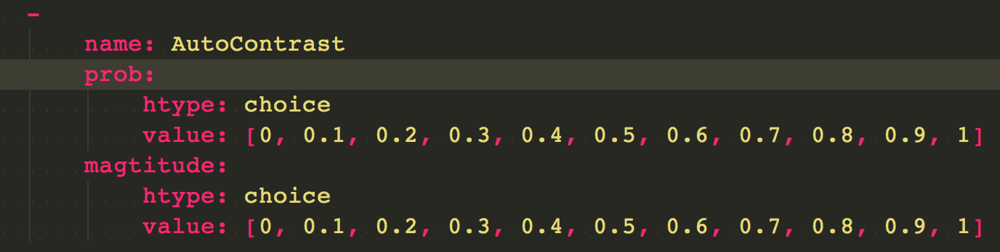
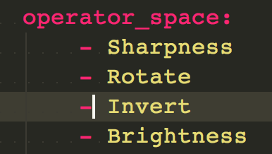

# PaddleHub 自动数据增强

本示例将展示如何使用PaddleHub搜索最适合数据的数据增强策略，并将其应用到模型训练中。

## 依赖

请预先从pip下载auto-augment软件包

```
pip install auto-augment
```


## auto-augment简述

auto-augment软件包目前支持Paddle的图像分类任务和物体检测任务。

应用时分成搜索(search)和训练(train)两个阶段

**搜索阶段在预置模型上对不同算子的组合进行策略搜索，输出最优数据增强调度策略组合**

**训练阶段在特定模型上应用最优调度数据增强策略组合 **

详细关于auto-augment的使用及benchmark可参考auto_augment/doc里的readme


## 支持任务

目前auto-augment支持paddlhub的图像分类任务。

后续会扩充到其他任务


## 图像分类任务

### 参数配置

参数配置支持yaml格式描述及json格式描述，项目中仅提供yaml格式配置模板。模板统一于configs/路径下

用户可配置参数分为task_config(任务配置)，data_config(数据配置), resource_config(资源配置)，algo_config(算法配置)， search_space(搜索空间配置)。

#### task_config(任务配置)

​	任务配置细节，包括任务类型及模型细节

​	具体字段如下:

​	run_mode: ["ray", "automl_service"],  #表示后端采用服务，目前支持单机ray框架

​	work_space: 用户工作空间

​	task_type： ["classifier"] #任务类型，目前PaddleHub支持图像分类单标签，需要请使用物体检测单标签任务的增强请参考auto_augment/doc

​	classifier: 具体任务类型的配置细节,

##### classifier任务配置细节

- model_name: paddlehub模型名称
- epochs: int, 任务搜索轮数， **必填** , 该参数需要特殊指定
- Input_size: 模型输入尺寸
- scale_size： 数据预处理尺寸
- no_cache_image: 不缓存数据， 默认False
- use_class_map: 使用label_list 映射


#### data_config(数据配置)

数据配置支持多种格式输入, 包括图像分类txt标注格式， 物体检测voc标注格式， 物体检测coco标注格式.

- train_img_prefix：str. 训练集数据路径前缀

- train_ann_file：str, 训练集数据描述文件，

- val_img_prefix：str, 验证集数据路径前缀

- val_ann_file：str,验证集数据描述文件

- label_list：str, 标签文件

- delimiter： ","  数据描述文件采用的分隔符


#### resource_config(资源配置)

- gpu：float, 表示每个搜索进程的gpu分配资源，run_mode=="ray"模式下支持小数分配

- cpu:  float, 表示每个搜索进程的cpu分配资源，run_mode=="ray"模式下支持小数分配


#### algo_config(算法配置)

算法配置目前仅支持PBA，后续会进一步拓展。

##### PBA配置

- algo_name: str, ["PBA"], 搜索算法
- algo_param:
  - perturbation_interval: 搜索扰动周期
  - num_samples：搜索进程数

#### search_space(搜索空间配置)

搜索空间定义， 策略搜索阶段必填， 策略应用训练会忽略。

- operators_repeat： int，默认1， 表示搜索算子的重复次数。

- operator_space： 搜索的算子空间

  1. 自定义算子模式：

     htype: str, ["choice"] 超参类型，目前支持choice枚举

     value: list, [0,0.5,1] 枚举数据

     

  2. 缩略版算子模式:

     用户只需要指定需要搜索的算子，prob, magtitue搜索空间为系统默认配置，为0-1之间。

     

  支持1，2模式混合定议


##### 图像分类算子

["Sharpness", "Rotate", "Invert", "Brightness", "Cutout", "Equalize","TranslateY", "AutoContrast", "Color","TranslateX", "Solarize", "ShearX","Contrast", "Posterize", "ShearY", "FlipLR"]


### 搜索阶段

用于数据增强策略的搜索

### 训练阶段

在训练中应用搜索出来的数据增强策略


### 示例demo

#### Flower数据组织


```
cd PaddleHub/demo/autaug/
mkdir -p ./dataset
cd dataset
wget https://bj.bcebos.com/paddlehub-dataset/flower_photos.tar.gz
tar -xvf flower_photos.tar.gz
```

#### 搜索流程

```
cd PaddleHub/demo/autaug/
bash search.sh
# 结果会以json形式dump到workspace中，用户可利用这个json文件进行训练
```

#### 训练阶段

```
cd PaddleHub/demo/autaug/
bash train.sh
```
