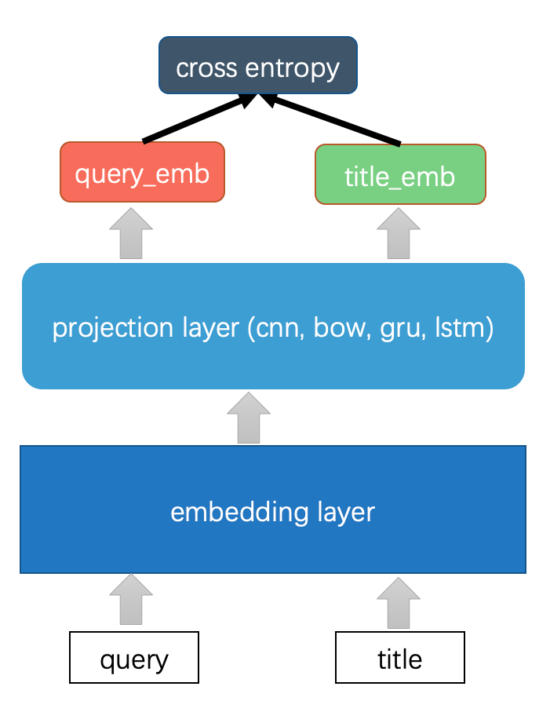

# PaddleHub Pointwise 文本匹配

本示例将展示如何使用PaddleHub Fine-tune API以及预训练模型(word2vec_skipgram、simnet_bow、ERNIE等)完成pointwise文本匹配任务。

**PaddleHub 1.8.0以上版本支持在预训练模型之后拼接预置网络(bow, cnn, gru, lstm)完成文本匹配任务**

## 目录结构
```
pointwise_text_matching
├── embedding_pointwise_matching_predict.py # 词向量预训练模型拼接预置网络的预测脚本
├── embedding_pointwise_matching.py # 词向量预训练模型拼接预置网络的训练脚本
├── ernie_pointwise_matching_predict.py # ERNIE预训练模型的预测脚本
├── ernie_pointwise_matching.py # ERNIE预训练模型的训练脚本
├── run_embedding_pointwise_matching_predict.sh # 词向量预训练模型拼接预置网络的预测启动脚本
├── run_embedding_pointwise_matching.sh # 词向量预训练模型拼接预置网络的训练启动脚本
├── run_ernie_pointwise_matching_predict.sh # ERNIE预训练模型的预测启动脚本
└── run_ernie_pointwise_matching.sh # ERNIE预训练模型的训练启动脚本
```

## 如何开始Fine-tune

以下例子以最简单的匹配网络（词向量拼接预置网络）完成文本分类任务，说明PaddleHub如何完成pointwise文本匹配迁移学习。

<p align="center">
 

在完成安装PaddlePaddle与PaddleHub后，通过执行脚本`sh run_embedding_pointwise_matching.sh`即可开始使用预训练embedding对LCQMC数据集进行Fine-tune。

其中脚本参数说明如下：

```bash
--batch_size: 批处理大小，请结合显存情况进行调整，若出现显存不足，请适当调低这一参数；
--learning_rate: Fine-tune的最大学习率；
--num_epoch: Fine-tune迭代的轮数；
--max_seq_len: 模型使用的最大序列长度，最大不能超过512, 若出现显存不足，请适当调低这一参数；
--checkpoint_dir: 模型保存路径，PaddleHub会自动保存验证集上表现最好的模型；
--network: 预置网络，可选bow、cnn、gru、lstm
```

## 代码步骤

使用PaddleHub Fine-tune API进行Fine-tune可以分为4个步骤。

### Step1: 加载预训练模型

```python
module = hub.Module(name="tencent_ailab_chinese_embedding_small")
inputs, outputs, program = module.context(trainable=True, max_seq_len=args.max_seq_len, num_slots=2)
```
其中最大序列长度`max_seq_len`是可以调整的参数，建议值128，根据任务文本长度不同可以调整该值。

`num_slots`: 文本匹配任务输入文本的数据量。pointwise文本匹配任务num_slots应为2，如上图中的query和title。 pairtwise文本匹配任务num_slots应为3。

PaddleHub还提供等其他词向量预训练模型可供选择, 模型对应的加载示例如下：

   模型名                           | PaddleHub Module
---------------------------------- | :------:
tencent_ailab_chinese_embedding_small | `hub.Module(name='tencent_ailab_chinese_embedding_small')`
word2vec_skipgram                | `hub.Module(name='word2vec_skipgram')`
simnet_bow           | `hub.Module(name='simnet_bow')`

更多模型请参考[PaddleHub官网](https://www.paddlepaddle.org.cn/hublist)。

如果想尝试word2vec_skipgram模型，只需要更换Module中的`name`参数即可.
```python
# 更换name参数即可无缝切换word2vec_skipgram模型, 代码示例如下
module = hub.Module(name="word2vec_skipgram")
```

### Step2: 选择Tokenizer读取数据

```python
tokenizer = hub.CustomTokenizer(
    vocab_file=module.get_vocab_path(),
    tokenize_chinese_chars=True,
)
```

`module.get_vocab_path()` 会返回预训练模型对应的词表；
`tokenize_chinese_chars` 是否切分中文文本

**NOTE:**
1. 如果使用Transformer类模型（如ERNIE、BERT、RoBerta等），则应该选择`hub.BertTokenizer`.
2. 如果使用非Transformer类模型（如word2vec_skipgram、tencent_ailab_chinese_embedding_small等），则应该选择`hub.CustomTokenizer`


### Step3: 准备数据集
```python
dataset = hub.dataset.LCQMC(tokenizer=tokenizer, max_seq_len=128)
```

`hub.dataset.LCQMC()` 会自动从网络下载数据集并解压到用户目录下`$HOME/.paddlehub/dataset`目录；

`max_seq_len` 需要与Step1中context接口传入的序列长度保持一致；

更多数据集信息参考[Dataset](https://github.com/PaddlePaddle/PaddleHub/blob/release/v1.7/docs/reference/dataset.md)。

#### 自定义数据集

如果想加载自定义数据集完成迁移学习，详细参见[自定义数据集](https://github.com/PaddlePaddle/PaddleHub/blob/release/v1.7/docs/tutorial/how_to_load_data.md)。

### Step3：选择优化策略和运行配置

```python
strategy = hub.DefaultStrategy(optimizer_name="sgd", learning_rate=5e-2)

config = hub.RunConfig(use_cuda=False, num_epoch=300, batch_size=128, strategy=strategy)
```

#### 优化策略

**NOTE:**

1. 如果使用非Transformer类模型（如word2vec_skipgram、tencent_ailab_chinese_embedding_small等，推荐使用SGD优化器在CPU下运行。
2. 如果使用Transformer类模型（如ERNIE、BERT、RoBerta等），推荐使用Adam优化器在GPU下运行。

针对ERNIE与BERT类任务，PaddleHub封装了适合这一任务的迁移学习优化策略`AdamWeightDecayStrategy`

```python
strategy = hub.AdamWeightDecayStrategy(
    warmup_proportion=0.1,
    weight_decay=0.01,
    learning_rate=5e-5,
    lr_scheduler="linear_decay")
```

* `learning_rate`: Fine-tune过程中的最大学习率；
* `weight_decay`: 模型的正则项参数，默认0.01，如果模型有过拟合倾向，可适当调高这一参数；
* `warmup_proportion`: 如果warmup_proportion>0, 例如0.1, 则学习率会在前10%的steps中线性增长至最高值learning_rate；
* `lr_scheduler`: 有两种策略可选(1) `linear_decay`策略学习率会在最高点后以线性方式衰减; `noam_decay`策略学习率会在最高点以多项式形式衰减；

#### 运行配置
`RunConfig` 主要控制Fine-tune的训练，包含以下可控制的参数:

* `use_cuda`: 是否使用GPU训练，默认为False；
* `checkpoint_dir`: 模型checkpoint保存路径, 若用户没有指定，程序会自动生成；
* `num_epoch`: Fine-tune的轮数；
* `batch_size`: 训练的批大小，如果使用GPU，请根据实际情况调整batch_size；
* `strategy`: Fine-tune优化策略；

### Step4: 构建网络并创建pointwise文本匹配迁移任务进行Fine-tune
```python
query = outputs["emb"]
title = outputs['emb_2']

matching_task = hub.PointwiseTextMatchingTask(
    dataset=dataset,
    query_feature=query,
    title_feature=title,
    tokenizer=tokenizer,
    network='bow',
    config=config)

matching_task.finetune_and_eval()
```
**NOTE:**
1. `outputs["emb"]`返回了预训练模型输入title对应的词向量向量，`outputs["emb_2"]`返回了预训练模型输入query对应的词向量。该词向量是token-levle特征，shape应为[-1, max_seq_len, emb_size]。
2. `hub.PointwiseTextMatchingTask`通过输入特征，label与预置网络，可以生成适用于pointwise文本匹配的迁移任务`PointwiseTextMatchingTask`。
3. 使用预置网络，可以通过`hub.PointwiseTextMatchingTask`参数network进行指定不同的网络结构。如下代码表示选择bilstm网络拼接在预训练模型之后。
   PaddleHub 文本匹配分类任务预置网络支持BOW，CNN，GRU，LSTM。指定network应是其中之一。


#### 自定义迁移任务

如果想改变迁移任务组网，详细参见[自定义迁移任务]()。

## 可视化

Fine-tune API训练过程中会自动对关键训练指标进行打点，启动程序后执行下面命令：
```bash
$ visualdl --logdir $CKPT_DIR/visualization --host ${HOST_IP} --port ${PORT_NUM}
```
其中${HOST_IP}为本机IP地址，${PORT_NUM}为可用端口号，如本机IP地址为192.168.0.1，端口号8040，用浏览器打开192.168.0.1:8040，即可看到训练过程中指标的变化情况。

## 模型预测

通过Fine-tune完成模型训练后，在对应的ckpt目录下，会自动保存验证集上效果最好的模型。
配置脚本参数
```
CKPT_DIR="ckpt_embedding_pointwise_matching/"
python embedding_pointwise_matching_predict.py --checkpoint_dir $CKPT_DIR --max_seq_len 128
```
其中CKPT_DIR为Fine-tune API保存最佳模型的路径, max_seq_len是模型的最大序列长度，*请与训练时配置的参数保持一致*

参数配置正确后，请执行脚本`sh run_embedding_pointwise_matching_predict.sh`，即可看到文本匹配预测结果。

我们在AI Studio上提供了IPython NoteBook形式的demo，点击[PaddleHub教程合集](https://aistudio.baidu.com/aistudio/projectdetail/231146)，可使用AI Studio平台提供的GPU算力进行快速尝试。


## 超参优化AutoDL Finetuner

PaddleHub还提供了超参优化（Hyperparameter Tuning）功能， 自动搜索最优模型超参得到更好的模型效果。详细信息参见[AutoDL Finetuner超参优化功能教程](../../docs/tutorial/autofinetune.md)。


## Fine-tune之后保存的模型转化为PaddleHub Module

Fine-tune之后保存的模型转化为PaddleHub Module[教程](../../docs/tutorial/finetuned_model_to_module.md)
