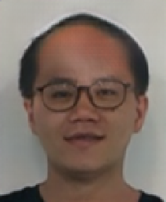

# 部署图像生成服务-以stgan_celeba为例
## 简介
图像生成是指根据预先设置的标签，生成对应图像的过程。stgan_celeba通过在GAN中加入encoder-decoder，可实现人脸属性的转换。关于stgan_celeba的具体信息请参见[stgan_celeba](https://paddlepaddle.org.cn/hubdetail?name=stgan_celeba&en_category=GANs)。

使用PaddleHub Serving可以轻松部署一个在线图像生成服务API，可将此API接入自己的web网站，也可接入应用程序，如美图类应用，实现传照片修饰脸的功能。

下面就带领大家使用PaddleHub Serving，通过简单几步部署一个图像生成服务。

## Step1：启动PaddleHub Serving
启动命令如下：
```shell
$ hub serving start -m stgan_celeba
```
启动时会显示加载模型过程，启动成功后显示：
```shell
Loading stgan_celeba successful.
```
这样就完成了一个图像生成服务化API的部署，默认端口号为8866。

## Step2：测试图像生成在线API
我们用来测试的样例图片为：  

<p align="center">  
  
</p>  

根据stgan_celeba所需信息，准备的数据包括图像文件和生成图像风格，格式为：
```python
files = [("image", file_a), ("image", file_b)]
data = {"info": ["info_a_1, info_a_2", "info_b_1, info_b_2"], "style": ["style_a", "style_b"]}
```
注意文件列表每个元素第一个参数为"image"。

info为图像描述，根据示例图像信息，info应为"Male,Black_Hair,Eyeglasses,No_Beard"，即"男性，黑发，戴眼镜，没有胡子"。

image为要生成的图像风格，我们选取"Bald"(秃顶的)作为生成图像的风格。

代码如下
```python
>>> # 指定要使用的图片文件并生成列表[("image", img_1), ("image", img_2), ... ]
>>> file_list = ["../img/man.png"]
>>> files = [("image", (open(item, "rb"))) for item in file_list]
>>> # 为每张图片对应指定info和style
>>> data = {"info": ["Male,Black_Hair,Eyeglasses,No_Beard"], "style": ["Bald"]}
```

## Step3：获取并验证结果
然后就可以发送请求到图像生成服务API，并得到结果，代码如下

```python
>>> url = "http://127.0.0.1:8866/predict/image/stgan_celeba"
>>> r = requests.post(url=url, data=data, files=files)
```
stgan_celeba返回的结果包括生成图像的base64编码格式，经过转换可以得到生成图像，代码如下
```python
>>> for item in results:
...     with open(output_path, "wb") as fp:
...         fp.write(base64.b64decode(item["base64"].split(',')[-1]))
```
查看指定输出文件夹，就能看到生成图像了，如图

<p align="center">  
  
</p>  


这样我们就完成了对图像生成服务化的部署和测试。

完整的测试代码见[stgan_celeba_serving_demo.py](stgan_celeba_serving_demo.py)。
