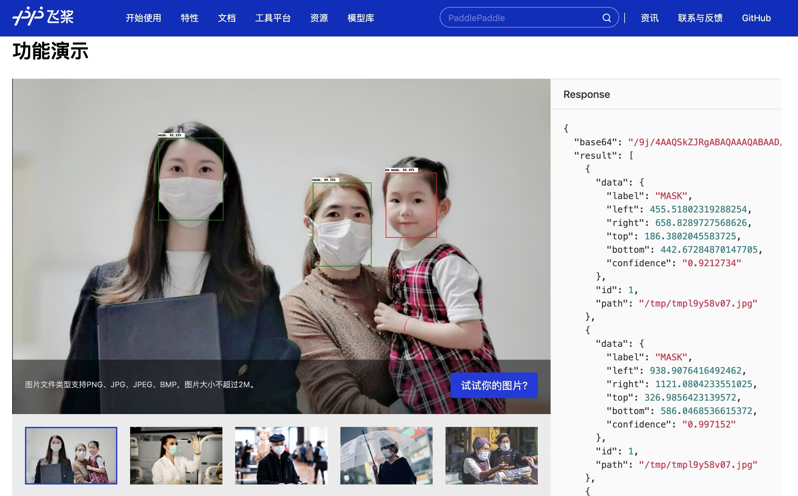
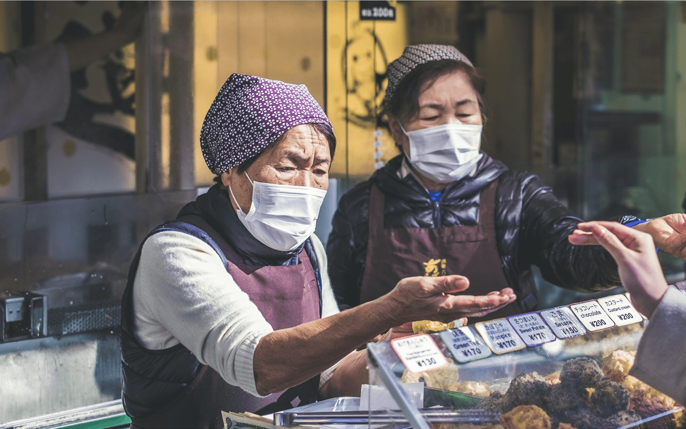
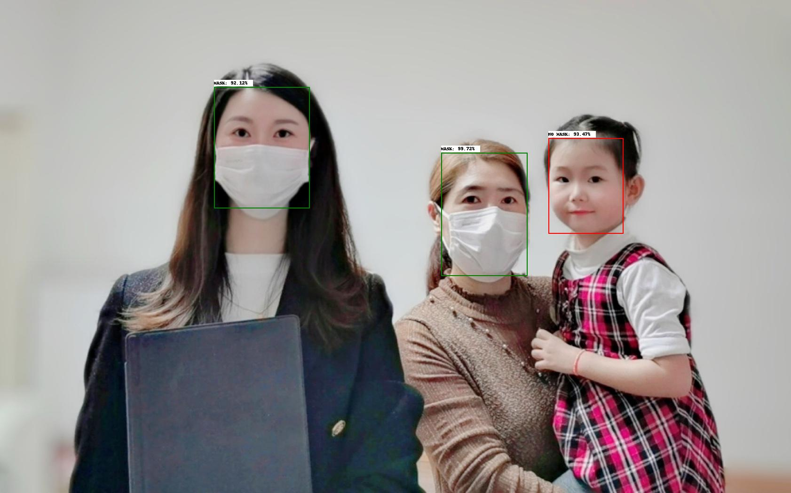
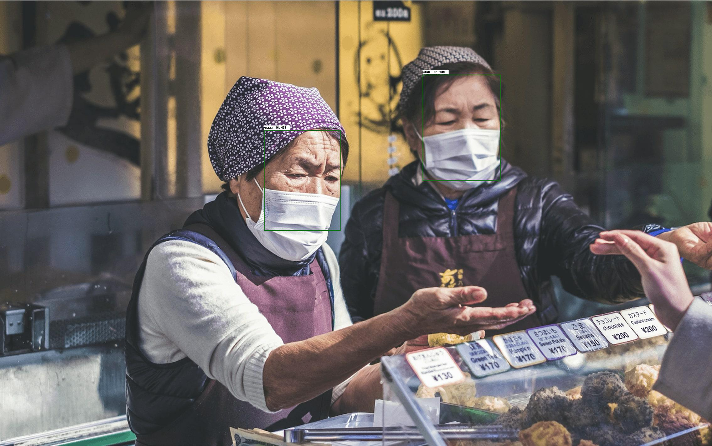

# 部署图像分类服务-以pyramidbox_lite_server_mask为例
## 简介
目标检测作为深度学习常见任务，在各种场景下都有所使用。`pyramidbox_lite_server_mask`模型可以应用于口罩检测任务，关于`pyramidbox_lite_server_mask`的具体信息请参见[pyramidbox_lite_server_mask](https://www.paddlepaddle.org.cn/hubdetail?name=pyramidbox_lite_server_mask&en_category=ObjectDetection)。

使用PaddleHub Serving可以轻松部署一个在线目标检测服务API，可快速实现在线目标检测等web服务，如PaddlePaddle官网提供的[口罩检测场景示例](https://paddlepaddle.org.cn/hub/scene/maskdetect)，如下图所示：

<p align="center">  

  

</p>

下面就带领大家使用PaddleHub Serving，通过简单几步部署一个目标检测服务。

## Step1：启动PaddleHub Serving
启动命令如下：
```shell
$ hub serving start -m pyramidbox_lite_server_mask
```
启动时会显示加载模型过程，启动成功后显示：
```shell
Loading pyramidbox_lite_server_mask successful.
```
这样就完成了一个口罩检测服务化API的部署，默认端口号为8866。

## Step2：测试图像生成在线API
我们用来测试的样例图片为：  

<p align="center">  

  

</p>  

<p align="center">  

  

</p>

准备的数据格式为：
```python
files = [("image", file_1), ("image", file_2)]
```
**NOTE:** 文件列表每个元素第一个参数为"image"。

代码如下：
```python
>>> # 指定要检测的图片并生成列表[("image", img_1), ("image", img_2), ... ]
>>> file_list = ["../../../../docs/imgs/family_mask.jpg", "../../../../docs/imgs/girl_mask.jpg"]
>>> files = [("image", (open(item, "rb"))) for item in file_list]
```

## Step3：获取并验证结果
通过发送请求到目标检测服务API，就可得到结果，代码如下：
```python
>>> # 指定检测方法为pyramidbox_lite_server_mask并发送post请求
>>> url = "http://127.0.0.1:8866/predict/image/pyramidbox_lite_server_mask"
>>> r = requests.post(url=url, files=files, data={"visual_result": "True"})
```
我们可以打印接口返回结果：
```python
>>> results = eval(r.json()["results"])
>>> print(json.dumps(results, indent=4, ensure_ascii=False))
[
    {
        "data": [
            {
                "label": "MASK",
                "left": 938.8167103528976,
                "right": 1126.8890985250473,
                "top": 335.8177453279495,
                "bottom": 586.0342741012573,
                "confidence": 0.9775171
            },
            {
                "label": "NO MASK",
                "left": 1166.563014626503,
                "right": 1331.2186390161514,
                "top": 298.1251895427704,
                "bottom": 496.373051404953,
                "confidence": 0.6512484
            },
            {
                "label": "MASK",
                "left": 458.2292696237564,
                "right": 664.9880893230438,
                "top": 179.45007160305977,
                "bottom": 446.70506715774536,
                "confidence": 0.98069304
            }
        ],
        "path": "family_mask.jpg",
        "id": 1
    },
    {
        "data": [
            {
                "label": "MASK",
                "left": 1340.4194090366364,
                "right": 1595.8429119586945,
                "top": 251.97067219018936,
                "bottom": 584.6931987404823,
                "confidence": 0.9681898
            },
            {
                "label": "MASK",
                "left": 839.8990581035614,
                "right": 1084.293223142624,
                "top": 446.8751857280731,
                "bottom": 758.4936121702194,
                "confidence": 0.9673422
            },
            {
                "label": "NO MASK",
                "left": 1145.4194769859314,
                "right": 1253.0083780288696,
                "top": 128.66552621126175,
                "bottom": 283.0486469864845,
                "confidence": 0.97426504
            }
        ],
        "path": "woman_mask.jpg",
        "id": 2
    }
]
```
根据结果可以看出准确识别了请求图片中的人脸位置及戴口罩确信度。

pyramidbox_lite_server_mask返回的结果还包括标注检测框的图像的base64编码格式，经过转换可以得到生成图像，代码如下：
```python
>>> for item in results:
...     with open(output_path, "wb") as fp:
...         fp.write(base64.b64decode(item["base64"].split(',')[-1]))
```
查看指定输出文件夹，就能看到生成图像了，如图：

<p align="center">  

  

</p>  

<p align="center">  

  

</p>  


这样我们就完成了对目标检测服务化的部署和测试。

完整的测试代码见[pyramidbox_lite_server_mask_file_serving_demo.py](pyramidbox_lite_server_mask_file_serving_demo.py)。

## 进一步提升模型服务性能
`pyramidbox_lite_server_mask`还支持直接传入opencv mat表示的图片，不产生结果文件，而是直接输出检测的人脸位置和戴口罩概率，响应时间平均提升20%以上，可用于对响应时间和性能要求更高的场景。

使用直接传输数据的模式，仅需要修改上文Step2中的POST方法参数，具体如下：

```python
>>> with open(file="../../../../docs/imgs/family_mask.jpg", mode="rb") as fp:
...     base64_data = base64.b64encode(fp.read())
>>> base64_data = str(base64_data, encoding="utf8")
>>> data = {"b64s": [base64_data]}
>>> data = {"data": json.dumps(data)}
```
进行HTTP请求时只需将data参数传入即可，具体如下：
```python
>>> r = requests.post(url=url, data=data)
```
对结果的处理与上文一致，但需注意此种方法仅输出识别结果，不产生结果文件，因此不能获得生成图片。

完整的测试代码见[pyramidbox_lite_server_mask_serving_demo.py](pyramidbox_lite_server_mask_serving_demo.py)。
