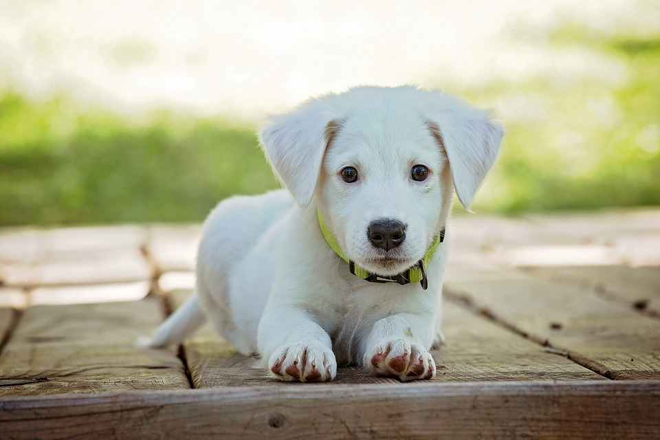
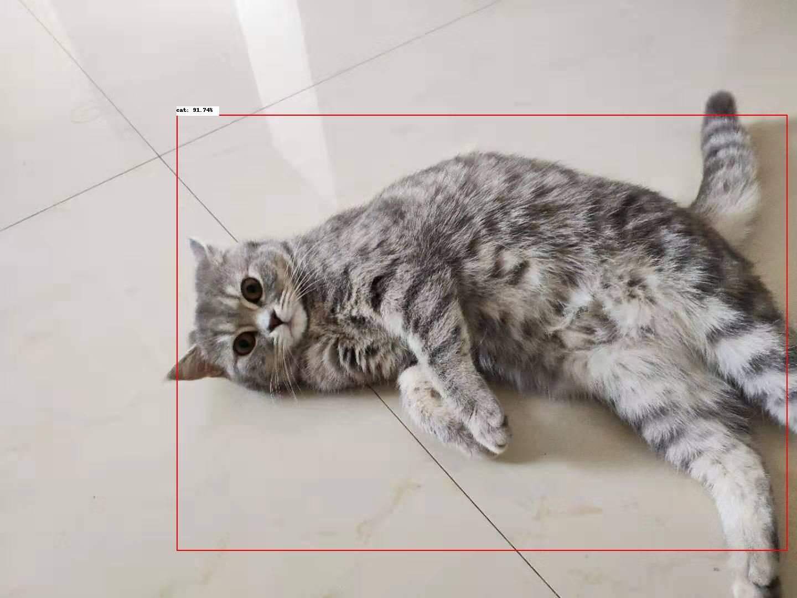
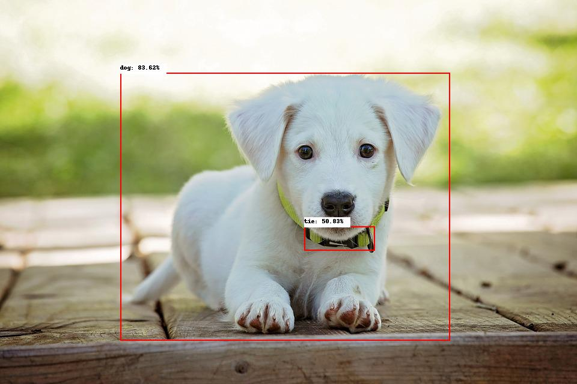

# 部署图像分类服务-以yolov3_darknet53_coco2017为例
## 简介
目标检测作为深度学习常见任务，在各种场景下都有所使用。使用`yolov3_darknet53_coco2017`模型可以进行目标检测任务，关于`yolov3_darknet53_coco2017`的具体信息请参见[yolov3_darknet53_coco2017](https://paddlepaddle.org.cn/hubdetail?name=yolov3_darknet53_coco2017&en_category=ObjectDetection)。

使用PaddleHub Serving可以轻松部署一个在线目标检测服务API，可将此API接入自己的web网站进行在线目标检测，也可接入移动端应用程序，实现识图、圈人等功能。

下面就带领大家使用PaddleHub Serving，通过简单几步部署一个目标检测服务。

## Step1：启动PaddleHub Serving
启动命令如下：
```shell
$ hub serving start -m yolov3_darknet53_coco2017
```
启动时会显示加载模型过程，启动成功后显示：
```shell
Loading yolov3_darknet53_coco2017 successful.
```
这样就完成了一个图像生成服务化API的部署，默认端口号为8866。

## Step2：测试图像生成在线API
首先引入需要的包：
```python
>>> import requests
>>> import json
>>> import base64
>>> import os
```
我们用来测试的样例图片为：  

<p align="center">  

  

</p>  

<p align="center">  

  

</p>  

准备的数据格式为：
```python
files = [("image", file_1), ("image", file_2)]
```
**NOTE:** 文件列表每个元素第一个参数为"image"。

代码如下：
```python
>>> # 指定要检测的图片并生成列表[("image", img_1), ("image", img_2), ... ]
>>> file_list = ["../img/cat.jpg", "../img/dog.jpg"]
>>> files = [("image", (open(item, "rb"))) for item in file_list]
```

## Step3：获取并验证结果
然后就可以发送请求到目标检测服务API，并得到结果，代码如下：
```python
>>> # 指定检测方法为yolov3_darknet53_coco2017并发送post请求
>>> url = "http://127.0.0.1:8866/predict/image/yolov3_darknet53_coco2017"
>>> r = requests.post(url=url, files=files)
```
我们可以打印接口返回结果：
```python
>>> results = eval(r.json()["results"])
>>> print(json.dumps(results, indent=4, ensure_ascii=False))
[
    {
        "path": "cat.jpg",
        "data": [
            {
                "left": 319.489,
                "right": 1422.8364,
                "top": 208.94229,
                "bottom": 993.8552,
                "label": "cat",
                "confidence": 0.9174191
            }
        ]
    },
    {
        "path": "dog.jpg",
        "data": [
            {
                "left": 200.6918,
                "right": 748.96204,
                "top": 122.74927,
                "bottom": 566.2066,
                "label": "dog",
                "confidence": 0.83619183
            },
            {
                "left": 506.8462,
                "right": 623.2322,
                "top": 378.0084,
                "bottom": 416.116,
                "label": "tie",
                "confidence": 0.5082839
            }
        ]
    }
]
```
根据结果可以看出准确识别了请求的图片。

yolov3_darknet53_coco2017返回的结果还包括标注检测框的图像的base64编码格式，经过转换可以得到生成图像。
我们创建一个保存结果图片的文件夹：
```python
>>> if not os.path.exists("output"):
>>>     os.mkdir("output")
```
然后将图片数据进行解码并保存，代码如下：
```python
>>> results = eval(r.json()["results"])
>>> for item in results:
...     with open(output_path, "wb") as fp:
...         fp.write(base64.b64decode(item["base64"].split(',')[-1]))
```
查看指定输出文件夹，就能看到生成图像了，如图：

<p align="center">  

  

</p>  

<p align="center">  

  

</p>  


这样我们就完成了对目标检测服务化的部署和测试。

完整的测试代码见[yolov3_darknet53_coco2017_serving_demo.py](yolov3_darknet53_coco2017_serving_demo.py)。
