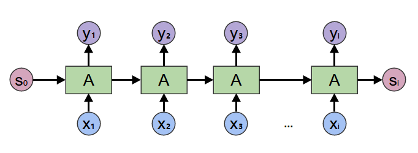
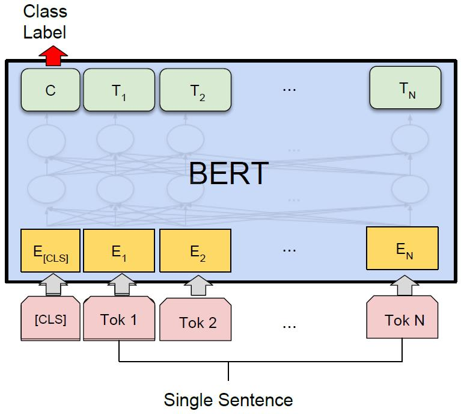

# PaddleHub Transformer模型fine-tune文本分类（动态图）

在2017年之前，工业界和学术界对NLP文本处理依赖于序列模型[Recurrent Neural Network (RNN)](https://baike.baidu.com/item/%E5%BE%AA%E7%8E%AF%E7%A5%9E%E7%BB%8F%E7%BD%91%E7%BB%9C/23199490?fromtitle=RNN&fromid=5707183&fr=aladdin).



近年来随着深度学习的发展，模型参数数量飞速增长，为了训练这些参数，需要更大的数据集来避免过拟合。然而，对于大部分NLP任务来说，构建大规模的标注数据集成本过高，非常困难，特别是对于句法和语义相关的任务。相比之下，大规模的未标注语料库的构建则相对容易。最近的研究表明，基于大规模未标注语料库的预训练模型（Pretrained Models, PTM) 能够习得通用的语言表示，将预训练模型Fine-tune到下游任务，能够获得出色的表现。另外，预训练模型能够避免从零开始训练模型。


本示例将展示如何使用PaddleHub Transformer模型（如 ERNIE、BERT、RoBERTa等模型）Module 以动态图方式fine-tune并完成预测任务。

## 如何开始Fine-tune


我们以中文情感分类公开数据集ChnSentiCorp为示例数据集，可以运行下面的命令，在训练集（train.tsv）上进行模型训练，并在开发集（dev.tsv）验证。通过如下命令，即可启动训练。

```shell
# 设置使用的GPU卡号
export CUDA_VISIBLE_DEVICES=0
python train.py
```


## 代码步骤

使用PaddleHub Fine-tune API进行Fine-tune可以分为4个步骤。

### Step1: 选择模型
```python
import paddlehub as hub

model = hub.Module(name='ernie_tiny', version='2.0.1', task='seq-cls', num_classes=2)
```

其中，参数：

* `name`：模型名称，可以选择`ernie`，`ernie_tiny`，`bert-base-cased`， `bert-base-chinese`, `roberta-wwm-ext`，`roberta-wwm-ext-large`等。
* `version`：module版本号
* `task`：fine-tune任务。此处为`seq-cls`，表示文本分类任务。
* `num_classes`：表示当前文本分类任务的类别数，根据具体使用的数据集确定，默认为2。

PaddleHub还提供BERT等模型可供选择, 当前支持文本分类任务的模型对应的加载示例如下：

模型名                           | PaddleHub Module
---------------------------------- | :------:
ERNIE, Chinese                     | `hub.Module(name='ernie')`
ERNIE tiny, Chinese                | `hub.Module(name='ernie_tiny')`
ERNIE 2.0 Base, English            | `hub.Module(name='ernie_v2_eng_base')`
ERNIE 2.0 Large, English           | `hub.Module(name='ernie_v2_eng_large')`
BERT-Base, English Cased           | `hub.Module(name='bert-base-cased')`
BERT-Base, English Uncased         | `hub.Module(name='bert-base-uncased')`
BERT-Large, English Cased          | `hub.Module(name='bert-large-cased')`
BERT-Large, English Uncased        | `hub.Module(name='bert-large-uncased')`
BERT-Base, Multilingual Cased      | `hub.Module(nane='bert-base-multilingual-cased')`
BERT-Base, Multilingual Uncased    | `hub.Module(nane='bert-base-multilingual-uncased')`
BERT-Base, Chinese                 | `hub.Module(name='bert-base-chinese')`
BERT-wwm, Chinese                  | `hub.Module(name='chinese-bert-wwm')`
BERT-wwm-ext, Chinese              | `hub.Module(name='chinese-bert-wwm-ext')`
RoBERTa-wwm-ext, Chinese           | `hub.Module(name='roberta-wwm-ext')`
RoBERTa-wwm-ext-large, Chinese     | `hub.Module(name='roberta-wwm-ext-large')`
RBT3, Chinese                      | `hub.Module(name='rbt3')`
RBTL3, Chinese                     | `hub.Module(name='rbtl3')`
ELECTRA-Small, English             | `hub.Module(name='electra-small')`
ELECTRA-Base, English              | `hub.Module(name='electra-base')`
ELECTRA-Large, English             | `hub.Module(name='electra-large')`
ELECTRA-Base, Chinese              | `hub.Module(name='chinese-electra-base')`
ELECTRA-Small, Chinese             | `hub.Module(name='chinese-electra-small')`

通过以上的一行代码，`model`初始化为一个适用于文本分类任务的模型，为ERNIE Tiny的预训练模型后拼接上一个全连接网络（Full Connected）。



以上图片来自于：https://arxiv.org/pdf/1810.04805.pdf

### Step2: 下载并加载数据集

```python
train_dataset = hub.datasets.ChnSentiCorp(
    tokenizer=model.get_tokenizer(), max_seq_len=128, mode='train')
dev_dataset = hub.datasets.ChnSentiCorp(
    tokenizer=model.get_tokenizer(), max_seq_len=128, mode='dev')
test_dataset = hub.datasets.ChnSentiCorp(
    tokenizer=model.get_tokenizer(), max_seq_len=128, mode='test')
```

* `tokenizer`：表示该module所需用到的tokenizer，其将对输入文本完成切词，并转化成module运行所需模型输入格式。
* `mode`：选择数据模式，可选项有 `train`, `test`, `dev`， 默认为`train`。
* `max_seq_len`：ERNIE/BERT模型使用的最大序列长度，若出现显存不足，请适当调低这一参数。

预训练模型ERNIE对中文数据的处理是以字为单位，tokenizer作用为将原始输入文本转化成模型model可以接受的输入数据形式。 PaddleHub 2.0中的各种预训练模型已经内置了相应的tokenizer，可以通过`model.get_tokenizer`方法获取。


### Step3:  选择优化策略和运行配置

```python
optimizer = paddle.optimizer.Adam(learning_rate=5e-5, parameters=model.parameters())
trainer = hub.Trainer(model, optimizer, checkpoint_dir='test_ernie_text_cls', use_gpu=True)

trainer.train(train_dataset, epochs=3, batch_size=32, eval_dataset=dev_dataset)

# 在测试集上评估当前训练模型
trainer.evaluate(test_dataset, batch_size=32)
```

#### 优化策略

Paddle2.0-rc提供了多种优化器选择，如`SGD`, `Adam`, `Adamax`等，详细参见[策略](https://www.paddlepaddle.org.cn/documentation/docs/zh/2.0-rc/api/paddle/optimizer/optimizer/Optimizer_cn.html)。

其中`Adam`:

* `learning_rate`: 全局学习率。默认为1e-3；
* `parameters`: 待优化模型参数。

#### 运行配置

`Trainer` 主要控制Fine-tune的训练，包含以下可控制的参数:

* `model`: 被优化模型；
* `optimizer`: 优化器选择；
* `use_vdl`: 是否使用vdl可视化训练过程；
* `checkpoint_dir`: 保存模型参数的地址；
* `compare_metrics`: 保存最优模型的衡量指标；

`trainer.train` 主要控制具体的训练过程，包含以下可控制的参数：

* `train_dataset`: 训练时所用的数据集；
* `epochs`: 训练轮数；
* `batch_size`: 训练的批大小，如果使用GPU，请根据实际情况调整batch_size；
* `num_workers`: works的数量，默认为0；
* `eval_dataset`: 验证集；
* `log_interval`: 打印日志的间隔， 单位为执行批训练的次数。
* `save_interval`: 保存模型的间隔频次，单位为执行训练的轮数。

## 模型预测

当完成Fine-tune后，Fine-tune过程在验证集上表现最优的模型会被保存在`${CHECKPOINT_DIR}/best_model`目录下，其中`${CHECKPOINT_DIR}`目录为Fine-tune时所选择的保存checkpoint的目录。

我们以以下数据为待预测数据，使用该模型来进行预测

```text
这个宾馆比较陈旧了，特价的房间也很一般。总体来说一般
怀着十分激动的心情放映，可是看着看着发现，在放映完毕后，出现一集米老鼠的动画片
作为老的四星酒店，房间依然很整洁，相当不错。机场接机服务很好，可以在车上办理入住手续，节省时间。
```

```python
import paddlehub as hub

data = [
    ['这个宾馆比较陈旧了，特价的房间也很一般。总体来说一般'],
    ['怀着十分激动的心情放映，可是看着看着发现，在放映完毕后，出现一集米老鼠的动画片'],
    ['作为老的四星酒店，房间依然很整洁，相当不错。机场接机服务很好，可以在车上办理入住手续，节省时间。'],
]
label_map = {0: 'negative', 1: 'positive'}

model = hub.Module(
    name='ernie_tiny',
    version='2.0.1',
    task='seq-cls',
    load_checkpoint='./test_ernie_text_cls/best_model/model.pdparams',
    label_map=label_map)
results, probs = model.predict(data, max_seq_len=50, batch_size=1, use_gpu=False, return_prob=True)
for idx, text in enumerate(data):
    print('Data: {} \t Lable: {} \t Prob: {}'.format(text[0], results[idx], probs[idx]))
```

参数配置正确后，请执行脚本`python predict.py`， 加载模型具体可参见[加载](https://www.paddlepaddle.org.cn/documentation/docs/zh/2.0-rc/api/paddle/framework/io/load_cn.html#load)。
