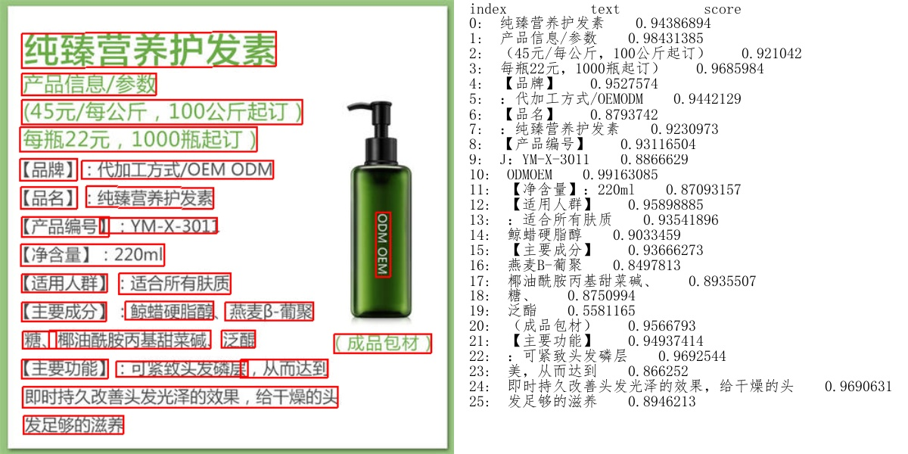
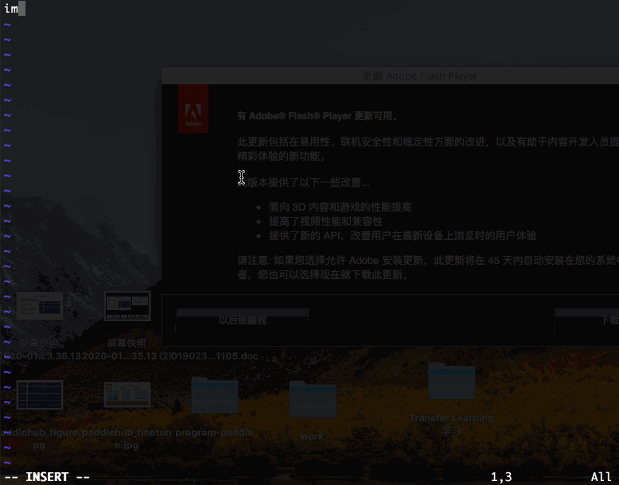

## 特性详解
<a name="丰富的预训练模型"></a>

### 1、丰富的预训练模型

#### 1.1、图像

|            | **精品模型举例**                                             |
| ---------- | :----------------------------------------------------------- |
| 图像分类 | [菜品识别](https://www.paddlepaddle.org.cn/hubdetail?name=resnet50_vd_dishes&en_category=ImageClassification)、[动物识别](https://www.paddlepaddle.org.cn/hubdetail?name=resnet50_vd_animals&en_category=ImageClassification)、[动物识别](https://www.paddlepaddle.org.cn/hubdetail?name=resnet50_vd_animals&en_category=ImageClassification)、[-->More](../modules/image/classification/README.md) |
| 目标检测   | [通用检测](https://www.paddlepaddle.org.cn/hubdetail?name=yolov3_darknet53_coco2017&en_category=ObjectDetection)、[行人检测](https://www.paddlepaddle.org.cn/hubdetail?name=yolov3_darknet53_pedestrian&en_category=ObjectDetection)、[车辆检测](https://www.paddlepaddle.org.cn/hubdetail?name=yolov3_darknet53_vehicles&en_category=ObjectDetection)、[-->More](../modules/image/object_detection/README.md) |
| 人脸检测 | [人脸检测](https://www.paddlepaddle.org.cn/hubdetail?name=pyramidbox_lite_server&en_category=FaceDetection)、[口罩检测](https://www.paddlepaddle.org.cn/hubdetail?name=pyramidbox_lite_server_mask&en_category=FaceDetection)、[-->More](../modules/image/face_detection/README.md) |
| 图像分割   | [人像分割](https://www.paddlepaddle.org.cn/hubdetail?name=deeplabv3p_xception65_humanseg&en_category=ImageSegmentation)、[人体解析](https://www.paddlepaddle.org.cn/hubdetail?name=ace2p&en_category=ImageSegmentation)、[肺炎CT影像分析](https://www.paddlepaddle.org.cn/hubdetail?name=Pneumonia_CT_LKM_PP&en_category=ImageSegmentation)、[-->More](../modules/image/semantic_segmentation/README.md) |
| 关键点检测 | [人体关键点](https://www.paddlepaddle.org.cn/hubdetail?name=human_pose_estimation_resnet50_mpii&en_category=KeyPointDetection)、[人脸关键点](https://www.paddlepaddle.org.cn/hubdetail?name=face_landmark_localization&en_category=KeyPointDetection)、[手部关键点](https://www.paddlepaddle.org.cn/hubdetail?name=hand_pose_localization&en_category=KeyPointDetection)、[-->More](./modules/image/keypoint_detection/README.md) |
| 文本识别 | [超轻量中英文OCR文字识别](https://www.paddlepaddle.org.cn/hubdetail?name=chinese_ocr_db_crnn_mobile&en_category=TextRecognition)、[-->More](../modules/image/text_recognition/README.md) |
| 图像生成    | [风格迁移](https://www.paddlepaddle.org.cn/hubdetail?name=stylepro_artistic&en_category=GANs)、[街景动漫画](https://www.paddlepaddle.org.cn/hubdetail?name=animegan_v2_hayao_99&en_category=GANs)、[-->More](../modules/image/Image_gan/README.md) |
| 图像编辑 | [超分辨率](https://www.paddlepaddle.org.cn/hubdetail?name=realsr&en_category=ImageEditing)、[黑白上色](https://www.paddlepaddle.org.cn/hubdetail?name=deoldify&en_category=ImageEditing)、[-->More](../modules/image/Image_editing/README.md) |
#### 1.2、文本
|            | **精品模型举例**                                           |
| ---------- | :----------------------------------------------------------- |
| 词句分析 | [词法分析 ](https://www.paddlepaddle.org.cn/hubdetail?name=lac&en_category=LexicalAnalysis)、[句法分析](https://www.paddlepaddle.org.cn/hubdetail?name=ddparser&en_category=SyntacticAnalysis)、[-->More](../modules/text/lexical_analysis/README.md) |
| 情感分析   | [情感判断](https://www.paddlepaddle.org.cn/hubdetail?name=lac&en_category=LexicalAnalysis)、[情绪分析](https://www.paddlepaddle.org.cn/hubdetail?name=emotion_detection_textcnn&en_category=SentimentAnalysis) 、[-->More](../modules/text/sentiment_analysis/README.md)|
| 文本审核 | [色情审核](https://www.paddlepaddle.org.cn/hubdetail?name=porn_detection_gru&en_category=TextCensorship)、[-->More](../modules/text/text_review/README.md) |
| 文本生成 | [对联生成](https://www.paddlepaddle.org.cn/hubdetail?name=ernie_tiny_couplet&en_category=TextGeneration)、[情话生成](https://www.paddlepaddle.org.cn/hubdetail?name=ernie_gen_poetry&en_category=TextGeneration)、[藏头诗生成](https://www.paddlepaddle.org.cn/hubdetail?name=ernie_gen_acrostic_poetry&en_category=TextGeneration)、[土味情话](https://www.paddlepaddle.org.cn/hubdetail?name=ernie_gen_lover_words&en_category=TextGeneration) 、[-->More](../modules/text/text_generation/README.md)|
| 语义模型   | [ERNIE](https://www.paddlepaddle.org.cn/hubdetail?name=ERNIE&en_category=SemanticModel)、[文本相似度](https://www.paddlepaddle.org.cn/hubdetail?name=simnet_bow&en_category=SemanticModel)、[-->More](../modules/text/language_model/README.md) |

#### 1.3、语音
|            | **精品模型举例**                                           |
| ---------- | :----------------------------------------------------------- |
| 语音合成   | [语音合成](https://www.paddlepaddle.org.cn/hubdetail?name=deepvoice3_ljspeech&en_category=TextToSpeech) 、[-->More](../modules/audio/README.md)                         |
#### 1.4、视频
|            | **精品模型举例**                                       |
| ---------- | :----------------------------------------------------------- |
| 视频分类 | [视频分类](https://www.paddlepaddle.org.cn/hublist?filter=en_category&value=VideoClassificationhttps://www.paddlepaddle.org.cn/hublist?filter=en_category&value=VideoClassification)、[-->More](../modules/video/README.md) |

<a name="一键模型预测"></a>

### 2、一键模型预测


* 举例，假如考虑使用文字识别轻量级中文OCR模型chinese_ocr_db_crnn_mobile即可一键快速识别图片中的文字。
```shell
$ pip install paddlehub
$ wget https://paddlehub.bj.bcebos.com/model/image/ocr/test_ocr.jpg
$ hub run chinese_ocr_db_crnn_mobile --input_path test_ocr.jpg --visualization=True
```

* 预测结果图片保存在当前运行路径下ocr_result文件夹中，如下图所示。

<p align="center">
 

* 使用词法分析模型LAC进行分词
```shell
$ hub run lac --input_text "现在，慕尼黑再保险公司不仅是此类行动的倡议者，更是将其大量气候数据整合进保险产品中，并与公众共享大量天气信息，参与到新能源领域的保障中。"
[{
    'word': ['现在', '，', '慕尼黑再保险公司', '不仅', '是', '此类', '行动', '的', '倡议者', '，', '更是', '将', '其', '大量', '气候', '数据', '整合', '进', '保险', '产品', '中', '，', '并', '与', '公众', '共享', '大量', '天气', '信息', '，', '参与', '到', '新能源', '领域', '的', '保障', '中', '。'],
    'tag':  ['TIME', 'w', 'ORG', 'c', 'v', 'r', 'n', 'u', 'n', 'w', 'd', 'p', 'r', 'a', 'n', 'n', 'v', 'v', 'n', 'n', 'f', 'w', 'c', 'p', 'n', 'v', 'a', 'n', 'n', 'w', 'v', 'v', 'n', 'n', 'u', 'vn', 'f', 'w']
}]
```

除了一行代码预测之外，PaddleHub也支持使用API调用模型的方式，可以参考每个模型的详细文档。

<a name="一键模型转服务"></a>

### 3、一键模型转服务

PaddleHub提供便捷的模型转服务的能力，只需简单一行命令即可完成模型的HTTP服务部署。通过以下命令即可快速启动LAC词法分析服务：

```shell
$ hub serving start -m chinese_ocr_db_crnn_mobile
```

更多关于模型服务化使用说明参见[PaddleHub模型一键服务化部署](./tutorial/serving.md)。


<a name="十行代码迁移学习"></a>

### 4、十行代码迁移学习

通过Fine-tune API，只需要少量代码即可完成深度学习模型在计算机视觉场景下的迁移学习。

* [Demo示例](../demo)提供丰富的Fine-tune API的使用代码，包括[图像分类](../demo/image_classification)、[图像着色](../demo/colorization)、[风格迁移](../demo/style_transfer)、等场景的模型迁移示例。

<p align="center">
 

<p align='center'>
 十行代码完成工业级文本分类
</p>

* 如需在线快速体验，请点击[PaddleHub教程合集](https://aistudio.baidu.com/aistudio/projectdetail/231146)，可使用AI Studio平台提供的GPU算力进行快速尝试。
