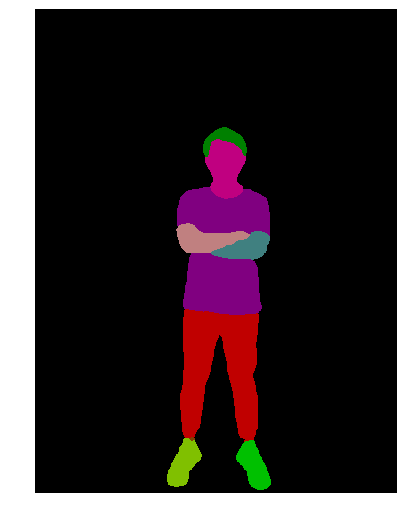

=================
快速体验
=================

在PaddleHub中，Module代表一个可执行模块，一般来讲就是一个可以端到端预测的预训练模型（例如目标检测模型、中文词法分析模型），又或者是一个需要根据下游任务进一步微调（迁移学习）的模型，例如BERT/ERNIE。

PaddleHub采用模型即软件的设计理念，所有的预训练模型与Python软件包类似，具备版本的概念。

本教程会带您快速体验如何使用PaddleHub提供的预训练模型来完成一些常见的AI任务。

下载测试图片
=============================================

首先，使用`wget`下载一张测试图片

.. code-block:: shell

    # 下载图片
    wget https://paddlehub.bj.bcebos.com/resources/test_image.jpg

.. image:: ../../imgs/humanseg_test.png
    :width: 300px

人像分割
=============================================

人像分割任务旨在将输入图片中的人像和背景区分开来。该任务有很多的应用场景，例如背景虚化、背景替换、影视后期处理等等。我们使用 `humanseg_lite <https://www.paddlepaddle.org.cn/hubdetail?name=humanseg_lite&en_category=ImageSegmentation>`_ 来展示这个功能。

.. code-block:: python

    import paddlehub as hub
    # module = hub.Module(name="humanseg_lite", version="1.1.1")
    module = hub.Module(name="humanseg_lite")

    res = module.segment(
        paths = ["./test_image.jpg"], 
        visualization=True, 
        output_dir='humanseg_output')

人体解析
=============================================

人体解析是人像分割的细粒度任务。该任务旨在提取输入图片中人体的不同部件。相关模型经常和新兴的GAN模型一起使用，应用场景包括美颜、换衣服等等。我们使用 `ace2p <https://www.paddlepaddle.org.cn/hubdetail?name=ace2p&en_category=ImageSegmentation>`_  来展示这个功能。

.. code-block:: python

    import paddlehub as hub
    # module = hub.Module(name="ace2p", version="1.1.0")
    module = hub.Module(name="ace2p")

    res = module.segment(
        paths = ["./test_image.jpg"], 
        visualization=True, 
        output_dir='ace2p_output')

人脸检测 
=============================================

人脸检测任务旨在检测出输入图片中的每一张人脸的位置。应用的场景包括视频监控、人流量估计等等场景。我们使用 `ultra_light_fast_generic_face_detector_1mb_640 <https://www.paddlepaddle.org.cn/hubdetail?name=ultra_light_fast_generic_face_detector_1mb_640&en_category=FaceDetection>`_ 来展示这个功能。

.. code-block:: python

    import paddlehub as hub
    # module = hub.Module(name="ultra_light_fast_generic_face_detector_1mb_640", version="1.1.2")
    module = hub.Module(name="ultra_light_fast_generic_face_detector_1mb_640")

    res = module.face_detection(
        paths = ["./test_image.jpg"], 
        visualization=True, 
        output_dir='face_detection_output')

.. image:: ../../imgs/output_15_3.png
    :width: 300px

关键点检测
=============================================

关键点检测任务旨在识别输入图片中每一个人体的不同关键点信息，例如头部、肩膀、关节等等。依赖于模型能力的不同，能够检测到的关键点数量也不同。该任务一般用于人体美型、人体姿态估计等等，我们使用 `openpose_body_estimation <https://www.paddlepaddle.org.cn/hubdetail?name=openpose_body_estimation&en_category=KeyPointDetection>`_ 来展示这个功能。

.. code-block:: python

    import paddlehub as hub
    # module = hub.Module(name="openpose_body_estimation", version="1.0.0")
    module = hub.Module(name="openpose_body_estimation")

    res = module.predict(
        img="./test_image.jpg", 
        visualization=True, 
        save_path='keypoint_output')

.. image:: ../../imgs/output_18_2.png
    :width: 300px

中文词法分析
=============================================

中文词法分析旨在对输入的语句进行分词、词性分析、命名实体识别，我们使用 `lac <https://www.paddlepaddle.org.cn/hubdetail?name=lac&en_category=LexicalAnalysis>`_ 来展示这个功能。

.. code-block:: python

    import paddlehub as hub
    # lac = hub.Module(name="lac", version="2.2.0")
    lac = hub.Module(name="lac")

    test_text = ["1996年，曾经是微软员工的加布·纽维尔和麦克·哈灵顿一同创建了Valve软件公司。他们在1996年下半年从id software取得了雷神之锤引擎的使用许可，用来开发半条命系列。"]
    print(lac.lexical_analysis(texts = test_text))
    
----------------

    [{'word': ['1996年', '，', '曾经', '是', '微软', '员工', '的', '加布·纽维尔', '和', '麦克·哈灵顿', '一同', '创建', '了', 'Valve软件公司', '。', '他们', '在', '1996年下半年', '从', 'id', ' ', 'software', '取得', '了', '雷神之锤', '引擎', '的', '使用', '许可', '，', '用来', '开发', '半条命', '系列', '。'], 'tag': ['TIME', 'w', 'd', 'v', 'ORG', 'n', 'u', 'PER', 'c', 'PER', 'd', 'v', 'u', 'ORG', 'w', 'r', 'p', 'TIME', 'p', 'nz', 'w', 'n', 'v', 'u', 'n', 'n', 'u', 'vn', 'vn', 'w', 'v', 'v', 'n', 'n', 'w']}]

中文情感分析
=============================================

中文情感分析旨在分析输入语句的情感倾向，我们使用 `senta_bilstm <https://www.paddlepaddle.org.cn/hubdetail?name=senta_bilstm&en_category=SentimentAnalysis>`_ 来展示这个功能。

.. code-block:: python

    import paddlehub as hub
    # senta = hub.Module(name="senta_bilstm", version="1.2.0")
    senta = hub.Module(name="senta_bilstm")

    test_text = ["味道不错，确实不算太辣，适合不能吃辣的人。就在长江边上，抬头就能看到长江的风景。鸭肠、黄鳝都比较新鲜。"]
    print(senta.sentiment_classify(texts = test_text))

----------------

    [{'text': '味道不错，确实不算太辣，适合不能吃辣的人。就在长江边上，抬头就能看到长江的风景。鸭肠、黄鳝都比较新鲜。', 'sentiment_label': 1, 'sentiment_key': 'positive', 'positive_probs': 0.9771, 'negative_probs': 0.0229}]
