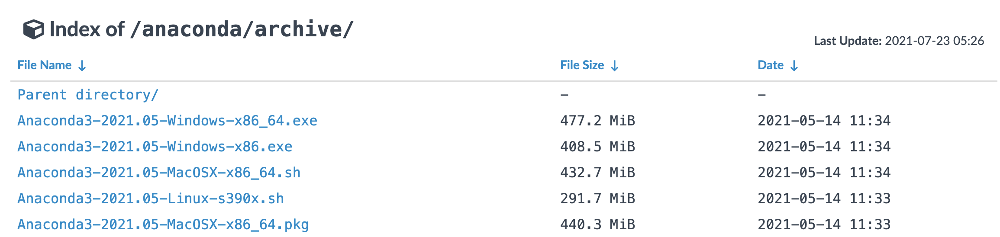
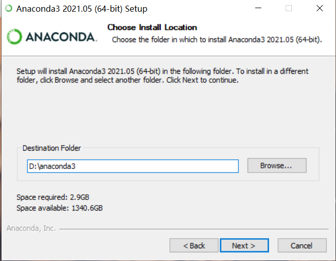
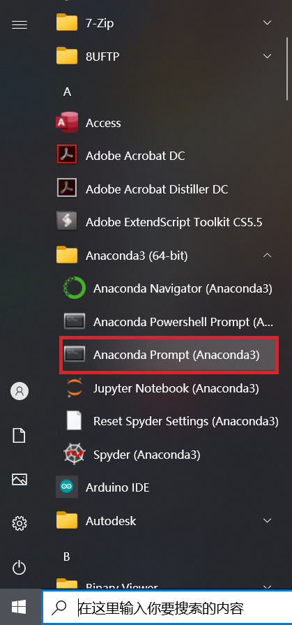

# 零基础windows安装并实现图像风格迁移

## 第1步：安装Anaconda

- 说明：使用paddlepaddle需要先安装python环境，这里我们选择python集成环境Anaconda工具包
  - Anaconda是1个常用的python包管理程序
  - 安装完Anaconda后，可以安装python环境，以及numpy等所需的工具包环境。
- Anaconda下载：
  - 地址：https://mirrors.tuna.tsinghua.edu.cn/anaconda/archive/?C=M&O=D
  - 大部分win10电脑均为64位操作系统，选择x86_64版本；若电脑为32位操作系统，则选择x86.exe
  - 
  - 下载完成后，双击安装程序进入图形界面
  - 默认安装位置为C盘，建议将安装位置更改到D盘：
    - 
  - 勾选conda加入环境变量，忽略警告：
    - 

## 第2步：打开终端并创建conda环境

- 打开Anaconda Prompt终端
  - 左下角Windows Start Menu -> Anaconda3 -> Anaconda Prompt启动控制台
  - 


- 创建新的conda环境

  - ```shell
    # 在命令行输入以下命令，创建名为paddle_env的环境
    # 此处为加速下载，使用清华源
    conda create --name paddle_env python=3.8 --channel https://mirrors.tuna.tsinghua.edu.cn/anaconda/pkgs/free/  # 这是一行命令
    ```

  - 该命令会创建1个名为paddle_env、python版本为3.8的可执行环境，根据网络状态，需要花费一段时间

  - 之后命令行中会输出提示信息，输入y并回车继续安装

  - 

- 激活刚创建的conda环境，在命令行中输入以下命令：

  - ```shell
    # 激活paddle_env环境
    conda activate paddle_env
    # 查看当前python的位置
    where python
    ```

  - 

  - 以上anaconda环境和python环境安装完毕

## 第3步：安装程序运行所需库

- 使用pip命令在刚激活的环境中安装paddle，

  - ```shell
    # 在命令行中输入以下命令
    # 确认当前所用的pip是否是paddle_env环境下的pip
    where pip
    # 默认安装CPU版本，安装paddle时建议使用百度源
    pip install paddlepaddle -i https://mirror.baidu.com/pypi/simple
    ```

  - 若需要安装GPU版本，则请打开[paddle官网](https://www.paddlepaddle.org.cn/)选择适合的版本

    - paddle官网：https://www.paddlepaddle.org.cn/
    - 由于安装GPU版本需要先配置好CUDA和cudnn，建议有一定基础后再安装GPU版本

- 安装完paddle后，继续在paddle_env环境中安装paddlehub：

  - ```shell
    # 在命令行中输入以下命令
    pip install paddlehub -i https://mirror.baidu.com/pypi/simple
    ```

  - paddlehub的介绍文档：https://github.com/PaddlePaddle/PaddleHub/blob/release/v2.1/README_ch.md

## 第4步：安装paddlehub并下载模型

- 安装完paddlehub后，下载风格迁移模型：

  - ```shell
    # 在命令行中输入以下命令
    hub install stylepro_artistic==1.0.1
    ```

  - 模型的说明文档：[https://www.paddlepaddle.org.cn/hubsearch?filter=en_category&value=%7B%22scenes%22%3A%5B%22GANs%22%5D%7D](https://www.paddlepaddle.org.cn/hubsearch?filter=en_category&value={"scenes"%3A["GANs"]})

  - 

## 第5步：准备风格迁移数据和代码

### 准备风格迁移数据

- 切换工作目录到`D:\style_transfer`，在命令行中输入以下命令

  - ```shell
    # 在命令行中输入以下命令
    #把当前工作目录切换到D盘根目录
    D:
    #创建style_transfer目录
    mkdir style_transfer
    #切换当前目录到style_transfer目录
    cd style_transfer
    ```

- 分别放置待转换图片和风格图片
  - 将待转换图片放置到`D:\style_transfer\pic.jpg`
    - 
  - 将风格图片放置到`D:\style_transfer\fangao.jpg`
    - 

### 代码

- 在`D:\style_transfer`目录下创建代码文件`style_transfer.py`

  - 若没有vscode等编辑器，可使用记事本先创建1个txt文件，再将文件名改成`style_transfer.py`

- 在`style_transfer.py`中复制进如下代码：

  - ```python
    import paddlehub as hub
    import cv2
  
    # 待转换图片的绝对地址
    picture = 'D:\\style_transfer\\pic.jpg'  # 注意代码中此处为双反斜杠
    # 风格图片的绝对地址
    style_image = 'D:\\style_transfer\\fangao.jpg'
  
    # 创建风格转移网络并加载参数
    stylepro_artistic = hub.Module(name="stylepro_artistic")
  
    # 读入图片并开始风格转换
    result = stylepro_artistic.style_transfer(
                        images=[{'content': cv2.imread(picture),
                                 'styles': [cv2.imread(style_image)]}],
                        visualization=True
    )
    ```

- 运行代码：

  - 在命令行中，输入`python style_transfer.py`
  - 程序执行时，会创建新文件夹`transfer_result`，并将转换后的文件保存到该目录下
  - 输出图片如下：
    - 

## 第六步：飞桨预训练模型探索之旅
- 恭喜你，到这里PaddleHub在windows环境下的安装和入门案例就全部完成了，快快开启你更多的深度学习模型探索之旅吧。[【更多模型探索，跳转飞桨官网】](https://www.paddlepaddle.org.cn/hublist)
