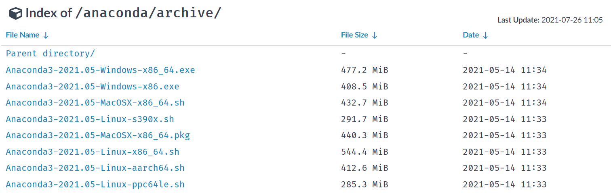
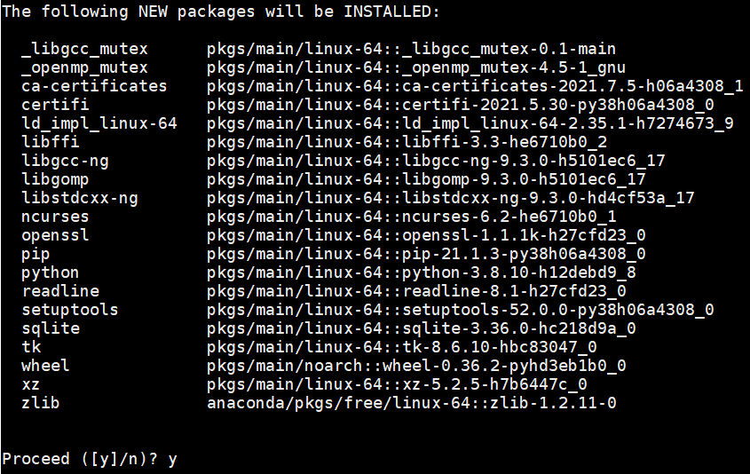

# Zero base Linux installation and image style transfer

## Step 1: Install Anaconda

- Note: To use paddlepaddle, you need to install the Python environment first. Here we choose the Python integrated environment Anaconda toolkit.
  - Anaconda is a commonly used python package management program.
  - After installing Anaconda, you can install the python environment and the toolkit environment required by numpy.
  
- **Download Anaconda**：
  
  - Download address: https://mirrors.tuna.tsinghua.edu.cn/anaconda/archive/?C=M&O=D
    - 
    - Select the version appropriate for your operating system
      - You can enter `uname -m` at the terminal to query the instruction set used by the system
    
  - Download method 1: Download locally, and then transfer the installation package to the Linux server
  
  - Download method 2: directly use the Linux command line to download
  
    - ```shell
      # Install wget first
      sudo apt-get install wget  # Ubuntu
      sudo yum install wget  # CentOS
      ```
  
    - ```shell
      # Then use wget to download from Tsinghua Source
      # To download Anaconda3-2021.05-Linux-x86_64.sh, the download command is as follows:
      wget https://mirrors.tuna.tsinghua.edu.cn/anaconda/archive/Anaconda3-2021.05-Linux-x86_64.sh
      
      # If you want to download other versions, you need to change the last/last file name to the version you want to download
      ```
  
- To install Anaconda:

  - At the command line, enter `sh Anaconda3-2021.05-Linux-x86_64.sh`
    - If you download another version, replace the file name of the command with the file name you downloaded
  - Just follow the installation prompts
    - When viewing the license, you can enter q to exit
  
- **Add conda to the environment variable**

  - The environment variable is added to enable the system to recognize the conda command. If you have added conda to the environment variable path during installation, you can skip this step

  - Open `~/.bashrc` in the terminal:

    - ```shell
      # Enter the following command in the terminal:
      vim ~/.bashrc
      ```

  - Add conda as an environment variable in `~/.bashrc`:

    - ```shell
      # Press i first to enter editing mode
      # On the first line, enter:
      export PATH="~/anaconda3/bin:$PATH"
      # If the installation location is customized during installation, change ~/anaconda3/bin to the bin folder under the customized installation directory
      ```

    - ```shell
      # Modified ~/.bash_profile file should be as follows (where xxx is the user name):：
      export PATH="~/opt/anaconda3/bin:$PATH"
      # >>> conda initialize >>>
      # !! Contents within this block are managed by 'conda init' !!
      __conda_setup="$('/Users/xxx/opt/anaconda3/bin/conda' 'shell.bash' 'hook' 2> /dev/null)"
      if [ $? -eq 0 ]; then
          eval "$__conda_setup"
      else
          if [ -f "/Users/xxx/opt/anaconda3/etc/profile.d/conda.sh" ]; then
              . "/Users/xxx/opt/anaconda3/etc/profile.d/conda.sh"
          else
              export PATH="/Users/xxx/opt/anaconda3/bin:$PATH"
          fi
      fi
      unset __conda_setup
      # <<< conda initialize <<<
      ```

    - After modification, press the `esc` key to exit editing mode, and then enter `:wq!` And enter to save the exit

  - Verify that the conda command is recognized:

    - Enter `source ~/.bash_profile` in the terminal to update environment variables
    - Then enter `conda info --envs` on the terminal. If the current base environment can be displayed, conda has added an environment variable

## Step 2: Create a conda environment

- Create a new conda environment

  - ```shell
    # On the command line, enter the following command to create a file named  paddle_env environment
    # This is for accelerated download, use Tsinghua Source
    conda create --name paddle_env python=3.8 --channel https://mirrors.tuna.tsinghua.edu.cn/anaconda/pkgs/free/
    ```

  - This command will create an executable environment named paddle_env with Python version 3.8. It will take a while depending on the network status

  - Then the command line will output a prompt message, enter y and press Enter to continue the installation

    - 

- Activate the newly created conda environment, and enter the following command on the command line:

  - ```shell
    # Activate paddle_env environment
    conda activate paddle_env
    ```
    
  - The above anaconda environment and python environment have been installed

## Step 3: Install the libraries required by the program

- Use the pip command to install the paddle in the newly activated environment:

  - ```shell
    # On the command line, enter the following command:
    # The CPU version is installed by default. Baidu Source is recommended when installing the paddlepaddle
    pip install paddlepaddle -i https://mirror.baidu.com/pypi/simple
    ```
  
- After installing the PaddlePaddle, continue to install the paddlehub in the paddle_env environment:

  - ```shell
    # On the command line, enter the following command:
    pip install paddlehub -i https://mirror.baidu.com/pypi/simple
    ```

  - Introduction document of paddlehub: https://github.com/PaddlePaddle/PaddleHub/blob/release/v2.3/README_ch.md
  
  - When installing the paddlehub, other dependent libraries will be installed automatically, which may take a while

## Step 4: Install the paddlehub and download the model

- After installing the paddlehub, download the style migration model:

  - ```shell
    # Enter the following command on the command line
    hub install stylepro_artistic==1.0.1
    ```

  - Description document of the model: [https://www.paddlepaddle.org.cn/hubsearch?filter=en_category&value=%7B%22scenes%22%3A%5B%22GANs%22%5D%7D](https://www.paddlepaddle.org.cn/hubsearch?filter=en_category&value={"scenes"%3A["GANs"]})

  - 

## Step 5: Prepare the style to migrate data and code

### Prepare style migration data

- Create Working Directory `style_transfer` under User Directory `~`

  - ```shell
    # Enter the following command in the terminal:
    cd ~  # Enter the user directory
    mkdir style_transfer  # Create style_transfer folder
    cd style_transfer  # Enter style_transfer directory
    ```

- Place pictures to be converted and style pictures respectively:

  - Place the picture to be converted to `~/style_transfer/pic.jpg`
    - 
  - Place style picture to `~/style_transfer/fangao.jpg`
    - 

### Code

- Create code file:

  - ```shell
    # The following commands are executed on the command line
    $ pwd # Check whether the current directory is style_transfer， if not, enter: cd ~/style_transfer
    $ touch style_transfer.py  # Create an empty file
    $ vim style_transfer.py  # Open code file with vim editor
    # Enter i first to enter editing mode
    # Copy the code into the vim editor
    # Press esc key to exit editing mode, then enter ": wq" and enter Enter to save and exit
    ```
    
  - ```python
    # Code
    import paddlehub as hub
    import cv2
    
    # Relative address of the picture to be converted
    picture = './pic.jpg'
    # Relative address of style picture
    style_image = './fangao.jpg'
    
    # Create a style transfer network and load parameters
    stylepro_artistic = hub.Module(name="stylepro_artistic")
    
    # Read in pictures and start style conversion
    result = stylepro_artistic.style_transfer(
                        images=[{'content': cv2.imread(picture),
                                 'styles': [cv2.imread(style_image)]}],
                        visualization=True
    )
    ```

- Running code:

  - On the command line, enter `python style_transfer.py`
  - When the program executes, a new folder `transfer_result` will be created, and save the converted file to this directory
  - The output pictures are as follows:
    - 

## Step 6: Explore the pre training model of flying oars
- Congratulations, the installation and introduction cases of PaddleHub in the Linux environment will be completed here. Start your more in-depth learning model exploration journey quickly.[【More model exploration, jump to the official website of PaddlePaddle】](https://www.paddlepaddle.org.cn/hublist)

