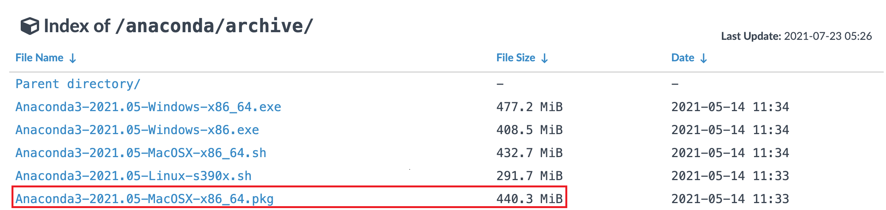
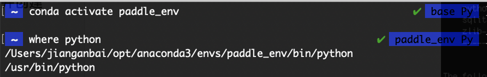

# Zero base mac installation and image style transfer

## Step 1: Install Anaconda

- Note: To use paddlepaddle, you need to install the Python environment first. Here we choose the Python integrated environment Anaconda toolkit
  - Anaconda is a commonly used python package management program
  - After installing Anaconda, you can install the python environment and the toolkit environment required by numpy
- Anaconda Download:
  - Link: https://mirrors.tuna.tsinghua.edu.cn/anaconda/archive/?C=M&O=D
  - 
  - Select the lowest `Anaconda3-2021.05-MacOSX-x86_64.pkg` download
- After downloading, double click the. pkg file to enter the graphical interface
  - By default, the installation will take a while
- It is recommended to install a code editor such as vscode or pycharm

## Step 2: Open the terminal and create a conda environment

- Open terminal

  - Press the command key and the space bar at the same time, enter "terminal" in the focus search, and double-click to enter the terminal

- **Add conda to the environment variable**

  - The environment variable is added to enable the system to recognize the conda command

  - Enter the following command to open `~/.bash_profile`：

    - ```shell
      vim ~/.bash_profile
      ```

  - In `~/.bash_profile` add conda as an environment variable:

    - ```shell
      # Press i first to enter editing mode
      # On the first line, enter:
      export PATH="~/opt/anaconda3/bin:$PATH"
      # If the installation location is customized during installation, change ~/opt/anaconda3/bin to the bin folder under the customized installation directory
      ```

    - ```shell
      # Modified ~/.bash_profile file should be as follows (where xxx is the user name):
      export PATH="~/opt/anaconda3/bin:$PATH"
      # >>> conda initialize >>>
      # !! Contents within this block are managed by 'conda init' !!
      __conda_setup="$('/Users/xxx/opt/anaconda3/bin/conda' 'shell.bash' 'hook' 2> /dev/null)"
      if [ $? -eq 0 ]; then
          eval "$__conda_setup"
      else
          if [ -f "/Users/xxx/opt/anaconda3/etc/profile.d/conda.sh" ]; then
              . "/Users/xxx/opt/anaconda3/etc/profile.d/conda.sh"
          else
              export PATH="/Users/xxx/opt/anaconda3/bin:$PATH"
          fi
      fi
      unset __conda_setup
      # <<< conda initialize <<<
      ```

    - After modification, press the `esc` key to exit editing mode, and then enter `:wq!` And enter to save the exit

  - Verify that the conda command is recognized:

    - Enter `source ~/.bash_profile` to update environment variables
    - Then enter `conda info --envs` on the terminal. If the current base environment can be displayed, conda has added an environment variable

- Create a new conda environment

  - ```shell
    # On the command line, enter the following command to create a file named paddle_env environment
    # This is for accelerated download, use Tsinghua source
    conda create --name paddle_env python=3.8 --channel https://mirrors.tuna.tsinghua.edu.cn/anaconda/pkgs/free/
    ```

  - This command will create an executable environment named paddle_env with Python version 3.8. It will take a while depending on the network status

  - Then the command line will output a prompt message, enter y and press Enter to continue the installation

    - 

- Activate the newly created conda environment, and enter the following command on the command line:

  - ```shell
    # Activate paddle_env environment
    conda activate paddle_env
    # View the current python location
    where python
    ```

  - 

  - The above anaconda environment and python environment have been installed

## Step 3: Install the libraries required by the program

- Use the pip command to install the pad in the newly activated environment:

  - ```shell
    # Enter the following command on the command line
    # Confirm whether the currently used pip is the pip in the paddle_env environment
    where pip
    # The CPU version is installed by default. Baidu Source is recommended when installing the PaddlePaddle
    pip install paddlepaddle -i https://mirror.baidu.com/pypi/simple
    ```

- After installing Paddle, continue to install the PaddleHub in the paddle_env environment:

  - ```shell
    # Enter the following command on the command line
    pip install paddlehub -i https://mirror.baidu.com/pypi/simple
    ```

  - Introduction document of paddlehub: https://github.com/PaddlePaddle/PaddleHub/blob/release/v2.3/README_ch.md
  
  - When installing the paddlehub, other dependent libraries will be installed automatically, which may take a while

## Step 4: Install the paddlehub and download the model

- After installing the PaddleHub, download the style migration model:

  - ```shell
    # Enter the following command on the command line
    hub install stylepro_artistic==1.0.1
    ```

  - Description document of the model: [https://www.paddlepaddle.org.cn/hubsearch?filter=en_category&value=%7B%22scenes%22%3A%5B%22GANs%22%5D%7D](https://www.paddlepaddle.org.cn/hubsearch?filter=en_category&value={"scenes"%3A["GANs"]})

  - 

## Step 5: Prepare the style to migrate data and code

### Prepare style migration data

- Create Working Directory `style_transfer` on Desktop 

  - ```shell
    # Enter the following command in the terminal:
    cd ~/Desktop  # Enter the desktop
    mkdir style_transfer  # Create style_transfer folder
    cd style_transfer  # Enter style_transfer directory
    ```

- Place pictures to be converted and style pictures respectively:

  - Place the picture to be converted on the desktop  `style_transfer/pic.jpg`
    - 
  - Place Style Picture on Desktop `style_transfer/fangao.jpg`
    - 

### 代码

- In `style_transfer` create code file `style_transfer.py`

- Copy the following code into `style_transfer.py`

  - ```python
    import paddlehub as hub
    import cv2
    
    # Relative address of the picture to be converted
    picture = './pic.jpg'
    # Relative address of style picture
    style_image = './fangao.jpg'
    
    # Create a style transfer network and load parameters
    stylepro_artistic = hub.Module(name="stylepro_artistic")
    
    # Read in pictures and start style conversion
    result = stylepro_artistic.style_transfer(
                        images=[{'content': cv2.imread(picture),
                                 'styles': [cv2.imread(style_image)]}],
                        visualization=True
    )
    ```

- If there is no code editor such as vscode, you can use the command line method:

  - ```shell
    pwd # Check whether the current directory is style_transfer， if not, enter: cd ~/Desktop/style_transfer
    touch style_transfer.py  # Create an empty file
    vim style_transfer.py  #  Open code file with vim editor
    # Enter i first to enter editing mode
    # Copy the above code into the vim editor
    # Press esc key to exit editing mode, then enter ": wq" and enter Enter to save and exit
    ```

- Running code:

  - On the command line, enter `python style_transfer.py`
  - When the program executes, a new folder `transfer_result` will be created, and save the converted file to this directory
  - The output pictures are as follows:
    - 

## Step 6: Explore the pre training model of flying oars
- Congratulations, the installation and introduction cases of PaddleHub in the Mac environment will be completed here. Start your more in-depth learning model exploration journey quickly.[【More model exploration, jump to the official website of PaddlePaddle】](https://www.paddlepaddle.org.cn/hublist)


