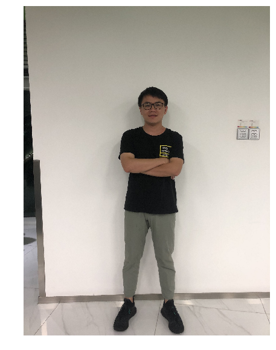
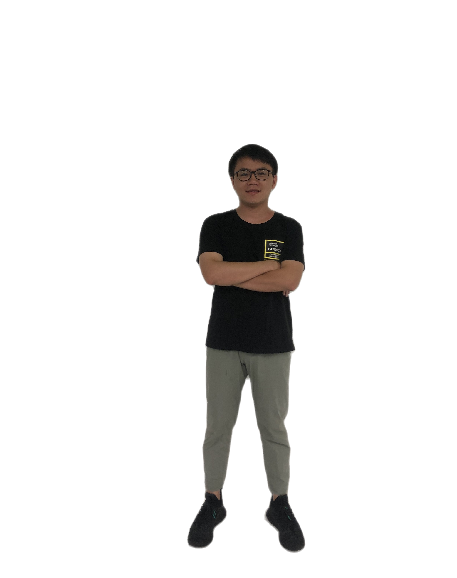
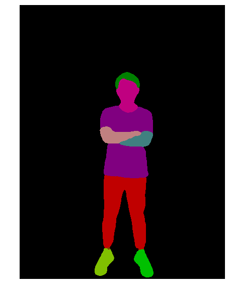

=================
Quick experience
=================

In PaddleHub, the concept `Module` represents an executable module, which usually a pre-trained model that can be used for end-to-end prediction, such as a face detection model or a lexical analysis model, or a pre-trained model that requires finetuning, such as BERT/ERNIE. 

PaddleHub adopts the model-based software design concept. All pre-training models are similar to Python packages, with the concept of version.

This tutorial will take you to quickly experience how to use the pre-trained model provided by PaddleHub to quickly complete several common AI tasks.

Download test image
=============================================

First of all, let's download a test image through `wget`.

.. code-block:: shell

    # Download a picture
    wget https://paddlehub.bj.bcebos.com/resources/test_image.jpg

Human segmentation
=============================================

Human segmentation aims to distinguish the person and the background in the input image. This task has many application scenarios, such as background blur, background replacement, film and television post-processing, etc. We use `humanseg_lite <https://www.paddlepaddle.org.cn/hubdetail?name=humanseg_lite&en_category=ImageSegmentation>`_ to show this feature.

.. code-block:: python

    import paddlehub as hub
    # module = hub.Module(name="humanseg_lite", version="1.1.1")
    module = hub.Module(name="humanseg_lite")

    res = module.segmentation(
        paths = ["./test_image.jpg"], 
        visualization=True, 
        output_dir='humanseg_output')

Human parsing
=============================================

Human parsing is a more detailed task of human segmentation. It aims to extract and distinguish different parts of the human body in the input photo. It is often used with many emerging GAN models. Application scenarios include beauty, changing clothes, etc. We use `ace2p <https://www.paddlepaddle.org.cn/hubdetail?name=ace2p&en_category=ImageSegmentation>`_ to show this feature.

.. code-block:: python

    import paddlehub as hub
    # module = hub.Module(name="ace2p", version="1.1.0")
    module = hub.Module(name="ace2p")

    res = module.segment(
        paths = ["./test_image.jpg"], 
        visualization=True, 
        output_dir='ace2p_output')

Face Detection 
=============================================

The task of face detection aims to detect all the faces in the input picture and give the specific coordinates and size of the faces (generally called the bounding box). Application scenarios include video surveillance, traffic analysis, etc. We use `ultra_light_fast_generic_face_detector_1mb_640 <https://www.paddlepaddle.org.cn/hubdetail?name=ultra_light_fast_generic_face_detector_1mb_640&en_category=FaceDetection>`_ to show this feature.

.. code-block:: python

    import paddlehub as hub
    # module = hub.Module(name="ultra_light_fast_generic_face_detector_1mb_640", version="1.1.2")
    module = hub.Module(name="ultra_light_fast_generic_face_detector_1mb_640")

    res = module.face_detection(
        paths = ["./test_image.jpg"], 
        visualization=True, 
        output_dir='face_detection_output')

Key Point Detection
=============================================

The key point detection task aims to identify different key points of each human body in the input image, such as the head, shoulders, joints, etc. The number of key points that can be identified is also different depending on the model's ability. This task can be used for human body beauty, human body gesture recognition and other tasks. We use `openpose_body_estimation <https://www.paddlepaddle.org.cn/hubdetail?name=openpose_body_estimation&en_category=KeyPointDetection>`_ to show this feature.

.. code-block:: python

    import paddlehub as hub
    # module = hub.Module(name="openpose_body_estimation", version="1.0.0")
    module = hub.Module(name="openpose_body_estimation")

    res = module.predict(
        img="./test_image.jpg", 
        visualization=True, 
        save_path='keypoint_output')

Lexical analysis of Chinese
=============================================

Chinese lexical analysis aims to perform tasks such as word segmentation, part-of-speech analysis, and named entity recognition on the input Chinese sentences. We use `lac <https://www.paddlepaddle.org.cn/hubdetail?name=lac&en_category=LexicalAnalysis>`_ to show this feature.

.. code-block:: python

    import paddlehub as hub
    # lac = hub.Module(name="lac", version="2.2.0")
    lac = hub.Module(name="lac")

    test_text = ["1996年，曾经是微软员工的加布·纽维尔和麦克·哈灵顿一同创建了Valve软件公司。他们在1996年下半年从id software取得了雷神之锤引擎的使用许可，用来开发半条命系列。"]
    print(lac.lexical_analysis(texts = test_text))
    
----------------

    [{'word': ['1996年', '，', '曾经', '是', '微软', '员工', '的', '加布·纽维尔', '和', '麦克·哈灵顿', '一同', '创建', '了', 'Valve软件公司', '。', '他们', '在', '1996年下半年', '从', 'id', ' ', 'software', '取得', '了', '雷神之锤', '引擎', '的', '使用', '许可', '，', '用来', '开发', '半条命', '系列', '。'], 'tag': ['TIME', 'w', 'd', 'v', 'ORG', 'n', 'u', 'PER', 'c', 'PER', 'd', 'v', 'u', 'ORG', 'w', 'r', 'p', 'TIME', 'p', 'nz', 'w', 'n', 'v', 'u', 'n', 'n', 'u', 'vn', 'vn', 'w', 'v', 'v', 'n', 'n', 'w']}]

Sentiment analysis of Chinese
=============================================

Chinese sentiment analysis aims to analyze the sentiment tendency of input Chinese sentences. We use `senta_bilstm <https://www.paddlepaddle.org.cn/hubdetail?name=senta_bilstm&en_category=SentimentAnalysis>`_ to show this feature.

.. code-block:: python

    import paddlehub as hub
    # senta = hub.Module(name="senta_bilstm", version="1.2.0")
    senta = hub.Module(name="senta_bilstm")

    test_text = ["味道不错，确实不算太辣，适合不能吃辣的人。就在长江边上，抬头就能看到长江的风景。鸭肠、黄鳝都比较新鲜。"]
    print(senta.sentiment_classify(texts = test_text))

----------------

    [{'text': '味道不错，确实不算太辣，适合不能吃辣的人。就在长江边上，抬头就能看到长江的风景。鸭肠、黄鳝都比较新鲜。', 'sentiment_label': 1, 'sentiment_key': 'positive', 'positive_probs': 0.9771, 'negative_probs': 0.0229}]