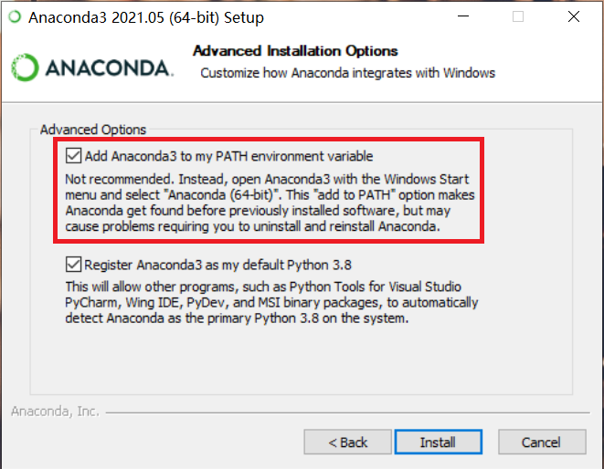
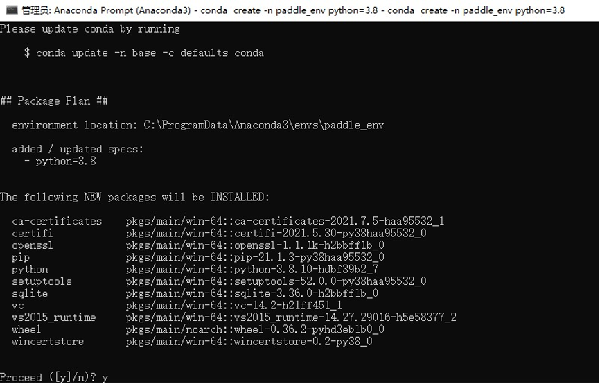

# Zero base Windows installation and image style transfer

## Step 1: Install Anaconda

- Note: To use paddlepaddle, you need to install the Python environment first. Here we choose the Python integrated environment Anaconda toolkit
  - Anaconda is a commonly used python package management program
  - After installing Anaconda, you can install the python environment and the toolkit environment required by numpy.
- Anaconda Download:
  - Link: https://mirrors.tuna.tsinghua.edu.cn/anaconda/archive/?C=M&O=D
  - Most win10 computers are 64 bit operating systems, choose x86_64 version; If the computer is a 32-bit operating system, select x86.exe
  - 
  - After downloading, double click the installer to enter the graphical interface
  - The default installation location is Disk C, and it is recommended to change the installation location to Disk D:
    - 
  - Check conda to add environment variables, and ignore the warning:
    - 

## Step 2: Open the terminal and create a conda environment

- Open Anaconda Prompt terminal
  - Windows Start Menu -> Anaconda3 -> Anaconda Prompt
  - 


- Create a new conda environment

  - ```shell
    # On the command line, enter the following command to create a file named paddle_env Env environment
    # This is for accelerated download, use Tsinghua Source
    conda create --name paddle_env python=3.8 --channel https://mirrors.tuna.tsinghua.edu.cn/anaconda/pkgs/free/  # 这是一行命令
    ```

  - This command will create an executable environment named paddle_env with Python version 3.8. It will take a while depending on the network status

  - Then the command line will output a prompt message, enter y and press Enter to continue the installation

  - 

- Activate the newly created conda environment, and enter the following command on the command line:

  - ```shell
    # Activate paddle_env environment
    conda activate paddle_env
    # View the current python location
    where python
    ```

  - 

  - The above anaconda environment and python environment have been installed

## Step 3: The required libraries for the installer to run

- Use the pip command to install the PaddlePaddle in the environment you just activated

  - ```shell
    # Enter the following command on the command line
    # Confirm whether the currently used pip is a pad_ Pip in env environment
    where pip
    # The CPU version is installed by default. Baidu Source is recommended when installing the paddle
    pip install paddlepaddle -i https://mirror.baidu.com/pypi/simple
    ```

  - If you need to install the GPU version, please open the [paddle official website](https://www.paddlepaddle.org.cn/) select the appropriate version.

    - Paddle official website: https://www.paddlepaddle.org.cn/
    - Since CUDA and cudnn need to be configured before installing the GPU version, it is recommended to install the GPU version after a certain foundation

- After installing the Paddle, continue to install the paddlehub in the paddle_env environment:

  - ```shell
    # Enter the following command on the command line
    pip install paddlehub -i https://mirror.baidu.com/pypi/simple
    ```

  - Introduction document of paddlehub: https://github.com/PaddlePaddle/PaddleHub/blob/release/v2.1/README_ch.md

## Step 4: Install the paddlehub and download the model

- After installing the paddlehub, download the style migration model:

  - ```shell
    # Enter the following command on the command line
    hub install stylepro_artistic==1.0.1
    ```

  - Description document of the model: [https://www.paddlepaddle.org.cn/hubsearch?filter=en_category&value=%7B%22scenes%22%3A%5B%22GANs%22%5D%7D](https://www.paddlepaddle.org.cn/hubsearch?filter=en_category&value={"scenes"%3A["GANs"]})

  - 

## Step 5: Prepare the style to migrate data and code

### Prepare style migration data

- Switch Working Directory to `D:\style_transfer`, enter the following command on the command line

  - ```shell
    # Enter the following command on the command line
    # Switch the current working directory to the root directory of disk D
    D:
    # Create style_transfer directory
    mkdir style_transfer
    # Switch the current directory to style_transfer directory
    cd style_transfer
    ```

- Place pictures to be converted and style pictures respectively
  - Place the picture to be converted to `D:\style_transfer\pic.jpg`
    - 
  - Place Style Picture to `D:\style_transfer\fangao.jpg`
    - 

### Code

- In `D:\style_transfer` create code file `style_transfer.py`

  - If there is no editor such as vscode, you can use Notepad to create a txt file first, and then change the file name to `style_transfer.py`

- Copy the following code into `style_transfer.py`

  - ```python
    import paddlehub as hub
    import cv2
  
    # The absolute address of the picture to be converted
    picture = 'D:\\style_transfer\\pic.jpg'  # Note that double backslashes are used in the code
  
    # Absolute address of the style picture
    style_image = 'D:\\style_transfer\\fangao.jpg'
  
    # Create a style transfer network and load parameters
    stylepro_artistic = hub.Module(name="stylepro_artistic")
  
    # Read in pictures and start style conversion
    result = stylepro_artistic.style_transfer(
                        images=[{'content': cv2.imread(picture),
                                 'styles': [cv2.imread(style_image)]}],
                        visualization=True
    )
    ```

- Running code:

  - On the command line, enter `python style_transfer.py`
  - When the program executes, a new folder `transfer_result` will be created, and save the converted file to this directory.
  - The output picture is as follows:
    - 

## Step 6: Explore the pre training model of flying oars
- Congratulations, the installation and introduction cases of PaddleHub in the Windows environment will be completed here. Start your more in-depth learning model exploration journey quickly.[【More model exploration, jump to the official website of PaddlePaddle】](https://www.paddlepaddle.org.cn/hublist)

