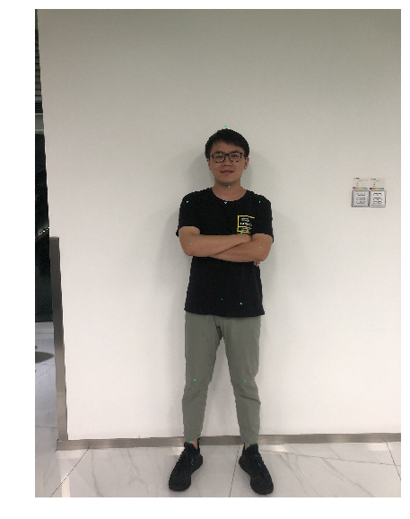

# Using PaddleHub through Python Code Execution

The codes/commands on this page can run online on [AIStudio](https://aistudio.baidu.com/aistudio/projectdetail/635335). It is similar to the notebook environment, which can be accessed through a browser, without environment preparation. This is a quick and easy experiences for developers.

## PaddleHub example for computer vision tasks

Taking the computer vision task as an example, we choose a test image test.jpg to implement the following four functions:

* Portrait Cutout ([deeplabv3p\_xception65\_humanseg](https://www.paddlepaddle.org.cn/hubdetail?name=deeplabv3p_xception65_humanseg&en_category=ImageSegmentation))

* Body Part Segmentation ([ace2p](https://www.paddlepaddle.org.cn/hubdetail?name=ace2p&en_category=ImageSegmentation))

* Face Detection ([ultra\_light\_fast\_generic\_face\_detector\_1mb\_640](https://www.paddlepaddle.org.cn/hubdetail?name=ultra_light_fast_generic_face_detector_1mb_640&en_category=FaceDetection))

* Key Point Detection ([human\_pose\_estimation\_resnet50\_mpii](https://www.paddlepaddle.org.cn/hubdetail?name=human_pose_estimation_resnet50_mpii&en_category=KeyPointDetection))

> Note: If you need to find out which pre-training models can be executed from PaddleHub, get the model name (for example, deeplabv3p\_xception65\_humanseg, by which the model will be executed in subsequent codes). For details, see official website document. In the documents, it is easy to search because models are classified according to model categories, with providing a detailed description of the models.

### Before experience, install the PaddleHub.

```shell
# install the latest version
$ pip install paddlehub --upgrade -i https://pypi.tuna.tsinghua.edu.cn/simple
```

### Original Image Display

```shell
# Download a picture
$ wget https://paddlehub.bj.bcebos.com/resources/test_image.jpg
```

    --2020-07-22 12:22:19--  https://paddlehub.bj.bcebos.com/resources/test_image.jpg
    Resolving paddlehub.bj.bcebos.com (paddlehub.bj.bcebos.com)... 182.61.200.195, 182.61.200.229
    Connecting to paddlehub.bj.bcebos.com (paddlehub.bj.bcebos.com)|182.61.200.195|:443... connected.
    HTTP request sent, awaiting response... 200 OK
    Length: 967120 (944K) [image/jpeg]
    Saving to: ‘test_image.jpg.1’

    test_image.jpg.1    100%[===================>] 944.45K  5.51MB/s    in 0.2s  

    2020-07-22 12:22:19 (5.51 MB/s) - ‘test_image.jpg.1’ saved [967120/967120]


### Portrait Cutout

PaddleHub adopts the model-based software design concept. All pre-training models are similar to Python packages, with the concept of version. You can install, upgrade, and remove the model conveniently by running the commands `hub install` and `hub uninstall`:

> By default, you can download the model of the latest version by running the following command. If you want to specify the version, you can add the version number after the `==1.1.1` command.

```shell
#intall pre-trained models
$ hub install deeplabv3p_xception65_humanseg
```

    Downloading deeplabv3p_xception65_humanseg
    [==================================================] 100.00%
    Uncompress /home/aistudio/.paddlehub/tmp/tmpo32jeve0/deeplabv3p_xception65_humanseg
    [==================================================] 100.00%
    Successfully installed deeplabv3p_xception65_humanseg-1.1.1

```python
# import paddlehub
import paddlehub as hub
module = hub.Module(name="deeplabv3p_xception65_humanseg")
res = module.segmentation(paths = ["./test_image.jpg"], visualization=True, output_dir='humanseg_output')
```

    [32m[2020-07-22 12:22:49,474] [    INFO] - Installing deeplabv3p_xception65_humanseg module [0m


​  
    Downloading deeplabv3p_xception65_humanseg
    [==================================================] 100.00%
    Uncompress /home/aistudio/.paddlehub/tmp/tmpzrrl1duq/deeplabv3p_xception65_humanseg
    [==================================================] 100.00%


​  
    [32m[2020-07-22 12:23:11,811] [    INFO] - Successfully installed deeplabv3p_xception65_humanseg-1.1.1 [0m


As you can see, the execution of PaddleHub with Python codes requires only three lines of codes:

```
import paddlehub as hub  
module = hub.Module(name="deeplabv3p_xception65_humanseg")  
res = module.segmentation(paths = ["./test.jpg"], visualization=True, output_dir='humanseg_output')  
```

* Model names are specified through the `hub.Module` API.
* `module.segmentation` is used to execute the image segmentation prediction tasks. Different prediction APIs are designed for different types of tasks. For example, the face detection task uses the `face_detection` function. It is recommended to view the corresponding model introduction document before the pre-training model is executed.
* The prediction results are saved in `output_dir='humanseg_output'` directory, and you can view the output images in this directory.

For the implementation of other tasks, refer to this pattern. Let's see how the next few tasks are implemented.

### Body Part Segmentation

```shell
$ hub install ace2p
```

    /opt/conda/envs/python35-paddle120-env/lib/python3.7/site-packages/sklearn/externals/joblib/externals/cloudpickle/cloudpickle.py:47: DeprecationWarning: the imp module is deprecated in favour of importlib; see the module's documentation for alternative uses
      import imp
    Downloading ace2p
    [==================================================] 100.00%
    Uncompress /home/aistudio/.paddlehub/tmp/tmpfsovt3f8/ace2p
    [==================================================] 100.00%
    Successfully installed ace2p-1.1.0

```python
import paddlehub as hub
module = hub.Module(name="ace2p")
res = module.segmentation(paths = ["./test_image.jpg"], visualization=True, output_dir='ace2p_output')
```

    [32m[2020-07-22 12:23:58,027] [    INFO] - Installing ace2p module [0m


​  
    Downloading ace2p
    [==================================================] 100.00%
    Uncompress /home/aistudio/.paddlehub/tmp/tmptrogpj6j/ace2p
    [==================================================] 100.00%


​  
    [32m[2020-07-22 12:24:22,575] [    INFO] - Successfully installed ace2p-1.1.0 [0m


### Face Detection

```shell
#install pre-trained model
$ hub install ultra_light_fast_generic_face_detector_1mb_640
```

    Downloading ultra_light_fast_generic_face_detector_1mb_640
    [==================================================] 100.00%
    Uncompress /home/aistudio/.paddlehub/tmp/tmpz82xnmy6/ultra_light_fast_generic_face_detector_1mb_640
    [==================================================] 100.00%
    Successfully installed ultra_light_fast_generic_face_detector_1mb_640-1.1.2

```python
import paddlehub as hub
module = hub.Module(name="ultra_light_fast_generic_face_detector_1mb_640")
res = module.face_detection(paths = ["./test_image.jpg"], visualization=True, output_dir='face_detection_output')
```

    [32m[2020-07-22 12:25:12,948] [    INFO] - Installing ultra_light_fast_generic_face_detector_1mb_640 module [0m


​  
    Downloading ultra_light_fast_generic_face_detector_1mb_640
    [==================================================] 100.00%
    Uncompress /home/aistudio/.paddlehub/tmp/tmpw44mo56p/ultra_light_fast_generic_face_detector_1mb_640
    [==================================================] 100.00%


​  
    [32m[2020-07-22 12:25:14,698] [    INFO] - Successfully installed ultra_light_fast_generic_face_detector_1mb_640-1.1.2


### Key Point Detection

```shell
$ hub install human_pose_estimation_resnet50_mpii
```

    /opt/conda/envs/python35-paddle120-env/lib/python3.7/site-packages/sklearn/externals/joblib/externals/cloudpickle/cloudpickle.py:47: DeprecationWarning: the imp module is deprecated in favour of importlib; see the module's documentation for alternative uses
      import imp
    Downloading human_pose_estimation_resnet50_mpii
    [==================================================] 100.00%
    Uncompress /home/aistudio/.paddlehub/tmp/tmpn_ppwkzq/human_pose_estimation_resnet50_mpii
    [========                                          ] 17.99%

```python
import paddlehub as hub
module = hub.Module(name="human_pose_estimation_resnet50_mpii")
res = module.keypoint_detection(paths = ["./test_image.jpg"], visualization=True, output_dir='keypoint_output')
```

    [32m[2020-07-23 11:27:33,989] [    INFO] - Installing human_pose_estimation_resnet50_mpii module [0m
    [32m[2020-07-23 11:27:33,992] [    INFO] - Module human_pose_estimation_resnet50_mpii already installed in /home/aistudio/.paddlehub/modules/human_pose_estimation_resnet50_mpii [0m


​  
    image saved in keypoint_output/test_imagetime=1595474855.jpg



## PaddleHub Example for Natural Language Processing Tasks

Let's look at two more examples of natural language processing tasks: Chinese word segmentation and sentiment classification tasks.

* Chinese word segmentation ([lac](https://www.paddlepaddle.org.cn/hubdetail?name=lac&en_category=LexicalAnalysis))
* Sentiment analysis ([senta\_bilstm](https://www.paddlepaddle.org.cn/hubdetail?name=senta_bilstm&en_category=SentimentAnalysis))

### Chinese word segmentation

```shell
$ hub install lac
```

    2020-07-22 10:03:09,866-INFO: font search path ['/opt/conda/envs/python35-paddle120-env/lib/python3.7/site-packages/matplotlib/mpl-data/fonts/ttf', '/opt/conda/envs/python35-paddle120-env/lib/python3.7/site-packages/matplotlib/mpl-data/fonts/afm', '/opt/conda/envs/python35-paddle120-env/lib/python3.7/site-packages/matplotlib/mpl-data/fonts/pdfcorefonts']
    2020-07-22 10:03:10,208-INFO: generated new fontManager
    Downloading lac
    [==================================================] 100.00%
    Uncompress /home/aistudio/.paddlehub/tmp/tmp8ukaz690/lac
    [==================================================] 100.00%
    Successfully installed lac-2.1.1

```python
import paddlehub as hub
lac = hub.Module(name="lac")
test_text = ["1996年，曾经是微软员工的加布·纽维尔和麦克·哈灵顿一同创建了Valve软件公司。他们在1996年下半年从id software取得了雷神之锤引擎的使用许可，用来开发半条命系列。"]
res = lac.lexical_analysis(texts = test_text)
print("The resuls are: ", res)
```

    [32m[2020-07-22 10:03:18,439] [    INFO] - Installing lac module[0m
    [32m[2020-07-22 10:03:18,531] [    INFO] - Module lac already installed in /home/aistudio/.paddlehub/modules/lac [0m


​  
    The resuls are: [{'word': ['1996年', '，', '曾经', '是', '微软', '员工', '的', '加布·纽维尔', '和', '麦克·哈灵顿', '一同', '创建', '了', 'Valve软件公司', '。', '他们', '在', '1996年下半年', '从', 'id', ' ', 'software', '取得', '了', '雷神之锤', '引擎', '的', '使用', '许可', '，', '用来', '开发', '半条命', '系列', '。'], 'tag': ['TIME', 'w', 'd', 'v', 'ORG', 'n', 'u', 'PER', 'c', 'PER', 'd', 'v', 'u', 'ORG', 'w', 'r', 'p', 'TIME', 'p', 'nz', 'w', 'n', 'v', 'u', 'n', 'n', 'u', 'vn', 'vn', 'w', 'v', 'v', 'n', 'n', 'w']}]

As you can see, compared to computer vision tasks, there are differences between the input and output interfaces (where you need to enter text, executed as the function parameters), because it depends on the task types. For details, see the API description for the corresponding pre-training model.

### Sentiment classification

```shell
$ hub install senta_bilstm
```

    Module senta_bilstm-1.1.0 already installed in /home/aistudio/.paddlehub/modules/senta_bilstm

```python
import paddlehub as hub
senta = hub.Module(name="senta_bilstm")
test_text = ["味道不错，确实不算太辣，适合不能吃辣的人。就在长江边上，抬头就能看到长江的风景。鸭肠、黄鳝都比较新鲜。"]
res = senta.sentiment_classify(texts = test_text)

print("情感分析结果：", res)
```

    [32m[2020-07-22 10:34:06,922] [    INFO] - Installing senta_bilstm module [0m
    [32m[2020-07-22 10:34:06,984] [    INFO] - Module senta_bilstm already installed in /home/aistudio/.paddlehub/modules/senta_bilstm
    [32m[2020-07-22 10:34:08,937] [    INFO] - Installing lac module[0m
    [32m[2020-07-22 10:34:08,939] [    INFO] - Module lac already installed in /home/aistudio/.paddlehub/modules/lac [0m


​  
    情感分析结果： [{'text': '味道不错，确实不算太辣，适合不能吃辣的人。就在长江边上，抬头就能看到长江的风景。鸭肠、黄鳝都比较新鲜。', 'sentiment_label': 1, 'sentiment_key': 'positive', 'positive_probs': 0.9771, 'negative_probs': 0.0229}]

## Summary

PaddleHub provides a rich set of pre-training models, including image classification, semantic model, video classification, image generation, image segmentation, text review, key point detection and other mainstream models. These can be executed quickly and easily with only 3 lines of Python codes, with the instant output of prediction results. You can try it out by selecting some models from the Pre-training Model List.
