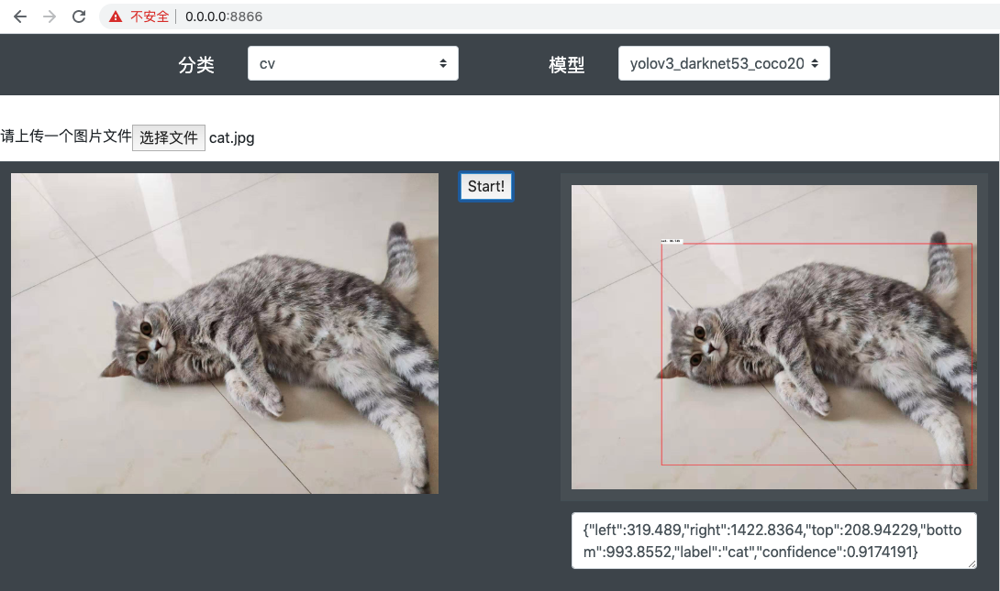
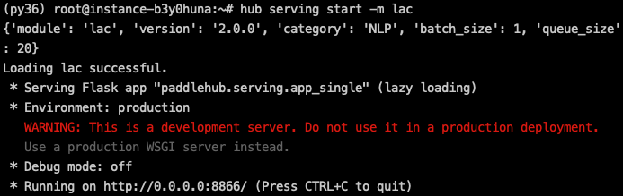

# PaddleHub Serving ： One-Key Deploy Models as Services

## Introduction

### Background

PaddleHub enables the rapid model prediction. Developers are often faced with the need to migrate the local prediction process to go online. PaddleHub's ability to rapidly deploy model prediction services is required, whether to open public service ports or to build the prediction services on a LAN. In this background, the PaddleHub Serving, the model one-key service deployment tool, emerges. Developers can quickly launch a model prediction online service with using a single line of command, without having to concern about the network framework selection and implementation.

### One-Key Service Deployment

PaddleHub Serving is a one-key model service deployment tool based on PaddleHub. It can easily start a model prediction online service through a simple Hub command line tool. The front-end completes the processing of network requests through Flask and Gunicorn. The background directly invokes the PaddleHub prediction interface and supports multi-process to improve the concurrency by using multi-core to ensure the performance of the prediction service.

### Supported Models

Currently, PaddleHub Serving supports the service deployment for all direct prediction PaddleHub models, including `lac`, `senta_bilstm` and other NLP models, as well as `yolov3_darknet53_coco2017`, `vgg16_imagenet` and other CV models. For more models, refer to [PaddleHub Supported Models List](https://paddlepaddle.org.cn/hublist). In the future, developers will also be able to use the models from PaddleHub Fine-tune API for rapid service deployment.

## Usage

### Step 1: Start the server deployment.

PaddleHub Serving starts in two ways: Starting in the command line, and Starting by using the configuration file.

#### Start in command line

Command

```shell
$ hub serving start --modules [Module1==Version1, Module2==Version2, ...] \
                    --port XXXX \
                    --use_gpu \
                    --use_multiprocess \
                    --workers \
                    --gpu \
```

Parameter:

| Parameter          | Purpose                                                      |
| ------------------ | ------------------------------------------------------------ |
| --modules/-m       | PaddleHub Serving pre-installed model. It is listed as multiple Module==Version key value pairs <br/> |
| --port/-p          | Service port. By default, it is 8866.                        |
| --use_gpu          | paddlepaddle-gpu must be installed when the GPU is used for prediction. |
| --use_multiprocess | Whether to enable concurrent mode. By default, it is single process. This is recommended for multi-core CPUs <br/>*`Only single process is supported in Windows system`* |
| --workers          | The number of concurrent tasks specified in the concurrent mode. By default, it is `2*cpu_count-1`, where `cpu_count` is the number of CPU cores. |
| --gpu              | Specify the card number of the GPU to be used. For example, `1,2` means using VGA card 1 and VGA card 2. By default, only VGA card 0 is used. |

**NOTE:** --use\_gpu should not be used together with --use\_multiprocess.

#### Start by using the configuration file

Command

```shell
$ hub serving start --config config.json
```

`config.json`The format is as follows:

```json
{
  "modules_info": {
    "yolov3_darknet53_coco2017": {
      "init_args": {
        "version": "1.0.0"
      },
      "predict_args": {
        "batch_size": 1,
        "use_gpu": false
      }
    },
    "lac": {
      "init_args": {
        "version": "1.1.0"
      },
      "predict_args": {
        "batch_size": 1,
        "use_gpu": false
      }
    }
  },
  "port": 8866,
  "use_multiprocess": false,
  "workers": 2,
  "gpu": "0,1,2"
}

```

Parameter:


### Step 2: Access the server

After deploying the server model prediction service using PaddleHub Serving, you can access the prediction interface on the client to get the results. The interface url format is:

`http://127.0.0.1:8866/predict/<MODULE>`

where `<MODULE>` is the model name.

The prediction results can be obtained by sending a POST request. Below we will show a concrete demo to illustrate the deployment and usage process using the PaddleHub Serving.

### Step 3: Use the PaddleHub Serving to perform the personalization development.

After deploying the model service using the PaddleHub Serving, you can use the obtained interface for development, such as, providing external web services, or accessing the application to reduce the prediction pressure on clients and improve performance. A web page demo is displayed as follows:



### Step 4: Shut down the serving.

Run the shutdown command to shut down the serving.

```shell
$ hub serving stop --port XXXX
```

Parameter:

| Parameter | Purpose                                                      |
| --------- | ------------------------------------------------------------ |
| --port/-p | Specify the service port to be closed. By default, it is 8866. |

## Demo – Deploy an Online Lac Word Segmentation Service

### Step 1: Deploy the lac online service.

Now, we want to deploy a lac online service to get the word segmentation results of texts through an interface.

First, choose either start-up methods:

```shell
$ hub serving start -m lac
```

OR

```shell
$ hub serving start -c serving_config.json
```

where `serving_config.json` is as follows.

```json
{
  "modules_info": {
    "lac": {
      "init_args": {
        "version": "1.1.0"
      },
      "predict_args": {
        "batch_size": 1,
        "use_gpu": false
      }
    }
  },
  "port": 8866,
  "use_multiprocess": false,
  "workers": 2
}
```

The successful startup interface is displayed in the following figure:



We have successfully deployed lac's online word segmentation service on port 8866. *The warning here is a Flask prompt, without affecting the usage.*

### Step 2: Access the lac prediction interface.

After the service is deployed, we can test it with the texts `今天是个好日子` and `天气预报说今天要下雨`.

The client codes are as follows:

```python
# coding: utf8
import requests
import json

if __name__ == "__main__":

    text = ["今天是个好日子", "天气预报说今天要下雨"]
    data = {"texts": text, "batch_size": 1}
    url = "http://127.0.0.1:8866/predict/lac"
    headers = {"Content-Type": "application/json"}

    r = requests.post(url=url, headers=headers, data=json.dumps(data))

    # Print results
    print(json.dumps(r.json(), indent=4, ensure_ascii=False))
```

Run and get results.

```python
{
    "msg": "",
    "results": [
        {
            "tag": [
                "TIME", "v", "q", "n"
            ],
            "word": [
                "今天", "是", "个", "好日子"
            ]
        },
        {
            "tag": [
                "n", "v", "TIME", "v", "v"
            ],
            "word": [
                "天气预报", "说", "今天", "要", "下雨"
            ]
        }
    ],
    "status": "0"
}

```

### Step 3: Stop the serving the service

Since we are using the default service port 8866 at startup, the corresponding shutdown command is:

```shell
$ hub serving stop --port 8866
```

Or if you do not specify a shutdown port, the default port is 8866.

```shell
$ hub serving stop
```

Wait for serving to clear the service. The system prompts:

```shell
$ PaddleHub Serving will stop.
```

The serving service has been stopped.

For specific information and codes of this demo, see [LAC Serving](../../demo/serving/module_serving/lexical_analysis_lac). In addition, some other One-key Service Deployment demos are shown below.

## More Demos

* [Chinese lexical analysis - based on lac.](../../demo/serving/module_serving/lexical_analysis_lac)

  This example demonstrates the deployment and online prediction of Chinese text segmentation services using lac, to get the text word-segmentation results, and intervene in the word segmentation results with a user-defined dictionary.

* [Face Detection - based on pyramidbox\_lite\_server\_mask](../../demo/serving/module_serving/object_detection_pyramidbox_lite_server_mask)

  This example shows the face mask detection by using  pyramidbox\_lite\_server\_mask, to detect the location of the face and the confidence level of the mask.
