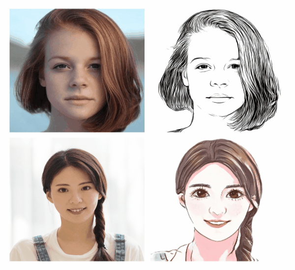

### Text Recognition
- Contain ultra-lightweight Chinese and English OCR models, high-precision Chinese and English, multilingual German, French, Japanese, Korean OCR recognition.
- Many thanks to CopyRight@[PaddleOCR](https://github.com/PaddlePaddle/PaddleOCR) for the pre-trained models, you can try to train your models with PadddleOCR.

### Face Detection
- Including face detection, mask face detection, multiple algorithms are optional.
- Many thanks to CopyRight@[PaddleDetection](https://github.com/PaddlePaddle/PaddleDetection) for the pre-trained models, you can try to train your models with PadddleDetection.

### Image Editing
- 4x super resolution effect, multiple super resolution models are optional.
- Colorization models can be used to repair old grayscale photos.
- Many thanks to CopyRight@[PaddleGAN](https://github.com/PaddlePaddle/PaddleGAN) for the pre-trained models, you can try to train your models with PadddleGAN.

<table>
    <thead>
    </thead>
    <tbody>
        <tr>
            <th>SuperResolution </th>
            <th>Restoration </th>
        </tr>
        <tr>
            <th>
             
            </th>
            <th>
             
            </th>
        </tr>
    </tbody>
</table>

**Deoldify Huggingface Web Demo**: Integrated to [Huggingface Spaces](https://huggingface.co/spaces) with [Gradio](https://github.com/gradio-app/gradio). See demo: 

### Image Generation
- Including portrait cartoonization, street scene cartoonization, and style transfer.
- Many thanks to CopyRight@[PaddleGAN](https://github.com/PaddlePaddle/PaddleGAN)、CopyRight@[AnimeGAN](https://github.com/TachibanaYoshino/AnimeGANv2)for the pre-trained models.

**UGATIT Selfie2anime Huggingface Web Demo**: Integrated to [Huggingface Spaces](https://huggingface.co/spaces) with [Gradio](https://github.com/gradio-app/gradio). See demo: 

**Photo2Cartoon Huggingface Web Demo**: Integrated to [Huggingface Spaces](https://huggingface.co/spaces) with [Gradio](https://github.com/gradio-app/gradio). See demo: 

### Object Detection
- Pedestrian detection, vehicle detection, and more industrial-grade ultra-large-scale pretrained models are provided.
- Many thanks to CopyRight@[PaddleDetection](https://github.com/PaddlePaddle/PaddleDetection) for the pre-trained models, you can try to train your models with PadddleDetection.

### Key Point Detection
- Support body, face and hands key point detection for single or multiple person.
- Many thanks to CopyRight@[openpose](https://github.com/CMU-Perceptual-Computing-Lab/openpose) for the pre-trained models.

### Image Segmentation
- High quality pixel-level portrait cutout model, ACE2P human body analysis world champion models are provided, Dynamic Sky Replacement and Harmonization.
- Many thanks to CopyRight@[PaddleSeg](https://github.com/PaddlePaddle/PaddleSeg), CopyRight@[Zhengxia Zou](https://github.com/jiupinjia/SkyAR) for the pre-trained models, you can try to retrain your models by paddleseg or sky matting model.

(The second gif comes from  CopyRight@[jiupinjia/SkyAR](https://github.com/jiupinjia/SkyAR#district-9-ship-video-source))

### Image Classification
- Various models like animal classification, dish classification, wild animal product classification are available.
- Many thanks to CopyRight@[PaddleClas](https://github.com/PaddlePaddle/PaddleClas) for the pre-trained models, you can try to train your models with PadddleClas.

### Text Generation
- AI poem writing, AI couplets, AI love words generation models are available.
- Many thanks to CopyRight@[ERNIE](https://github.com/PaddlePaddle/ERNIE) for the pre-trained models, you can try to train your models with ERNIE.

### Lexical Analysis
- Excelent Chinese text segmentation, part-of-speech, named entity recognition model are provided by [LAC](https://github.com/baidu/LAC)@Baidu NLP.

### Syntactic Analysis
- Leading Chinese syntactic analysis model are provided by [DDParser](https://github.com/baidu/DDParser)@Baidu NLP.

### Sentiment Analysis
- All SOTA Chinese sentiment analysis model released by Baidu NLP can be used just one-line of code.

### Text Review
- Text review model of Chinese pornographic text are available.

### Speech Synthesis
- TTS speech synthesis algorithm, multiple algorithms are available.
- Many thanks to CopyRight@[Parakeet](https://github.com/PaddlePaddle/Parakeet) for the pre-trained models, you can try to train your models with Parakeet.
- Input: `Life was like a box of chocolates, you never know what you're gonna get.`
- The synthesis effect is as follows:

<table>
    <thead>
    </thead>
    <tbody>
        <tr>
            <th>deepvoice3 </th>
            <th>fastspeech </th>
            <th>transformer</th>
        </tr>
        <tr>
            <th>
             
            </th>
            <th>
             
            </th>
            <th>
             
            </th>
        </tr>
    </tbody>
</table>

### Video Classification
- Short video classification trained via large-scale video datasets, supports 3000+ tag types prediction for short Form Videos.
- Many thanks to CopyRight@[PaddleVideo](https://github.com/PaddlePaddle/PaddleVideo) for the pre-trained model, you can try to train your models with PaddleVideo.
- `Example: Input a short video of swimming, the algorithm can output the result of "swimming"`

