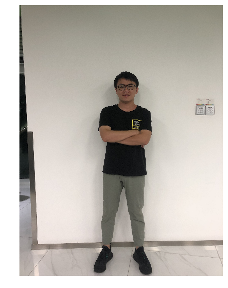

# 通过Python代码调用方式使用PaddleHub

本页面的代码/命令可在[AIStudio](https://aistudio.baidu.com/aistudio/projectdetail/635335)上在线运行，类似notebook的环境，只需通过浏览器即可访问，无需准备环境，非常方便开发者快速体验。

## 计算机视觉任务的PaddleHub示例
先以计算机视觉任务为例，我们选用一张测试图片test.jpg，分别实现如下四项功能：
* 人像扣图（[deeplabv3p_xception65_humanseg](https://www.paddlepaddle.org.cn/hubdetail?name=deeplabv3p_xception65_humanseg&en_category=ImageSegmentation)）
* 人体部位分割（[ace2p](https://www.paddlepaddle.org.cn/hubdetail?name=ace2p&en_category=ImageSegmentation)）

* 人脸检测（[ultra_light_fast_generic_face_detector_1mb_640](https://www.paddlepaddle.org.cn/hubdetail?name=ultra_light_fast_generic_face_detector_1mb_640&en_category=FaceDetection)）
* 关键点检测（[human_pose_estimation_resnet50_mpii](https://www.paddlepaddle.org.cn/hubdetail?name=human_pose_estimation_resnet50_mpii&en_category=KeyPointDetection)）

>注：如果需要查找PaddleHub中可以调用哪些预训练模型，获取模型名称（如deeplabv3p_xception65_humanseg，后续代码中通过该名称调用模型），请参考[官网文档](https://www.paddlepaddle.org.cn/hublist)，文档中已按照模型类别分好类，方便查找，并且提供了详细的模型介绍。


### 体验前请提前安装好PaddleHub


```shell
# 安装最新版本，使用清华源更稳定、更迅速
$ pip install paddlehub --upgrade -i https://pypi.tuna.tsinghua.edu.cn/simple
```

### 原图展示


```shell
# 下载待测试图片
$ wget https://paddlehub.bj.bcebos.com/resources/test_image.jpg
```

    --2020-07-22 12:22:19--  https://paddlehub.bj.bcebos.com/resources/test_image.jpg
    Resolving paddlehub.bj.bcebos.com (paddlehub.bj.bcebos.com)... 182.61.200.195, 182.61.200.229
    Connecting to paddlehub.bj.bcebos.com (paddlehub.bj.bcebos.com)|182.61.200.195|:443... connected.
    HTTP request sent, awaiting response... 200 OK
    Length: 967120 (944K) [image/jpeg]
    Saving to: ‘test_image.jpg.1’

    test_image.jpg.1    100%[===================>] 944.45K  5.51MB/s    in 0.2s  

    2020-07-22 12:22:19 (5.51 MB/s) - ‘test_image.jpg.1’ saved [967120/967120]





### 人像扣图

PaddleHub采用模型即软件的设计理念，所有的预训练模型与Python软件包类似，具备版本的概念，通过`hub install`、`hub uninstall`命令可以便捷地完成模型的安装、升级和卸载。
> 使用如下命令默认下载最新版本的模型，如果需要指定版本，可在后面接版本号，如`==1.1.1`。


```shell
#安装预训练模型，deeplabv3p_xception65_humanseg是模型名称
$ hub install deeplabv3p_xception65_humanseg
```

    Downloading deeplabv3p_xception65_humanseg
    [==================================================] 100.00%
    Uncompress /home/aistudio/.paddlehub/tmp/tmpo32jeve0/deeplabv3p_xception65_humanseg
    [==================================================] 100.00%
    Successfully installed deeplabv3p_xception65_humanseg-1.1.1


```python
# 导入paddlehub库
import paddlehub as hub
# 指定模型名称、待预测的图片路径、输出结果的路径，执行并输出预测结果
module = hub.Module(name="deeplabv3p_xception65_humanseg")
res = module.segmentation(paths = ["./test_image.jpg"], visualization=True, output_dir='humanseg_output')
```

    [32m[2020-07-22 12:22:49,474] [    INFO] - Installing deeplabv3p_xception65_humanseg module [0m


    Downloading deeplabv3p_xception65_humanseg
    [==================================================] 100.00%
    Uncompress /home/aistudio/.paddlehub/tmp/tmpzrrl1duq/deeplabv3p_xception65_humanseg
    [==================================================] 100.00%


    [32m[2020-07-22 12:23:11,811] [    INFO] - Successfully installed deeplabv3p_xception65_humanseg-1.1.1 [0m


可以看到，使用Python代码调用PaddleHub只需要三行代码即可实现：
```
import paddlehub as hub   # 导入PaddleHub代码库
module = hub.Module(name="deeplabv3p_xception65_humanseg")    # 指定模型名称
res = module.segmentation(paths = ["./test.jpg"], visualization=True, output_dir='humanseg_output')  # 指定模型的输入和输出路径，执行并输出预测结果，其中visualization=True表示将结果可视化输出
```
* 模型名称均通过`hub.Module` API来指定；
* `module.segmentation`用于执行图像分割类的预测任务，不同类型任务设计了不同的预测API，比如人脸检测任务采用`face_detection`函数执行预测，建议调用预训练模型之前先仔细查阅对应的模型介绍文档。
* 预测结果保存在`output_dir='humanseg_output'`目录下，可以到该路径下查看输出的图片。

其他任务的实现方式，均可参考这个“套路”。看一下接下来几个任务如何实现。

### 人体部位分割


```shell
#安装预训练模型
$ hub install ace2p
```

    /opt/conda/envs/python35-paddle120-env/lib/python3.7/site-packages/sklearn/externals/joblib/externals/cloudpickle/cloudpickle.py:47: DeprecationWarning: the imp module is deprecated in favour of importlib; see the module's documentation for alternative uses
      import imp
    Downloading ace2p
    [==================================================] 100.00%
    Uncompress /home/aistudio/.paddlehub/tmp/tmpfsovt3f8/ace2p
    [==================================================] 100.00%
    Successfully installed ace2p-1.1.0


```python
# 导入paddlehub库
import paddlehub as hub
# 指定模型名称、待预测的图片路径、输出结果的路径，执行并输出预测结果
module = hub.Module(name="ace2p")
res = module.segmentation(paths = ["./test_image.jpg"], visualization=True, output_dir='ace2p_output')
```

    [32m[2020-07-22 12:23:58,027] [    INFO] - Installing ace2p module [0m


    Downloading ace2p
    [==================================================] 100.00%
    Uncompress /home/aistudio/.paddlehub/tmp/tmptrogpj6j/ace2p
    [==================================================] 100.00%


    [32m[2020-07-22 12:24:22,575] [    INFO] - Successfully installed ace2p-1.1.0 [0m


### 人脸检测


```shell
#安装预训练模型
$ hub install ultra_light_fast_generic_face_detector_1mb_640
```

    Downloading ultra_light_fast_generic_face_detector_1mb_640
    [==================================================] 100.00%
    Uncompress /home/aistudio/.paddlehub/tmp/tmpz82xnmy6/ultra_light_fast_generic_face_detector_1mb_640
    [==================================================] 100.00%
    Successfully installed ultra_light_fast_generic_face_detector_1mb_640-1.1.2


```python
# 导入paddlehub库
import paddlehub as hub
# 指定模型名称、待预测的图片路径、输出结果的路径，执行并输出预测结果
module = hub.Module(name="ultra_light_fast_generic_face_detector_1mb_640")
res = module.face_detection(paths = ["./test_image.jpg"], visualization=True, output_dir='face_detection_output')
```

    [32m[2020-07-22 12:25:12,948] [    INFO] - Installing ultra_light_fast_generic_face_detector_1mb_640 module [0m


    Downloading ultra_light_fast_generic_face_detector_1mb_640
    [==================================================] 100.00%
    Uncompress /home/aistudio/.paddlehub/tmp/tmpw44mo56p/ultra_light_fast_generic_face_detector_1mb_640
    [==================================================] 100.00%


    [32m[2020-07-22 12:25:14,698] [    INFO] - Successfully installed ultra_light_fast_generic_face_detector_1mb_640-1.1.2


### 关键点检测


```shell
#安装预训练模型
$ hub install human_pose_estimation_resnet50_mpii
```

    /opt/conda/envs/python35-paddle120-env/lib/python3.7/site-packages/sklearn/externals/joblib/externals/cloudpickle/cloudpickle.py:47: DeprecationWarning: the imp module is deprecated in favour of importlib; see the module's documentation for alternative uses
      import imp
    Downloading human_pose_estimation_resnet50_mpii
    [==================================================] 100.00%
    Uncompress /home/aistudio/.paddlehub/tmp/tmpn_ppwkzq/human_pose_estimation_resnet50_mpii
    [========                                          ] 17.99%


```python
# 导入paddlehub库
import paddlehub as hub
# 指定模型名称、待预测的图片路径、输出结果的路径，执行并输出预测结果
module = hub.Module(name="human_pose_estimation_resnet50_mpii")
res = module.keypoint_detection(paths = ["./test_image.jpg"], visualization=True, output_dir='keypoint_output')
```

    [32m[2020-07-23 11:27:33,989] [    INFO] - Installing human_pose_estimation_resnet50_mpii module [0m
    [32m[2020-07-23 11:27:33,992] [    INFO] - Module human_pose_estimation_resnet50_mpii already installed in /home/aistudio/.paddlehub/modules/human_pose_estimation_resnet50_mpii [0m


    image saved in keypoint_output/test_imagetime=1595474855.jpg


## 自然语言处理任务的PaddleHub示例

再看两个自然语言处理任务的示例，下面以中文分词和情感分类的任务为例介绍。
* 中文分词（[lac](https://www.paddlepaddle.org.cn/hubdetail?name=lac&en_category=LexicalAnalysis)）
* 情感分析（[senta_bilstm](https://www.paddlepaddle.org.cn/hubdetail?name=senta_bilstm&en_category=SentimentAnalysis)）

### 中文分词


```shell
#安装预训练模型
$ hub install lac
```

    2020-07-22 10:03:09,866-INFO: font search path ['/opt/conda/envs/python35-paddle120-env/lib/python3.7/site-packages/matplotlib/mpl-data/fonts/ttf', '/opt/conda/envs/python35-paddle120-env/lib/python3.7/site-packages/matplotlib/mpl-data/fonts/afm', '/opt/conda/envs/python35-paddle120-env/lib/python3.7/site-packages/matplotlib/mpl-data/fonts/pdfcorefonts']
    2020-07-22 10:03:10,208-INFO: generated new fontManager
    Downloading lac
    [==================================================] 100.00%
    Uncompress /home/aistudio/.paddlehub/tmp/tmp8ukaz690/lac
    [==================================================] 100.00%
    Successfully installed lac-2.1.1


```python
# 导入paddlehub库
import paddlehub as hub
# 指定模型名称、待分词的文本，执行并输出预测结果
lac = hub.Module(name="lac")
test_text = ["1996年，曾经是微软员工的加布·纽维尔和麦克·哈灵顿一同创建了Valve软件公司。他们在1996年下半年从id software取得了雷神之锤引擎的使用许可，用来开发半条命系列。"]
res = lac.lexical_analysis(texts = test_text)
# 打印预测结果
print("中文词法分析结果：", res)
```

    [32m[2020-07-22 10:03:18,439] [    INFO] - Installing lac module[0m
    [32m[2020-07-22 10:03:18,531] [    INFO] - Module lac already installed in /home/aistudio/.paddlehub/modules/lac [0m


    中文词法分析结果： [{'word': ['1996年', '，', '曾经', '是', '微软', '员工', '的', '加布·纽维尔', '和', '麦克·哈灵顿', '一同', '创建', '了', 'Valve软件公司', '。', '他们', '在', '1996年下半年', '从', 'id', ' ', 'software', '取得', '了', '雷神之锤', '引擎', '的', '使用', '许可', '，', '用来', '开发', '半条命', '系列', '。'], 'tag': ['TIME', 'w', 'd', 'v', 'ORG', 'n', 'u', 'PER', 'c', 'PER', 'd', 'v', 'u', 'ORG', 'w', 'r', 'p', 'TIME', 'p', 'nz', 'w', 'n', 'v', 'u', 'n', 'n', 'u', 'vn', 'vn', 'w', 'v', 'v', 'n', 'n', 'w']}]


可以看到，与计算机视觉任务相比，输入和输出接口（这里需要输入文本，以函数参数的形式传入）存在差异，这与任务类型相关，具体可查看对应预训练模型的API介绍。

### 情感分类


```shell
#安装预训练模型
$ hub install senta_bilstm
```

    Module senta_bilstm-1.1.0 already installed in /home/aistudio/.paddlehub/modules/senta_bilstm


```python
import paddlehub as hub
senta = hub.Module(name="senta_bilstm")
test_text = ["味道不错，确实不算太辣，适合不能吃辣的人。就在长江边上，抬头就能看到长江的风景。鸭肠、黄鳝都比较新鲜。"]
res = senta.sentiment_classify(texts = test_text)

print("情感分析结果：", res)
```

    [32m[2020-07-22 10:34:06,922] [    INFO] - Installing senta_bilstm module [0m
    [32m[2020-07-22 10:34:06,984] [    INFO] - Module senta_bilstm already installed in /home/aistudio/.paddlehub/modules/senta_bilstm
    [32m[2020-07-22 10:34:08,937] [    INFO] - Installing lac module[0m
    [32m[2020-07-22 10:34:08,939] [    INFO] - Module lac already installed in /home/aistudio/.paddlehub/modules/lac [0m


    情感分析结果： [{'text': '味道不错，确实不算太辣，适合不能吃辣的人。就在长江边上，抬头就能看到长江的风景。鸭肠、黄鳝都比较新鲜。', 'sentiment_label': 1, 'sentiment_key': 'positive', 'positive_probs': 0.9771, 'negative_probs': 0.0229}]


## 总结
PaddleHub提供了丰富的预训练模型，包括图像分类、语义模型、视频分类、图像生成、图像分割、文本审核、关键点检测等主流模型，只需要3行Python代码即可快速调用，即时输出预测结果，非常方便。您可以尝试一下，从[预训练模型列表](https://www.paddlepaddle.org.cn/hublist)中选择一些模型体验一下。

