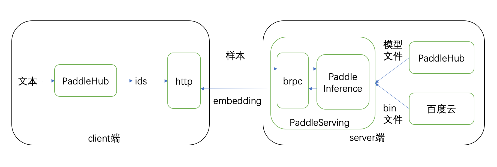

# Bert Service  
## 简介
### 为什么使用Bert Service
开发者在进行NLP（自然语言处理）的时候常常需要获取文本的embedding（词向量），需要专门编写相应代码，且只能在本地进行。使用`Bert Service`能够将此过程转化为远程调用API，完成远程获取embedding。
### 什么是Bert Service
`Bert Service`是基于[Paddle Serving](https://github.com/PaddlePaddle/Serving)框架的快速部署模型远程计算服务方案，可将获取embedding的过程通过调用API接口的方式实现，减少了对机器资源的依赖。使用PaddleHub可在服务器上一键部署`Bert Service`服务，在另外的普通机器上通过客户端接口即可轻松的获取文本对应的embedding数据。  

整体流程图如下：  




### Bert Service的特点
使用`Bert Service`能够帮助开发者在限制性较强的环境中有效获取embedding，常用于以下情景：  
* 算力有限的集群环境中，可利用一台或几台高性能机器部署`Bert Service`服务端，为全部机器提供在线embedding功能。  

* 实际的生产服务器不适宜承担大批量embedding工作，通过API接口可减少资源占用。  

* 专注下游深度学习任务，可利用PaddleHub的`Bert Service`大幅减少embedding代码。  

`Bert Service`具有几个突出的优点：  

* 代码精短，易于使用。简单的pip安装方式，服务端仅需一行命令即可启动，客户端仅需一行代码即可获取embedding结果。  

* 更高性能，更高效率。通过Paddle AnalysisPredictor API对模型的计算图进行优化，提升了计算速度并减小了显存占用。

* 随"机"应变，灵活扩展。可根据机器资源选择不同数量的服务端，并根据实际需求快速、灵活地进行增减，同时支持各张显卡执行不同的模型计算任务。  

* 删繁就简，专注任务。`Bert Service`基于PaddlePaddle和PaddleHub开发，将模型的下载和安装等管理工作交由PaddleHub，开发者可以专注于主要任务，还可以无缝对接PaddleHub继续进行文本分类、序列标注等下游任务。

使用Bert Service搭建服务主要分为下面三个步骤：

## Step1：准备环境
### 环境要求  
下表是使用`Bert Service`的环境要求，带有*号标志项为非必需依赖，可根据实际使用需求选择安装。  

|项目|版本|说明|  
|:-:|:-:|:-:|  
|操作系统|Linux|目前仅支持Linux操作系统|  
|PaddleHub|>=1.4.0|无|  
|PaddlePaddle|>=1.6.1|若使用GPU计算，则对应使用PaddlePaddle-gpu版本|  
|GCC|>=4.8|无|  
|paddle-gpu-serving*|>=0.8.2|在`Bert Service`服务端需依赖此包|  
|ujson*|>=1.35|在`Bert Service`客户端需依赖此包|  

### 安装步骤
a) 安装PaddlePaddle，利用pip下载CPU版本命令如下。GPU版本、Docker方式安装等其他更具体的安装过程见[开始使用PaddlePaddle](https://paddlepaddle.org.cn/install/quick)
```shell
$ # 安装paddlepaddle的CPU版本
$ pip install paddlepaddle
```
b) 安装PaddleHub
```shell
$ pip install paddlehub
```
c) server端，需另外安装`paddle-gpu-serving`，以获取快速部署服务的能力
```shell
$ pip install paddle-gpu-serving
```  
d) client端，需另外安装ujson
```shell
$ pip install ujson
```


### 支持模型
目前`Bert Service`支持的语义模型如下表，可根据需要选择模型进行部署embedding服务，未来还将支持更多模型。  

|模型|网络|
|:-|:-:|
|[ernie](https://paddlepaddle.org.cn/hubdetail?name=ERNIE&en_category=SemanticModel)|ERNIE|
|[ernie_tiny](https://paddlepaddle.org.cn/hubdetail?name=ernie_tiny&en_category=SemanticModel)|ERNIE tiny|
|[ernie_v2_eng_large](https://paddlepaddle.org.cn/hubdetail?name=ernie_v2_eng_large&en_category=SemanticModel)|ERNIE 2.0|
|[ernie_v2_eng_base](https://paddlepaddle.org.cn/hubdetail?name=ernie_v2_eng_base&en_category=SemanticModel)|ERNIE 2.0|
|[roberta_wwm_ext_chinese_L-12_H-768_A-12](https://paddlepaddle.org.cn/hubdetail?name=roberta_wwm_ext_chinese_L-12_H-768_A-12&en_category=SemanticModel)|BERT|
|[roberta_wwm_ext_chinese_L-24_H-1024_A-16](https://paddlepaddle.org.cn/hubdetail?name=roberta_wwm_ext_chinese_L-24_H-1024_A-16&en_category=SemanticModel)|BERT|
|[bert_wwm_ext_chinese_L-12_H-768_A-12](https://paddlepaddle.org.cn/hubdetail?name=bert_wwm_ext_chinese_L-12_H-768_A-12&en_category=SemanticModel)|BERT|
|[bert_uncased_L-12_H-768_A-12](https://paddlepaddle.org.cn/hubdetail?name=bert_uncased_L-12_H-768_A-12&en_category=SemanticModel)|BERT|
|[bert_uncased_L-24_H-1024_A-16](https://paddlepaddle.org.cn/hubdetail?name=bert_uncased_L-24_H-1024_A-16&en_category=SemanticModel)|BERT|
|[bert_cased_L-12_H-768_A-12](https://paddlepaddle.org.cn/hubdetail?name=bert_cased_L-12_H-768_A-12&en_category=SemanticModel)|BERT|
|[bert_cased_L-24_H-1024_A-16](https://paddlepaddle.org.cn/hubdetail?name=bert_cased_L-24_H-1024_A-16&en_category=SemanticModel)|BERT|
|[bert_multi_cased_L-12_H-768_A-12](https://paddlepaddle.org.cn/hubdetail?name=bert_multi_cased_L-12_H-768_A-12&en_category=SemanticModel)|BERT|
|[bert_chinese_L-12_H-768_A-12](https://paddlepaddle.org.cn/hubdetail?name=bert_chinese_L-12_H-768_A-12&en_category=SemanticModel)|BERT|


## Step2：启动服务端(server)
### 简介
server端接收client端发送的数据，执行模型计算过程并将计算结果返回给client端。  

server端启动时会按照指定的模型名称从PaddleHub获取对应的模型文件进行加载，无需提前下载模型或指定模型路径，对模型的管理工作由PaddleHub负责。在加载模型后在指定的端口启动`BRPC`服务，保持端口监听，当接收到数据后便执行模型计算，并将计算结果通过`BRPC`返回并发送至client端。

### 启动  
使用PaddleHub的命令行工具可一键启动`Bert Service`，命令如下：
```shell
$ hub serving start bert_service -m ernie_tiny -p 8866 --use_gpu --gpu 0
```
启动成功则显示  
```shell
Server[baidu::paddle_serving::predictor::bert_service::BertServiceImpl] is serving on port=8866.
```
[整个启动过程动态图](https://github.com/ShenYuhan/ml-python/blob/master/short_start_fast.gif)


其中各参数说明如下表：

<div align="center">

|参数|说明|是否必填|  
|:--:|:--:|:----:|  
|hub serving start bert_service|启动`Bert Service`服务端。|必填项|  
|--module/-m|指定启动的模型，如果指定的模型不存在，则自动通过PaddleHub下载指定模型。|必填项|  
|--port/-p|指定启动的端口，每个端口对应一个模型，可基于不同端口进行多次启动，以实现多个模型的服务部署。|必填项|  
|--use_gpu|若指定此项则使用GPU进行工作，反之仅使用CPU。注意需安装GPU版本的PaddlePaddle。|非必填项，默认为不指定|  
|--gpu|指定使用的GPU卡号，如未指定use_gpu则填写此项无效，每个服务对应一张卡，部署多个服务时需指定不同卡|非必填项，默认为0号显卡|  

</div>

### 关闭
通过在启动服务端的命令行页面使用Ctrl+C终止`Bert Service`运行，关闭成功则显示：
```shell
Paddle Inference Server exit successfully!
```


## Step3：启动客户端(client)  
### 简介
client端接收文本数据，并获取server端返回的模型计算的embedding结果。  

client端利用PaddleHub的语义理解任务将原始文本按照不同模型的数据预处理方案将文本ID化，并生成对应的sentence type、position、input masks数据，将这些信息封装成json数据，通过http协议按照指定的IP端口信息发送至server端，等待并获取模型生成结果。
### 启动
服务端类BSClient初始化方法原型为：
```python
BSClient.__init__(self,
             module_name,
             server,
             max_seq_len=20,
             show_ids=False,
             do_lower_case=True,
             retry=3)
# 获取embedding方法原型为
BSClient.get_result(self, input_text)  
```  
其中各参数说明如下表：  

|参数|说明|类型|样例|  
|:--:|:--:|:--:|:--:|  
|module_name|指定使用的模型名称|string|"ernie"|  
|server|要访问的server地址，包括ip地址及端口号|string|"127.0.0.1:8866"|  
|max_seq_len|计算时的样例长度，样例长度不足时采用补零策略，超出此参数则超出部分会被截断|int|128|  
|show_ids|是否展现数据预处理后的样例信息，指定为True则显示样例信息，反之则不显示|bool|False|  
|do_lower_case|是否将英文字母转换成小写，指定为True则将所有英文字母转换为小写，反之则保持原状|bool|True|
|retry|连接失败后的最大重试次数|int|3|  
|input_text|输入文本，要获取embedding的原始文本|二维list类型，内部元素为string类型的文本|[['样例1'],['样例2']]|

## Demo——利用Bert Service部署ernie_tiny在线embedding服务
在这里，我们将展示一个实际场景中可能使用的demo，我们利用PaddleHub在一台GPU机器上部署`ernie_tiny`模型服务，并在另一台CPU机器上尝试访问，获取一首七言绝句的embedding。
### Step1：安装环境依赖
首先需要安装环境依赖，根据第2节内容分别在两台机器上安装相应依赖。  

### Step2：启动Bert Service服务端
确保环境依赖安装正确后，在要部署服务的GPU机器上使用PaddleHub命令行工具启动`Bert Service`服务端，命令如下：
```shell
$ hub serving start bert_service -m ernie_tiny --use_gpu --gpu 0 --port 8866
```
启动成功后打印
```shell
Server[baidu::paddle_serving::predictor::bert_service::BertServiceImpl] is serving on port=8866.
```  
这样就启动了`ernie_tiny`的在线服务，监听8866端口，并在0号GPU上进行任务。
### Step3：使用Bert Service客户端进行远程调用  
部署好服务端后，就可以用普通机器作为客户端测试在线embedding功能。

首先导入客户端依赖。  
```python
from paddlehub.serving.bert_serving import bs_client
```

接着启动并初始化`bert service`客户端`BSClient`(这里的server为虚拟地址，需根据自己实际ip设置)
```python
bc = bs_client.BSClient(module_name="ernie_tiny", server="127.0.0.1:8866")
```

然后输入文本信息。
```python
input_text = [["西风吹老洞庭波"], ["一夜湘君白发多"], ["醉后不知天在水"], ["满船清梦压星河"], ]
```

最后利用客户端接口`get_result`发送文本到服务端，以获取embedding结果。
```python
result = bc.get_result(input_text=input_text)
```
这样，就得到了embedding结果(此处只展示部分结果)。
```python
[[0.9993321895599361, 0.9994612336158751, 0.9999646544456481, 0.732795298099517, -0.34387934207916204, ... ]]
```
客户端代码demo文件见[示例](https://github.com/PaddlePaddle/PaddleHub/blob/release/v1.7/demo/serving/bert_service/bert_service_client.py)。  
运行命令如下：  
```shell
$ python bert_service_client.py
```  

[运行过程动态图](https://github.com/ShenYuhan/ml-python/blob/master/short_client_fast.gif)


### Step4：关闭Bert Service服务端
如要停止`Bert Service`服务端程序，可在其启动命令行页面使用Ctrl+C方式关闭，关闭成功会打印如下日志：
```shell
Paddle Inference Server exit successfully!
```
这样，我们就利用一台GPU机器就完成了`Bert Service`的部署，并利用另一台普通机器进行了测试，可见通过`Bert Service`能够方便地进行在线embedding服务的快速部署。  

## 预训练模型一键服务部署
除了`Bert Service`外，PaddleHub Serving还具有预训练模型一键服务部署功能，能够将预训练模型快捷部署上线，对外提供可靠的在线预测服务，具体信息请参见[Module Serving](./serving.md)。

## FAQ  
Q : 如何在一台服务器部署多个模型？  
A : 可通过多次启动`Bert Service`，分配不同端口实现。如果使用GPU，需要指定不同的显卡。如同时部署`ernie`和`bert_chinese_L-12_H-768_A-12`，分别执行命令如下：  
```shell
$ hub serving start bert_service -m ernie -p 8866
$ hub serving start bert_service -m bert_chinese_L-12_H-768_A-12 -p 8867
```

Q : 启动时显示"Check out http://${ip}:8887 in web
 browser."，这个页面有什么作用。  
A : 这是`BRPC`的内置服务，主要用于查看请求数、资源占用等信息，可对server端性能有大致了解，具体信息可查看[BRPC内置服务](https://github.com/apache/incubator-brpc/tree/master/docs/cn)。

Q : 为什么输入文本的格式为[["文本1"], ["文本2"], ]，而不是["文本1", "文本2", ]？  
A : 因为Bert模型可以对一轮对话生成向量表示，例如[["问题1","回答1"],["问题2","回答2"]]，为了防止使用时混乱，每个样本使用一个list表示，一个样本list内部可以是1条string或2条string，如下面的文本：  
```python
input_text = [
   ["你今天吃饭了吗","我已经吃过饭了"],
   ["今天天气怎么样","今天天气不错"],
]
```
