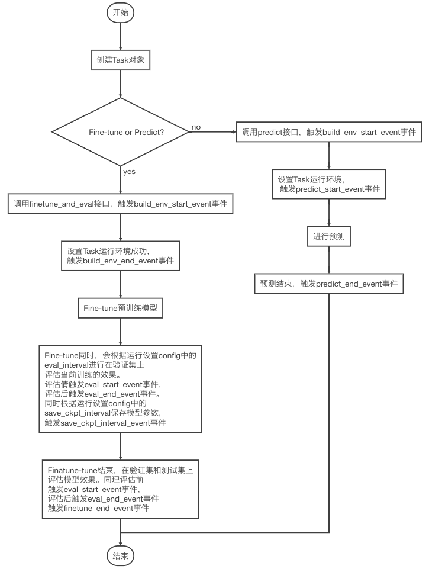

# 如何修改Task内置方法？


了解如何修改Task内置方法，我们首先了解下Task中的事件。

Task定义了[组网事件](./how_to_define_task.md)和[运行事件](./how_to_define_task.md)。其中运行事件的工作流程如下图。




**NOTE:**
* 图中提到的运行设置config参见[RunConfig说明](../reference/config.md)
* "finetune_start_event"，"finetune_end_event"，"predict_start_event"，"predict_end_event"，
"eval_start_event"，"eval_end_event"等事件是用于打印相应阶段的日志信息。"save_ckpt_interval_event"事件用于保存当前训练的模型参数。"log_interval_event"事件用于计算模型评价指标以及可视化这些指标。

如果您需要对图中提到的事件的具体实现进行修改，可以通过Task提供的事件回调hook机制进行改写。

如你想要改变任务评价指标，如下示例中将PaddleHub默认的accuracy评价指标改为F1评价指标。同时还想用自定义的可视化工具可视化模型训练过程，如下示例将可视化工具改写为tb-paddle。则你需要改写评估方法log_interval_event。这时候你可以用Hook实现。具体使用方法如下：

```python
import numpy as np

def calculate_f1_np(preds, labels):
    # 计算F1分数
    # preds：预测label
    # labels： 真实labels
    # 返回F1分数
    preds = np.array(preds)
    labels = np.array(labels)
    tp = np.sum((labels == 1) & (preds == 1))
    tn = np.sum((labels == 0) & (preds == 0))
    fp = np.sum((labels == 0) & (preds == 1))
    fn = np.sum((labels == 1) & (preds == 0))
    p = tp / (tp + fp) if (tp + fp) else 0
    r = tp / (tp + fn) if (tp + fn) else 0
    f1 = (2 * p * r) / (p + r) if p + r else 0
    return f1

# 自定义评估方法实现
def calculate_metrics(self, run_states):
    # run_states: list类型，每个元素是一个RunState对象，指明了该step的运行状态
    # 返回评估得分，平均损失值和平局运行速度
    loss_sum = acc_sum = run_examples = 0
    run_step = run_time_used = 0
    all_labels = np.array([])
    all_infers = np.array([])

    for run_state in run_states:
        run_examples += run_state.run_examples
        run_step += run_state.run_step
        loss_sum += np.mean(
            run_state.run_results[-1]) * run_state.run_examples
        acc_sum += np.mean(
            run_state.run_results[2]) * run_state.run_examples
        np_labels = run_state.run_results[0]
        np_infers = run_state.run_results[1]
        all_labels = np.hstack((all_labels, np_labels.reshape([-1])))
        all_infers = np.hstack((all_infers, np_infers.reshape([-1])))

    run_time_used = time.time() - run_states[0].run_time_begin
    avg_loss = loss_sum / run_examples
    run_speed = run_step / run_time_used

    scores = OrderedDict()
    f1 = calculate_f1_np(all_infers, all_labels)
    scores["f1"] = f1

    return scores, avg_loss, run_speed

# 利用自定义可视化工具tb-paddle记录训练过程中的损失值，评估指标等
from tb_paddle import SummaryWriter

tb_writer = SummaryWriter("PATH/TO/LOG")

def record_value(evaluation_scores, loss, s)
    tb_writer.add_scalar(
        tag="Loss_{}".format(self.phase),
        scalar_value=loss,
        global_step=self._envs['train'].current_step)
    log_scores = ""
    for metric in evaluation_scores:
        self.tb_writer.add_scalar(
            tag="{}_{}".format(metric, self.phase),
            scalar_value=scores[metric],
            global_step=self._envs['train'].current_step)
        log_scores += "%s=%.5f " % (metric, scores[metric])
    print("step %d / %d: loss=%.5f %s[step/sec: %.2f]" %
            (self.current_step, self.max_train_steps, avg_loss,
                log_scores, run_speed))

# 改写_log_interval_event实现
def new_log_interval_event(self, run_states):
    # 改写的事件方法，参数列表务必与PaddleHub内置的相应方法保持一致
    print("This is the new log_interval_event!")
    scores, avg_loss, run_speed = calculate_metrics(run_states)
    record_value(scores, avg_loss, run_speed)

# 利用Hook改写PaddleHub内置_log_interval_event实现，需要2步(假设task已经创建好)
# 1.删除PaddleHub内置_log_interval_event实现
# hook_type：你想要改写的事件hook类型
# name：hook名字，“default”表示PaddleHub内置_log_interval_event实现
task.delete_hook(hook_type="log_interval_event", name="default")

# 2.增加自定义_log_interval_event实现(new_log_interval_event)
# hook_type：你想要改写的事件hook类型
# name: hook名字
# func：自定义改写的方法
task.add_hook(hook_type="log_interval_event", name="new_log_interval_event", func=new_log_interval_event)

# 输出hook信息
task.hook_info()
```

**NOTE:**
* 关于上述提到的run_states参见[RunEnv说明](../reference/task/runenv.md)
* tb-paddle详细信息参见[官方文档](https://github.com/ShenYuhan/tb-paddle)
* 改写的事件方法，参数列表务必与PaddleHub内置的相应方法保持一致。
* 只支持改写/删除以下事件hook类型：
 "build_env_start_event"，"build_env_end_event"，"finetune_start_event"，"finetune_end_event"，
 "predict_start_event"，"predict_end_event"，"eval_start_event"，"eval_end_event"，
 "log_interval_event"，"save_ckpt_interval_event"，"eval_interval_event"，"run_step_event"。
* 如果想要改写组网事件，Hook不支持。改写组网事件参见[自定义Task](./how_to_define_task.md)。
* 如何创建Task，参见[PaddleHub迁移学习示例](../../demo)
