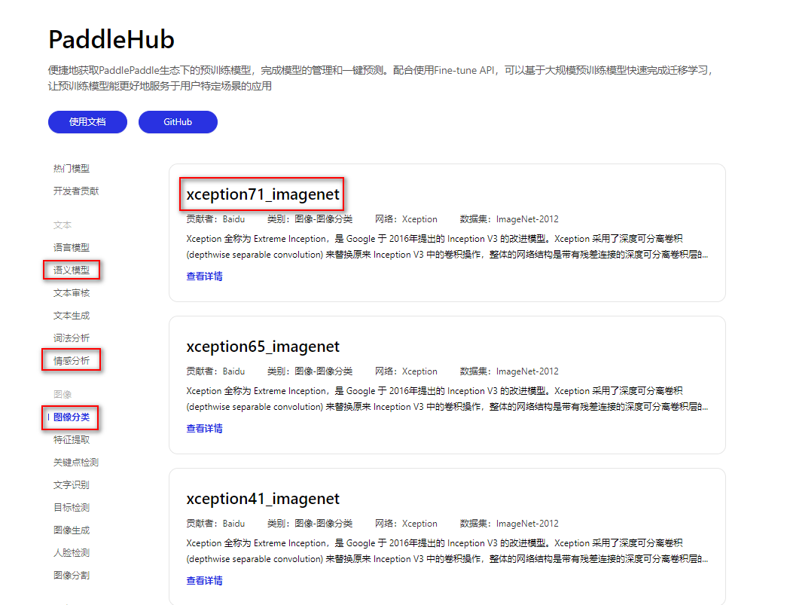

## **迁移学习**

### **概述**
迁移学习 (Transfer Learning) 是属于深度学习的一个子研究领域，该研究领域的目标在于利用数据、任务、或模型之间的相似性，将在旧领域学习过的知识，迁移应用于新领域中。通俗的来讲，迁移学习就是运用已有的知识来学习新的知识，例如学会了骑自行车的人也能较快的学会骑电动车。较为常用的一种迁移学习方式是利用预训练模型进行微调，即用户基于当前任务的场景从PaddleHub中选择已训练成功的模型进行新任务训练，且该模型曾经使用的数据集与新场景的数据集情况相近，此时仅需要在当前任务场景的训练过程中使用新场景的数据对模型参数进行微调（**Fine-tune**），即可完成训练任务。迁移学习吸引了很多研究者投身其中，因为它能够很好的解决深度学习中的以下几个问题：  
* 一些研究领域只有少量标注数据，且数据标注成本较高，不足以训练一个足够鲁棒的神经网络。
* 大规模神经网络的训练依赖于大量的计算资源，这对于一般用户而言难以实现。
* 应对于普适化需求的模型，在特定应用上表现不尽如人意。  


为了让开发者更便捷地应用迁移学习，飞桨开源了预训练模型管理工具 PaddleHub。开发者仅仅使用十余行的代码，就能完成迁移学习。本文将为读者全面介绍使用PaddleHub完成迁移学习的方法。

### **前置条件**  
在开始迁移学习之前，用户需要做好如下工作：  
* 用户已安装PaddleHub。
* 准备好用于迁移学习的数据，用户可以选择使用PaddleHub提供的数据集或者自定义数据集，如果是自定义数据，需要参考“自定义数据集如何Fine-tune”对数据集处理。  
* 使用hub install命令安装或更新用于训练的module，以使用ERNIE模型为例，命令格式如下所示。用户可能在之前的任务中已经安装过相关的预训练模型，但是仍然推荐用户在开始训练前执行此步骤，这样可以保证预训练模型是最新版本。


```python
$ hub install ernie==1.2.0
```

### **迁移学习流程**  
用户完成迁移学习前需要先编写好用于迁移学习的脚本。用户编写脚本的过程非常简单，仅需要十余行代码即可完成。整个脚本的编写过程，可以分为如下几个步骤：
1. 导入必要的包。
2. 加载预训练模型（Module），即加载PaddleHub提供的预训练模型。
3. 加载数据集（Dataset），用户可以选择使用dataset API加载PaddleHub自带的数据集或者自行编写加载数据集的类来加载自定义数据集。
4. 配置数据读取器（Reader），负责将dataset的数据进行预处理，以特定格式组织并输入给模型进行训练。
5. 选择优化策略（Strategy），优化策略包含了多种预训练参数，例如使用什么学习率变化策略，使用哪种类型的优化器，使用什么类型的正则化等。
6. 设置运行配置（RunConfig），RunConfig包含了一些训练相关的配置，包括是否使用GPU、训练的轮数（Epoch）、训练批次大小（batch_size）等。
7. 组建训练任务（Task），一个迁移学习训练任务中会包含与该任务相关的Program和上面设置好的数据读取器Reader、运行配置等内容。
8. 启动Fine-tune，使用Finetune_and_eval函数完成训练和评估。

### **学会编写迁移学习训练脚本**  
PaddleHub提供了Finetune API和预训练模型完成多种不同任务场景的迁移学习，包括图像分类、文本分类、多标签分类、序列标注、检索式问答任务、回归任务、句子语义相似度计算、阅读理解任务等。本文将以文本分类为例介绍迁移学习脚本的编写方法。
#### **1. 导入必要的包。**


```python
import paddlehub as hub  
```

####  **2. 加载预训练模型**  
使用如下代码加载预训练模型，本例使用ERNIE预训练模型来完成文本分类任务。ERNIE（Enhanced Representation through kNowledge IntEgration）是百度提出的语义表示模型，以Transformer Encoder为网络基本组件，其预训练过程利用了更丰富的语义知识和更多的语义任务，用户可以使用该预训练模型随时逐步引入不同的自定义任务，例如命名实体预测、语篇关系识别、句子顺序预测任务、情感分析等。


```python
module = hub.Module(name="ernie")
```


PaddleHub还提供很多了其它可用于迁移学习的预训练模型, 在PaddleHub的官网上，图像分类、语义模型和情感分析几个目录下的预训练模型都支持迁移学习，用户仅需要将name的取值换成预训练模型名称即可，例如右侧红框中的示例。




####  **3. 加载数据集**  
在加载好预训练模型后，我们来加载数据集。用于迁移学习的数据集来源可以分为两种，用户自定义数据集和PaddleHub提供的数据集，使用不同类型的数据集加载方式也有所不同。  
##### **加载PaddleHub自带数据集**  
如果用户使用的是PaddleHub自带数据集，则可以通过PaddleHub的数据集API编写一行代码完成加载数据集的动作。


```python
dataset = hub.dataset.ChnSentiCorp()
```

其中ChnSentiCorp是中文情感分析数据集，其目标是判断一段文本的情感态度。例如文本是“这道菜很好吃”，则对应的标签为“1”，表示正向评价，又例如“房间太小了”，对应标签为“0”，表示负面评价。PaddleHub还提供了其他的文本分类数据集，用户可以自行选择数据集对应的API替换上面代码中dataset的取值，具体信息如下表所示。

|数据集|名称|API|
|:--------:|:--------:|:--------:|
|ChnSentiCorp|中文情感分析数据集|hub.dataset.ChnSentiCorp()|
|LCQMC|哈尔滨工业大学在自然语言处理国际顶会 COLING2018 构建的问答匹配中文数据集，其目标是判断两个问题的语义是否相同。|hub.dataset.LCQMC()|
|NLPCC-DPQA|国际自然语言处理和中文计算会议NLPCC于2016年举办的评测任务数据集，，其目标是选择能够回答问题的答案。|hub.dataset.NLPCC_DPQA()|
|MSRA-NER|微软亚研院发布的数据集，其目标是命名实体识别|hub.dataset.MSRA-NER()|
|Toxic|英文多标签分类数据集|hub.dataset.Toxic()|
|SQUAD|英文阅读理解数据集|hub.dataset.SQUAD()|
|GLUE-CoLA|文本分类任务数据集|hub.dataset.GLUE("CoLA")|
|GLUE-SST-2|情感分析任务数据集|hub.dataset.GLUE("SST-2")|
|GLUE-MNLI|文本推理任务数据集|hub.dataset.GLUE("MNLI_m")|
|GLUE-QQP|句子对分类任务数据集|hub.dataset.GLUE("QQP")|
|GLUE-QNLI|问题推理任务数据集|hub.dataset.GLUE("QNLI")|
|GLUE-STS-B|回归任务数据集|hub.dataset.GLUE("STS-B")|
|GLUE-MRPC|句子对分类任务数据集|hub.dataset.GLUE("MRPC")|
|GLUE-RTE|文本蕴含任务数据集|hub.dataset.GLUE("RTE")|
|XNLI|跨语言自然语言推理数据集|hub.dataset.XNLI(language=zh)|
|ChineseGLUE-TNEWS|今日头条中文新闻（短文本）分类数据集|hub.dataset.TNews()|
|ChineseGLUE-INEWS|互联网情感分析任务数据集|hub.dataset.INews()|
|DRCD|台达阅读理解数据集，属于通用领域繁体中文机器阅读理解数据集|hub.dataset.DRCD()|
|CMRC2018|中文机器阅读理解的跨度提取数据集|hub.dataset.CMRC2018()|
|ChinesGLUE-BQ|智能客服中文问句匹配数据集|hub.dataset.BQ()|
|ChineseGLUE-IFLYTEK|中文长文本分类数据集，该数据集共有1.7万多条关于app应用描述的长文本标注数据|hub.dataset.IFLYTEK()|
|ChineseGLUE-THUCNEWS|中文长文本分类数据集，该数据集共有4万多条中文新闻长文本标注数据，共14个类别|hub.dataset.THUCNEWS()|
|DogCatDataset|由Kaggle提供的数据集，用于图像二分类|hub.dataset.DogCatDataset()|
|Food101|由Kaggle提供的食品图片数据集，含有101种类别|hub.dataset.Food101()|
|Indoor67|由麻省理工学院发布的数据集，其包含67种室内场景，其目标是识别一张室内图片的场景类别。|hub.dataset.Indoor67()|
|Flowers|花卉数据集，数据集有5种类型，包括"roses"，"tulips"，"daisy"，"sunflowers"，"dandelion"|hub.dataset.Flowers()|
|StanfordDogs|斯坦福大学发布的数据集，其包含120个种类的狗，用于做图像分类。|hub.dataset.StanfordDogs()|


##### **加载自定义数据集**  
* 加载文本类自定义数据集。用户仅需要继承基类BaseNLPDatast，修改数据集存放地址以及类别即可，具体可以参考如下代码。  
```python
from paddlehub.dataset.base_nlp_dataset import BaseNLPDataset
# 构建数据集的类
class DemoDataset(BaseNLPDataset):
    def __init__(self):
        # 数据集实际路径
        self.dataset_dir = "path/to/dataset"
        super(DemoDataset, self).__init__(
            base_path=self.dataset_dir,
            train_file="train.tsv", # 训练集存放地址
            dev_file="dev.tsv",    # 验证集存放地址
            test_file="test.tsv",   # 测试集存放地址
            # 如果还有预测数据（不需要文本类别label），可以放在predict.tsv
            predict_file="predict.tsv",
            train_file_with_header=True,   # 训练集文件是否有列说明
            dev_file_with_header=True,     # 验证集文件是否有列说明
            test_file_with_header=True,    # 测试集文件是否有列说明
            predict_file_with_header=True, # 预测集文件是否有列说明
            # 数据集类别集合
            label_list=["0", "1"])
# 通过创建Dataset对象加载自定义文本数据集
dataset = DemoDataset()
```

然后就可以通过DemoDataset()获取自定义数据集了。进而配合数据预处理器以及预训练模型如ERNIE完成文本类任务。

* 加载图像类自定义数据集。用用户仅需要继承基类BaseCVDatast，修改数据集存放地址即可，具体可以参考如下代码。  
```python
from paddlehub.dataset.base_cv_dataset import BaseCVDataset

class DemoDataset(BaseCVDataset):
   def __init__(self):
       # 数据集存放位置
       self.dataset_dir = "/test/data"
       super(DemoDataset, self).__init__(
           base_path=self.dataset_dir,
           train_list_file="train_list.txt",     # 训练集存放地址
           validate_list_file="validate_list.txt", # 验证集存放地址
           test_list_file="test_list.txt",       # 测试集存放地址
           predict_file="predict_list.txt",      # 预测集存放地址
           label_list_file="label_list.txt",     # 数据集类别文件所在地址
           # 如果您的数据集类别较少，可以不用定义label_list.txt，可以在最后设置label_list=["数据集所有类别"]。
           )
# 通过创建Dataset对象加载图像类数据集
dataset = DemoDataset()
```

然后就可以通过DemoDataset()获取自定义数据集了。进而配合数据预处理器以及预训练模型完成视觉类的迁移学习任务。

####  **4. 配置数据预处理器**  

通过使用PaddleHub的数据预处理器API来读取NLP或CV的数据集数据。  


```python
reader = hub.reader.ClassifyReader(
    dataset=dataset,
    vocab_path=module.get_vocab_path(),   # 返回预训练模型对应的词表
    max_seq_len=128,                      # 需要与Step1中context接口传入的序列长度保持一致
    sp_model_path=module.get_spm_path(),  # 若module为ernie_tiny则返回对应的子词切分模型，否则返回None
    word_dict_path=module.get_word_dict_path())  # 若module为ernie_tiny则返回对应的词语切分模型，否则返回None

```

对于不同的任务类型，用户可以选择不同的Reader。

|数据读取器|描述|任务类型|API示例|
|:--------:|:--------:|:--------:|:--------|
|ClassifyReader|适用于Transformer预训练模型(ERNIE/BERT)的数据预处理器。|NLP|reader = hub.reader.ClassifyReader(<br>&nbsp;&nbsp;&nbsp;&nbsp;&nbsp;&nbsp;&nbsp;&nbsp;dataset=dataset,<br>&nbsp;&nbsp;&nbsp;&nbsp;&nbsp;&nbsp;&nbsp;&nbsp;vocab_path=module.get_vocab_path(),<br>&nbsp;&nbsp;&nbsp;&nbsp;&nbsp;&nbsp;&nbsp;&nbsp;max_seq_len=128,<br>&nbsp;&nbsp;&nbsp;&nbsp;&nbsp;&nbsp;&nbsp;&nbsp;sp_model_path=module.get_spm_path(),<br>&nbsp;&nbsp;&nbsp;&nbsp;&nbsp;&nbsp;&nbsp;&nbsp;word_dict_path=module.get_word_dict_path()) |
|LACClassifyReader|以LAC模块为切词器的数据预处理器，适用于Senta、ELMo等需要以词粒度分词的任务。|NLP|reader = hub.reader.LACClassifyReader(<br>&nbsp;&nbsp;&nbsp;&nbsp;&nbsp;&nbsp;&nbsp;&nbsp;dataset=dataset,<br>&nbsp;&nbsp;&nbsp;&nbsp;&nbsp;&nbsp;&nbsp;&nbsp;vocab_path=module.get_vocab_path())|
|SequenceLabelReader|适用于Transformer类模型(ERNIE/BERT)的序列标注预处理器。|NLP|reader = hub.reader.SequenceLabelReader(<br>&nbsp;&nbsp;&nbsp;&nbsp;&nbsp;&nbsp;&nbsp;&nbsp;dataset=dataset,<br>&nbsp;&nbsp;&nbsp;&nbsp;&nbsp;&nbsp;&nbsp;&nbsp;vocab_path=module.get_vocab_path(),<br>&nbsp;&nbsp;&nbsp;&nbsp;&nbsp;&nbsp;&nbsp;&nbsp;max_seq_len=128,<br>&nbsp;&nbsp;&nbsp;&nbsp;&nbsp;&nbsp;&nbsp;&nbsp;sp_model_path=module.get_spm_path(),<br>&nbsp;&nbsp;&nbsp;&nbsp;&nbsp;&nbsp;&nbsp;&nbsp;word_dict_path=module.get_word_dict_path())|
|MultiLabelClassifyReader|适用于Transformer类模型(ERNIE/BERT)的多标签分类预处理器。|NLP|reader = hub.reader.MultiLabelClassifyReader(<br>&nbsp;&nbsp;&nbsp;&nbsp;&nbsp;&nbsp;&nbsp;&nbsp;dataset=dataset,<br>&nbsp;&nbsp;&nbsp;&nbsp;&nbsp;&nbsp;&nbsp;&nbsp;vocab_path=module.get_vocab_path(),<br>&nbsp;&nbsp;&nbsp;&nbsp;&nbsp;&nbsp;&nbsp;&nbsp;max_seq_len=128)|
|ReadingComprehensionReader|适用于Transformer类模型(ERNIE/BERT)的阅读理解任务预处理器。|NLP|reader = hub.reader.ReadingComprehensionReader(<br>&nbsp;&nbsp;&nbsp;&nbsp;&nbsp;&nbsp;&nbsp;&nbsp;dataset=dataset,<br>&nbsp;&nbsp;&nbsp;&nbsp;&nbsp;&nbsp;&nbsp;&nbsp;vocab_path=module.get_vocab_path(),<br>&nbsp;&nbsp;&nbsp;&nbsp;&nbsp;&nbsp;&nbsp;&nbsp;max_seq_length=384)|
|RegressionReader|适用于回归任务的数据预处理器。|NLP|reader = hub.reader.RegressionReader(<br>&nbsp;&nbsp;&nbsp;&nbsp;&nbsp;&nbsp;&nbsp;&nbsp;dataset=dataset,<br>&nbsp;&nbsp;&nbsp;&nbsp;&nbsp;&nbsp;&nbsp;&nbsp;vocab_path=module.get_vocab_path(),<br>&nbsp;&nbsp;&nbsp;&nbsp;&nbsp;&nbsp;&nbsp;&nbsp;max_seq_len=args.max_seq_len)|
|ImageClassificationReader|适用于图像分类数据的预处理器。会修改输入图像的尺寸、进行标准化处理、图像增广处理等操作。|CV|reader = hub.reader.ImageClassificationReader(<br>&nbsp;&nbsp;&nbsp;&nbsp;&nbsp;&nbsp;&nbsp;&nbsp;image_width=module.get_expected_image_width(),<br>&nbsp;&nbsp;&nbsp;&nbsp;&nbsp;&nbsp;&nbsp;&nbsp;image_height=module.get_expected_image_height(),<br>&nbsp;&nbsp;&nbsp;&nbsp;&nbsp;&nbsp;&nbsp;&nbsp;images_mean=module.get_pretrained_images_mean(),<br>&nbsp;&nbsp;&nbsp;&nbsp;&nbsp;&nbsp;&nbsp;&nbsp;images_std=module.get_pretrained_images_std(),<br>&nbsp;&nbsp;&nbsp;&nbsp;&nbsp;&nbsp;&nbsp;&nbsp;dataset=dataset)|


####  **5. 选择优化策略**  
在PaddleHub中，Strategy类封装了一系列适用于迁移学习的Fine-tuning策略。Strategy包含了对预训练参数使用什么学习率变化策略，使用哪种类型的优化器，使用什么类型的正则化等。在我们要做的文本分类任务中，我们使用AdamWeightDecayStrategy优化策略。具体可以参考如下代码：


```python
strategy = hub.AdamWeightDecayStrategy(
    learning_rate=5e-5,   # Fine-tune过程中的最大学习率
    weight_decay=0.01,    # 模型的正则项参数，默认0.01，如果模型有过拟合倾向，可适当调高这一参数
    warmup_proportion=0.1,  #如果warmup_proportion>0, 例如0.1, 则学习率会在前10%的steps中线性增长至最高值learning_rate
    # 有两种策略可选：
    # （1）linear_decay策略学习率会在最高点后以线性方式衰减;
    # （2）noam_decay策略学习率会在最高点以多项式形式衰减；
    lr_scheduler="linear_decay",  
)
```

包括AdamWeightDecayStrategy在内，PaddleHub还提供了多种优化策略的API。

|优化策略|描述|API示例|
|:--------:|:--------|:--------|
|DefaultFinetuneStrategy|默认的优化策略。其对应参数如下：<br>* learning_rate: 全局学习率。默认为1e-4。<br>* optimizer_name: 优化器名称。默认adam。<br>* regularization_coeff: 正则化的λ参数。默认为1e-3。<br>在图像分类任务中推荐使用此优化策略。|strategy = hub.DefaultFinetuneStrategy(<br>&nbsp;&nbsp;&nbsp;&nbsp;&nbsp;&nbsp;&nbsp;&nbsp;learning_rate=1e-4,<br>&nbsp;&nbsp;&nbsp;&nbsp;&nbsp;&nbsp;&nbsp;&nbsp;optimizer_name="adam",<br>&nbsp;&nbsp;&nbsp;&nbsp;&nbsp;&nbsp;&nbsp;&nbsp;regularization_coeff=1e-3)|
|AdamWeightDecayStrategy|基于Adam优化器的学习率衰减策略。其对应参数如下：<br>* learning_rate: 全局学习率，默认为1e-4。<br>* lr_scheduler: 学习率调度方法，默认为"linear_decay"。<br>* warmup_proportion: warmup所占比重。<br>* weight_decay: 学习率衰减率。<br>* optimizer_name: 优化器名称，默认为adam。<br>在文本分类、阅读理解等任务中推荐使用此优化策略。|strategy = hub.AdamWeightDecayStrategy(<br>&nbsp;&nbsp;&nbsp;&nbsp;&nbsp;&nbsp;&nbsp;&nbsp;learning_rate=1e-4,<br>&nbsp;&nbsp;&nbsp;&nbsp;&nbsp;&nbsp;&nbsp;&nbsp;lr_scheduler="linear_decay",<br>&nbsp;&nbsp;&nbsp;&nbsp;&nbsp;&nbsp;&nbsp;&nbsp;warmup_proportion=0.0,<br>&nbsp;&nbsp;&nbsp;&nbsp;&nbsp;&nbsp;&nbsp;&nbsp;weight_decay=0.01,<br>&nbsp;&nbsp;&nbsp;&nbsp;&nbsp;&nbsp;&nbsp;&nbsp;optimizer_name="adam")|
|L2SPFinetuneStrategy|使用L2SP正则作为惩罚因子的Finetune策略。其对应参数如下：<br>* learning_rate: 全局学习率。默认为1e-4。<br>* optimizer_name: 优化器名称。默认adam。<br>* regularization_coeff: 正则化的λ参数。默认为1e-3。|strategy = hub.L2SPFinetuneStrategy(<br>&nbsp;&nbsp;&nbsp;&nbsp;&nbsp;&nbsp;&nbsp;&nbsp;learning_rate=1e-4,<br>&nbsp;&nbsp;&nbsp;&nbsp;&nbsp;&nbsp;&nbsp;&nbsp;optimizer_name="adam",<br>&nbsp;&nbsp;&nbsp;&nbsp;&nbsp;&nbsp;&nbsp;&nbsp;regularization_coeff=1e-3)|
|ULMFiTStrategy|该策略实现了ULMFiT论文中提出的三种策略：<br> * Slanted triangular learning rates是一种学习率先上升再下降的策略。<br>* Discriminative fine-tuning是一种学习率逐层递减的策略，通过该策略可以减缓底层的更新速度。<br>* Gradual unfreezing是一种逐层解冻的策略，通过该策略可以优先更新上层，再慢慢解冻下层参与更新。<br>其对应参数如下：<br> * learning_rate: 全局学习率。默认为1e-4。<br> * optimizer_name: 优化器名称。默认为adam。<br> * cut_fraction: 设置Slanted triangular learning rates学习率上升的步数在整个训练总步数中的比例。默认为0.1，如果设置为0，则不采用Slanted triangular learning rates。<br> * ratio: 设置Slanted triangular learning rates下降的最小学习率与上升的最大学习率的比例关系，默认为32，表示最小学习率是最大学习率的1/32。<br> * dis_blocks: 设置 Discriminative fine-tuning中的块数。默认为3，如果设置为0，则不采用Discriminative fine-tuning。<br> * factor: 设置Discriminative fine-tuning的衰减率。默认为2.6，表示下一层的学习率是上一层的1/2.6。<br> * frz_blocks: 设置Gradual unfreezing中的块数。块的概念同“dis_blocks”中介绍的概念。|strategy = hub.ULMFiTStrategy(<br>&nbsp;&nbsp;&nbsp;&nbsp;&nbsp;&nbsp;&nbsp;&nbsp;learning_rate=1e-4,<br>&nbsp;&nbsp;&nbsp;&nbsp;&nbsp;&nbsp;&nbsp;&nbsp;optimizer_name="adam",<br>&nbsp;&nbsp;&nbsp;&nbsp;&nbsp;&nbsp;&nbsp;&nbsp;cut_fraction=0.1,<br>&nbsp;&nbsp;&nbsp;&nbsp;&nbsp;&nbsp;&nbsp;&nbsp;ratio=32,<br>&nbsp;&nbsp;&nbsp;&nbsp;&nbsp;&nbsp;&nbsp;&nbsp;dis_blocks=3,<br>&nbsp;&nbsp;&nbsp;&nbsp;&nbsp;&nbsp;&nbsp;&nbsp;factor=2.6,<br>&nbsp;&nbsp;&nbsp;&nbsp;&nbsp;&nbsp;&nbsp;&nbsp;frz_blocks=3)|


#### **6. 设置运行配置。**  
在PaddleHub中，用户可以使用Finetune API中的RunConfig配置Task进行Finetune时使用的参数，包括运行的Epoch次数、batch的大小、是否使用GPU训练等。代码示例如下所示。  


```python
config = hub.RunConfig(use_cuda=True, num_epoch=3, batch_size=32, strategy=strategy)
```

#### **7. 组建训练任务。**  
有了合适的预训练模型，并加载好要迁移的数据集后，我们开始组建一个Task。在PaddleHub中，Task代表了一个Fine-tune的任务。任务中包含了执行该任务相关的Program、数据读取器Reader、运行配置等内容。在这里可以找到文本分类任务对应的Task说明[TextClassifierTask](https://github.com/PaddlePaddle/PaddleHub/blob/release/v1.6/docs/reference/task/text_classify_task.md)。具体实现方案如下：
1. 获取module（PaddleHub的预训练模型）的上下文环境，包括输入和输出的变量，以及Paddle Program（可执行的模型格式）。
2. 从预训练模型的输出变量中找到特征图提取层feature_map，在feature_map后面接入一个全连接层，如下代码中通过hub.TextClassifierTask的pooled_output参数指定。
3. 网络的输入层保持不变，依然从输入层开始，如下代码中通过hub.TextClassifierTask的参数feed_list变量指定。
hub.TextClassifierTask就是通过这两个参数明确我们的截取模型网络的要求，按照这样的配置，我们截取的网络是从输入层一直到特征提取的最后一层“pooled_output”，表示我将使用截出的网络来进行迁移学习训练。


```python
# 获取Module的上下文信息，得到输入、输出以及预训练的Paddle Program副本。
# trainable设置为True时，Module中的参数在Fine-tune时也会随之训练，否则保持不变。
# 其中最大序列长度max_seq_len为可调整的参数，建议值为128，根据任务文本长度不同可以进行修改，但最大不超过512。
# 若序列长度不足，会通过padding方式补到max_seq_len, 若序列长度大于该值，则会以截断方式让序列长度为max_seq_len。
inputs, outputs, program = module.context(trainable=True, max_seq_len=128)  
# 返回ERNIE/BERT模型对应的[CLS]向量,可以用于句子或句对的特征表达。
pooled_output = outputs["pooled_output"]

# feed_list的Tensor顺序不可以调整
# 指定ERNIE中的输入tensor的顺序，与ClassifyReader返回的结果一致
feed_list = [  
    inputs["input_ids"].name,  
    inputs["position_ids"].name,
    inputs["segment_ids"].name,
    inputs["input_mask"].name,
]
# 通过输入特征，label与迁移的类别数，可以生成适用于文本分类的迁移任务
cls_task = hub.TextClassifierTask(
    data_reader=reader,               # 读取数据的reader
    feature=pooled_output,            # 从预训练提取的特征矩阵
    feed_list=feed_list,              # 待feed变量的名字列表
    num_classes=dataset.num_labels,   # 数据集的类别数量
    metrics_choices = ["acc"],
    config=config)                    # 运行配置
```

PaddleHub预置了常见任务的Task，每种Task都有特定的应用场景并提供了对应的度量指标，满足用户的不同需求。

|Task类型|描述|任务类型|
|:--------:|:--------:|:--------:|
|ImageClassifierTask|该Task基于输入的特征，添加一个或多个全连接层来创建一个分类任务用于Fine-tune，度量指标为准确率，损失函数为交叉熵Loss。|图像分类任务|
|TextClassifierTask|该Task基于输入的特征，添加一个Dropout层，以及一个或多个全连接层来创建一个文本分类任务用于finetune，度量指标为准确率，损失函数为交叉熵Loss。|文本分类任务|
|SequenceLabelTask|该Task基于输入的特征，添加一个全连接层或者一个全连接层和CRF层来创建一个序列标注任务用于Fine-tune，度量指标为F1，损失函数为交叉熵Loss。|序列标注任务|
|MultiLabelClassifierTask|该Task基于输入的特征，添加一个或多个全连接层来创建一个多标签分类任务用于finetune，度量指标为多个标签的平均AUC，损失函数为多个标签的平均交叉熵。|多标签分类任务|
|RegressionTask|该Task基于输入的特征，添加一个Dropout层，以及一个或多个全连接层来创建一个文本回归任务用于finetune，度量指标为准确率，损失函数为均方差损失函数。|文本回归任务|
|ReadingComprehensionTask|该Task基于输入的特征，添加一个全连接层来创建一个阅读理解任务用于Fine-tune，损失函数为交叉熵Loss。|阅读理解任务|

在设定每个Task前，用户需要提前了解待迁移学习的预训练模型的输入与输出，即对应上面代码中的“feed_list”和“pooled_output”。具体的输入输出代码可以分为如下几类：  
* 图像分类模型
```  
input_dict, output_dict, program = module.context(trainable=True)
feature_map = output_dict["feature_map"]
feed_list = [input_dict["image"].name]
```
* 自然语言处理模型（不包括word2vec_skipgram、simnet_bow、文本匹配和文本生成几个模型）  
```  
inputs, outputs, program = module.context(trainable=True, max_seq_len=128)  
pooled_output = outputs["pooled_output"]
feed_list = [  
    inputs["input_ids"].name,  
    inputs["position_ids"].name,
    inputs["segment_ids"].name,
    inputs["input_mask"].name,
]
```
* word2vec_skipgram模型  
```  
inputs, outputs, program = module.context(trainable=True)
word_ids = inputs["word_ids"]
embedding = outputs["word_embs"]
```
* simnet_bow模型
```
inputs, outputs, program = module.context(trainable=True, max_seq_len=args.max_seq_len, num_slots=2)
query = outputs["emb"]
title = outputs['emb_2']
```
* Pairwise文本匹配模型  
```
inputs, outputs, program = module.context(trainable=True, max_seq_len=args.max_seq_len, num_slots=3)
query = outputs["emb"]
left = outputs['emb_2']
right = outputs['emb_3']
```
* Pointwise文本匹配  
```
inputs, outputs, program = module.context(trainable=True, max_seq_len=args.max_seq_len, num_slots=2)
query = outputs["emb"]
title = outputs['emb_2']
```
* 文本生成模型  
```
inputs, outputs, program = module.context(trainable=True, max_seq_len=128)
pooled_output = outputs["pooled_output"]
sequence_output = outputs["sequence_output"]
```

#### **8 启动Fine-tune，使用Finetune_and_eval函数完成训练和评估。**  


```python
cls_task.finetune_and_eval()
```

显示信息如下例所示。可以看到训练的评估结果，Loss值和准确率等等。
```
[2020-07-28 21:28:21,658] [   TRAIN] - step 810 / 900: loss=0.05022 acc=0.97813 [step/sec: 4.07]
[2020-07-28 21:28:24,115] [   TRAIN] - step 820 / 900: loss=0.04719 acc=0.98125 [step/sec: 4.07]
[2020-07-28 21:28:26,574] [   TRAIN] - step 830 / 900: loss=0.06895 acc=0.98125 [step/sec: 4.07]
[2020-07-28 21:28:29,035] [   TRAIN] - step 840 / 900: loss=0.07830 acc=0.97813 [step/sec: 4.07]
[2020-07-28 21:28:31,490] [   TRAIN] - step 850 / 900: loss=0.07279 acc=0.97500 [step/sec: 4.08]
[2020-07-28 21:28:33,939] [   TRAIN] - step 860 / 900: loss=0.03220 acc=0.99375 [step/sec: 4.09]
[2020-07-28 21:28:36,388] [   TRAIN] - step 870 / 900: loss=0.05016 acc=0.98750 [step/sec: 4.09]
[2020-07-28 21:28:38,840] [   TRAIN] - step 880 / 900: loss=0.05604 acc=0.98750 [step/sec: 4.08]
[2020-07-28 21:28:41,293] [   TRAIN] - step 890 / 900: loss=0.05622 acc=0.98125 [step/sec: 4.08]
[2020-07-28 21:28:43,748] [   TRAIN] - step 900 / 900: loss=0.06642 acc=0.97813 [step/sec: 4.08]
[2020-07-28 21:28:43,750] [    INFO] - Evaluation on dev dataset start
[2020-07-28 21:28:46,654] [    EVAL] - [dev dataset evaluation result] loss=0.17890 acc=0.94079 [step/sec: 13.23]
[2020-07-28 21:28:46,657] [    INFO] - Evaluation on dev dataset start
[2020-07-28 21:28:49,527] [    EVAL] - [dev dataset evaluation result] loss=0.17890 acc=0.94079 [step/sec: 13.39]
[2020-07-28 21:28:49,529] [    INFO] - Load the best model from ckpt_20200728212416/best_model
[2020-07-28 21:28:50,112] [    INFO] - Evaluation on test dataset start
[2020-07-28 21:28:52,987] [    EVAL] - [test dataset evaluation result] loss=0.14264 acc=0.94819 [step/sec: 13.36]
[2020-07-28 21:28:52,988] [    INFO] - Saving model checkpoint to ckpt_20200728212416/step_900
[2020-07-28 21:28:55,789] [    INFO] - PaddleHub finetune finished.
```

通过Fine-tune完成模型训练后，在对应的ckpt目录（CKPT_DIR）下，PaddleHub会自动保存验证集上效果最好的模型。用户可以参考如下代码进行预测，其中推理出的标签值0表示负向评价，1表示正向评价。。


```python
import numpy as np


# 待预测数据
data = [
    ["这个宾馆比较陈旧了，特价的房间也很一般。总体来说一般"],
    ["交通方便；环境很好；服务态度很好 房间较小"],
    ["19天硬盘就罢工了，算上运来的一周都没用上15天，可就是不能换了。唉，你说这算什么事呀！"]
]

index = 0
run_states = cls_task.predict(data=data)
results = [run_state.run_results for run_state in run_states]
for batch_result in results:
    # 预测类别取最大分类概率值
    batch_result = np.argmax(batch_result[0], axis=1)
    for result in batch_result:
        print("%s\tpredict=%s" % (data[index][0], result))
        index += 1
```

预测结果如下所示。
```  
[2020-07-28 18:06:45,441] [    INFO] - PaddleHub predict start
[2020-07-28 18:06:45,442] [    INFO] - The best model has been loaded
[2020-07-28 18:06:48,406] [    INFO] - PaddleHub predict finished.

这个宾馆比较陈旧了，特价的房间也很一般。总体来说一般	predict=0
交通方便；环境很好；服务态度很好 房间较小	predict=1
19天硬盘就罢工了，算上运来的一周都没用上15天，可就是不能换了。唉，你说这算什么事呀！	predict=0
```
