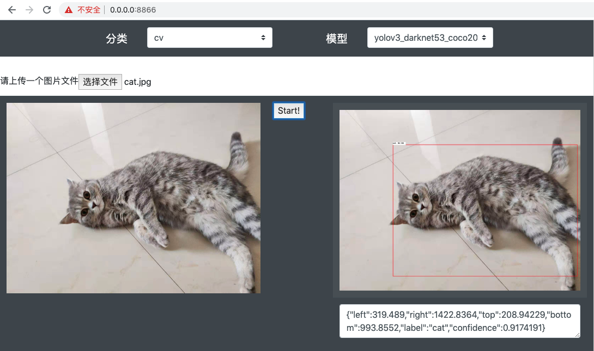
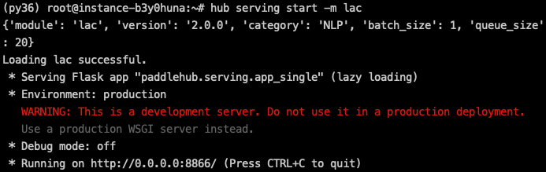

# PaddleHub Serving模型一键服务部署
## 简介
### 为什么使用一键服务部署
使用PaddleHub能够快速进行模型预测，但开发者常面临本地预测过程迁移线上的需求。无论是对外开放服务端口，还是在局域网中搭建预测服务，都需要PaddleHub具有快速部署模型预测服务的能力。在这个背景下，模型一键服务部署工具——PaddleHub Serving应运而生。开发者通过一行命令即可快速启动一个模型预测在线服务，而无需关注网络框架选择和实现。
### 什么是一键服务部署
PaddleHub Serving是基于PaddleHub的一键模型服务部署工具，能够通过简单的Hub命令行工具轻松启动一个模型预测在线服务，前端通过Flask和Gunicorn完成网络请求的处理，后端直接调用PaddleHub预测接口，同时支持使用多进程方式利用多核提高并发能力，保证预测服务的性能。

### 支持模型
目前PaddleHub Serving支持对PaddleHub所有可直接预测的模型进行服务部署，包括`lac`、`senta_bilstm`等NLP类模型，以及`yolov3_darknet53_coco2017`、`vgg16_imagenet`等CV类模型，更多模型请参见[PaddleHub支持模型列表](https://paddlepaddle.org.cn/hublist)。未来还将支持开发者使用PaddleHub Fine-tune API得到的模型用于快捷服务部署。

## 使用
### Step1：启动服务端部署
PaddleHub Serving有两种启动方式，分别是使用命令行启动，以及使用配置文件启动。

#### 命令行命令启动
启动命令
```shell
$ hub serving start --modules [Module1==Version1, Module2==Version2, ...] \
                    --port XXXX \
                    --use_gpu \
                    --use_multiprocess \
                    --workers \
```

**参数**：

|参数|用途|  
|-|-|  
|--modules/-m|PaddleHub Serving预安装模型，以多个Module==Version键值对的形式列出<br>*`当不指定Version时，默认选择最新版本`*|  
|--port/-p|服务端口，默认为8866|  
|--use_gpu|使用GPU进行预测，必须安装paddlepaddle-gpu|  
|--use_multiprocess|是否启用并发方式，默认为单进程方式，推荐多核CPU机器使用此方式<br>*`Windows操作系统只支持单进程方式`*|
|--workers|在并发方式下指定的并发任务数，默认为`2*cpu_count-1`，其中`cpu_count`为CPU核数|  

**NOTE:** --use_gpu不可与--use_multiprocess共用。

#### 配置文件启动
启动命令
```shell
$ hub serving start --config config.json
```
`config.json`格式如下：  

```json
{
  "modules_info": {
    "yolov3_darknet53_coco2017": {
      "init_args": {
        "version": "1.0.0"
      },
      "predict_args": {
        "batch_size": 1,
        "use_gpu": false
      }
    },
    "lac": {
      "init_args": {
        "version": "1.1.0"
      },
      "predict_args": {
        "batch_size": 1,
        "use_gpu": false
      }
    }
  },
  "port": 8866,
  "use_multiprocess": false,
  "workers": 2
}

```

**参数**：

|参数|用途|  
|-|-|  
|modules_info|PaddleHub Serving预安装模型，以字典列表形式列出，key为模型名称。其中:<br>`init_args`为模型加载时输入的参数，等同于`paddlehub.Module(**init_args)`<br>`predict_args`为模型预测时输入的参数，以`lac`为例，等同于`lac.analysis_lexical(**predict_args)`
|port|服务端口，默认为8866|  
|use_gpu|使用GPU进行预测，必须安装paddlepaddle-gpu|  
|use_multiprocess|是否启用并发方式，默认为单进程方式，推荐多核CPU机器使用此方式<br>*`Windows操作系统只支持单进程方式`*|
|workers|启动的并发任务数，在并发模式下才生效，默认为`2*cpu_count-1`，其中`cpu_count`代表CPU的核数|

### Step2：访问服务端

在使用PaddleHub Serving部署服务端的模型预测服务后，就可以在客户端访问预测接口以获取结果了，接口url格式为：

http://127.0.0.1:8866/predict/<CATEGORY\>/\<MODULE>

其中，\<CATEGORY>为text或image，与模型种类对应，\<MODULE>为模型名。

通过发送一个POST请求，即可获取预测结果，下面我们将展示一个具体的demo，以说明使用PaddleHub Serving部署和使用流程。


### Step3：利用PaddleHub Serving进行个性化开发
使用PaddleHub Serving进行模型服务部署后，可以利用得到的接口进行开发，如对外提供web服务，或接入到应用程序中，以降低客户端预测压力，提高性能，下面展示了一个web页面demo:




### Step4：关闭serving
使用关闭命令即可关闭启动的serving，
```shell
$ hub serving stop --port XXXX
```
**参数**：

|参数|用途|  
|-|-|  
|--port/-p|指定要关闭的服务端口，默认为8866|  

## Demo——部署一个在线lac分词服务

### Step1：部署lac在线服务
现在，我们要部署一个lac在线服务，以通过接口获取文本的分词结果。

首先，任意选择一种启动方式，两种方式分别为:
```shell
$ hub serving start -m lac
```
或
```shell
$ hub serving start -c serving_config.json
```
其中`serving_config.json`的内容如下：
```json
{
  "modules_info": {
    "lac": {
      "init_args": {
        "version": "1.1.0"
      },
      "predict_args": {
        "batch_size": 1,
        "use_gpu": false
      }
    }
  },
  "port": 8866,
  "use_multiprocess": false,
  "workers": 2
}
```
启动成功界面如图：



这样我们就在8866端口成功部署了lac的在线分词服务。
*此处warning为Flask提示，不影响使用*

### Step2：访问lac预测接口

在服务部署好之后，我们可以进行测试，用来测试的文本为`今天是个好日子`和`天气预报说今天要下雨`。

客户端代码如下
```python
# coding: utf8
import requests
import json

if __name__ == "__main__":
    # 指定用于用于预测的文本并生成字典{"text": [text_1, text_2, ... ]}
    text_list = ["今天是个好日子", "天气预报说今天要下雨"]
    text = {"text": text_list}
    # 指定预测方法为lac并发送post请求
    url = "http://127.0.0.1:8866/predict/text/lac"
    r = requests.post(url=url, data=text)

    # 打印预测结果
    print(json.dumps(r.json(), indent=4, ensure_ascii=False))
```
运行后得到结果


```python
{
    "results": [
        {
            "tag": [
                "TIME", "v", "q", "n"
            ],
            "word": [
                "今天", "是", "个", "好日子"
            ]
        },
        {
            "tag": [
                "n", "v", "TIME", "v", "v"
            ],
            "word": [
                "天气预报", "说", "今天", "要", "下雨"
            ]
        }
    ]
}
```

### Step3：停止serving服务

由于启动时我们使用了默认的服务端口8866，则对应的关闭命令为：
```shell
$ hub serving stop --port 8866
```
或不指定关闭端口，则默认为8866。
```shell
$ hub serving stop
```
等待serving清理服务后，提示：
```shell
$ PaddleHub Serving will stop.
```
则serving服务已经停止。

此Demo的具体信息和代码请参见[LAC Serving](../../demo/serving/module_serving/lexical_analysis_lac)。另外，下面展示了一些其他的一键服务部署Demo。

## Demo——其他模型的一键部署服务

获取其他PaddleHub Serving的一键服务部署场景示例，可参见下列demo

* [中文分词](../../demo/serving/module_serving/lexical_analysis_lac)  

&emsp;&emsp;该示例展示了利用LAC模型完成中文分词服务化部署和在线预测分词结果。

* [口罩检测](../../demo/serving/module_serving/object_detection_pyramidbox_lite_server_mask)  

&emsp;&emsp;该示例展示了利用pyramidbox_lite_server_mask模型检测是否佩戴口罩。

## 客户端请求新版模型的方式
对某些新版模型，客户端请求方式有所变化，更接近本地预测的请求方式，以降低学习成本。
以lac(2.1.0)为例，使用上述方法进行请求将提示：
```python
{
    "Warnning": "This usage is out of date, please use 'application/json' as content-type to post to /predict/lac. See 'https://github.com/PaddlePaddle/PaddleHub/blob/release/v1.6/docs/tutorial/serving.md' for more details."
}
```
对于lac(2.1.0)，请求的方式如下：
```python
# coding: utf8
import requests
import json

if __name__ == "__main__":
    # 指定用于预测的文本并生成字典{"text": [text_1, text_2, ... ]}
    text = ["今天是个好日子", "天气预报说今天要下雨"]
    # 以key的方式指定text传入预测方法的时的参数，此例中为"data"
    # 对应本地部署，则为lac.analysis_lexical(texts=[text1, text2])
    data = {"texts": text, "batch_size": 2}
    # 指定预测方法为lac并发送post请求
    url = "http://127.0.0.1:8866/predict/lac"
    # 指定post请求的headers为application/json方式
    headers = {"Content-Type": "application/json"}

    r = requests.post(url=url, headers=headers, data=json.dumps(data))

    # 打印预测结果
    print(json.dumps(r.json(), indent=4, ensure_ascii=False))
```

此Demo的具体信息和代码请参见[LAC Serving_2.1.0](../../demo/serving/module_serving/lexical_analysis_lac/lac_2.1.0_serving_demo.py)。

## Bert Service
除了预训练模型一键服务部署功能之外，PaddleHub Serving还具有`Bert Service`功能，支持ernie_tiny、bert等模型快速部署，对外提供可靠的在线embedding服务，具体信息请参见[Bert Service](./bert_service.md)。
