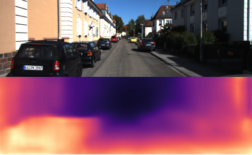

# 模型概述

- 本模型为单目深度估计模型，可用于户外道路图像的深度估计，估计效果如下：



- 本模型算法基于CVPR 2017的[SfMlearner](https://openaccess.thecvf.com/content_cvpr_2017/html/Zhou_Unsupervised_Learning_of_CVPR_2017_paper.html)，模型参数来自于[SfMlearner-Pytorch](https://github.com/ClementPinard/SfmLearner-Pytorch)

# 模型使用

- 安装SfMlearner模块：`hub install SfMlearner`
- 预测代码示例：

```python
import paddlehub as hub

SfMlearner = hub.Module(name='SfMlearner')
SfMlearner.estimation(img_dir='./input/',  # 待估计图像放在./input/文件夹内，支持jpg, jpeg, png等常见图像格式
                      output_dir='./output/',  # 估计结果的输出文件夹为./output/
                      USE_GPU=False)
```

- `SfMlearner.estimation`参数说明：
  - `img_dir`：所有待估计图像存放的文件夹
  - `output_dir`：输出结果的文件夹，大小统一为128*416
  - `USE_GPU`：是否采用GPU进行预测
  - `output_disp`（可选）：是否输出disparity map（即样例），默认为True
  - `output_depth`（可选）：是否输出depth map（效果不如disparity map），默认为False

# 库依赖

- paddlepaddle >= 2.1.0
- paddlehub >= 2.1.0
- PIL
- numpy
- os
- argparse
- matplotlib


